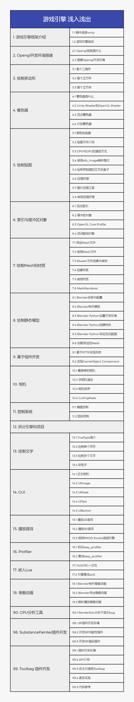
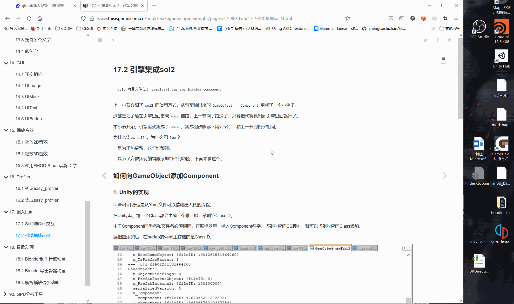

## 游戏引擎 浅入浅出

  

:blush::blush::blush::blush::blush::blush::blush::blush::blush::blush::blush::blush::blush::blush::blush::blush::blush::blush::blush::blush::blush::blush::blush::blush::blush:

## Useful links

:blue_book: [在线阅读](http://www.thisisgame.com.cn/book/makegameengineatnight/)

:orange_book: [随书项目实例](https://github.com/ThisisGame/makegameengineatnight/tree/main/samples)

:green_book: [Markdown](https://github.com/ThisisGame/makegameengineatnight/tree/main/pages)

## Directory

:file_folder: files

存放 blender、xmind、drawio 等源文件。

:file_folder: imgs

存放 markdown 图片。

:file_folder: pages

存放 markdown 文档。

:file_folder: samples

存放随书实例 CLion 工程。

## Chapter

我们每天与游戏引擎打交道，有时候会心痒痒想了解游戏引擎是怎么做的，但是游戏引擎是如此庞大的一个工程，如虚幻这行业至尊，代码量更是复杂到以千万行计，个人想完成一个游戏引擎似乎是不可能的事情。

不如退而求其次，从实现一个简单的游戏引擎入门，然后再深入Unity/Unreal的源码去钻研。

本书拆分游戏引擎的多个模块，到书中的每一章进行讲解，最终实现一个简单的游戏引擎。

## Content

本书包含内容

:white_check_mark: 各种开源库的使用方式

:white_check_mark: 如何将开源库组装成游戏引擎

本书不包括内容

:no_entry: 图形学

:no_entry: 物理学

:no_entry: 硬件知识

对从事游戏性能优化工作的开发者，从本书中或许可以找到以下问题的答案：

:white_check_mark: 为什么要合并DrawCall？

:white_check_mark: 为什么要减少顶点？

:white_check_mark: 为什么要减少骨骼数量？

:white_check_mark: 为什么要将图片压缩为不同的格式？

:white_check_mark: 为什么要烘焙灯光贴图？

:white_check_mark: 为什么要减少阴影？

:white_check_mark: 为什么……？

## Learning style

图书以实战为主，大部分章节都有CLion实例项目，项目路径在章节开头或结尾给出。

个人推荐的学习方式如下：

:arrow_forward: 打开CLion项目，编译运行，看看效果。

:arrow_forward: 过一遍代码，断点调试一下。

:arrow_forward: 看一遍章节内容。

:arrow_forward: 再过一遍代码。

## Find&Load CLion Project

每一小节的文章开头都贴出了本小节的CLion项目，按照下面Gif图指引打开。

## Resource download

本书Markdown以及章节配套项目托管在Github上，读书过程中有疑问、发现错误都可以提Issues。

    Github：https://github.com/ThisisGame/makegameengineatnight

本书使用到的其他工具，都在GameDevTools中集成。

    GameDevTools: https://github.com/ThisisGame/GameDevTools

## Contributors

项目目前由我个人维护更新, you could become one too !

<table>
  <tr>
    <td align="center">
        <a href="https://github.com/ThisisGame">
            
             
            <b>陈鹏</b>
        </a>
         
        
    </td>
  </tr>
</table>

## Sponsors

<table>
  <tr>
    <td align="center">
        <a href="https://github.com/">
            
             
            <b>GitHub</b>
        </a>
         
        
    </td>
    <td align="center">
        <a href="https://jb.gg/OpenSource">
            
             
            <b>JetBrains</b>
        </a>
         
        
    </td>
  </tr>
</table>
