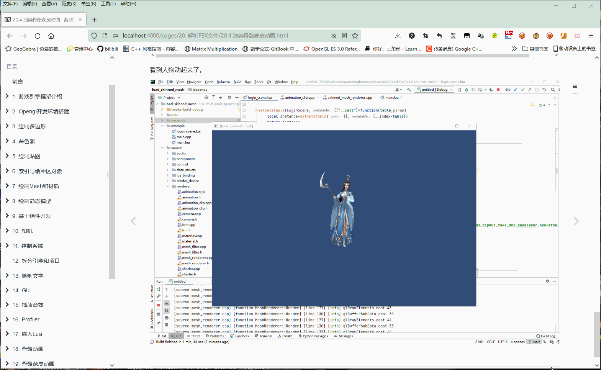
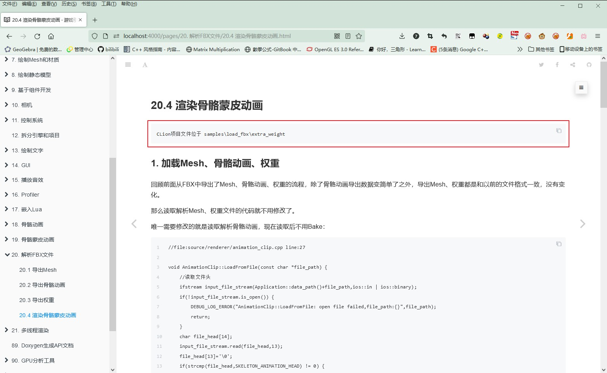
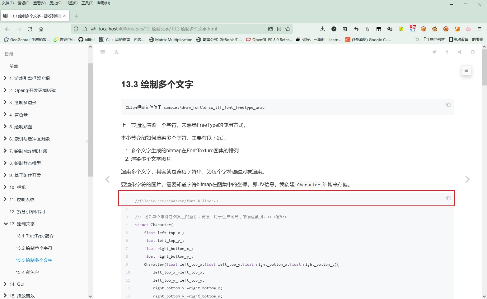
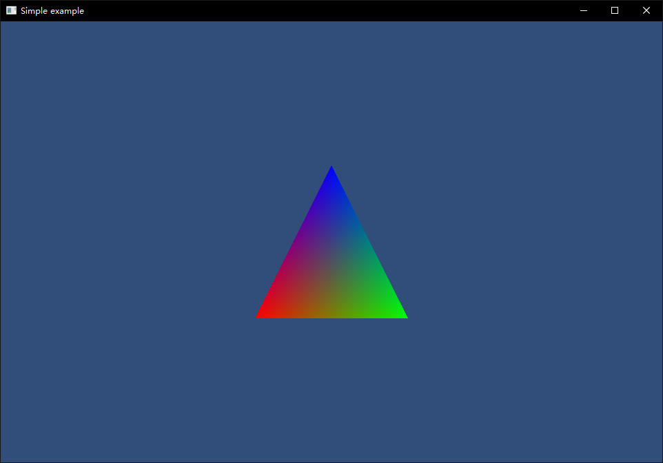

## 游戏引擎 浅入浅出

### 项目介绍 README

本书完整介绍一个游戏引擎的所有模块，从最基础的OpenGL环境搭建，到骨骼动画、多线程渲染、阴影实现等等，最后实现一个完整的游戏引擎。

### 章节内容 Chapter

第 1 章介绍游戏引擎框架，以Unity为例，介绍游戏引擎组成。

第 2 章介绍OpenGL开发环境搭建，创建一个OpenGL空窗口来入坑。

第 3 章介绍使用OpenGL绘制三角形、正方形、立方体，来熟悉游戏渲染的最基础元素。

第 4 章介绍Shader的概念，编译链接，以及Shader格式、关键字。

第 5 章介绍贴图格式，从直接读取PNG、JPG渲染，然后介绍GPU所使用的的压缩纹理。

第 6 章介绍索引与缓冲区对象，索引就是多个顶点的下标，使用索引可以复用顶点渲染。而缓冲区则是将顶点数据存储于显存中，不用再每一帧都从内存上传到GPU。

第 7 章介绍引擎自定义的Mesh文件格式以及材质的组成。将原来写死在代码中的顶点数据存储到Mesh文件中，将原来写死在代码中的Shader参数存储到材质中。

第 8 章介绍使用Blender制作模型并编写Python代码导出为Mesh文件。

第 9 章介绍如何实现GameObject-Component模式。

第 10 章介绍什么是相机，以及多相机渲染排序。

第 11 章介绍获取鼠标、键盘输入。

第 12 章介绍如何将Demo代码，拆分为引擎源码与项目源码。

第 13 章介绍使用FreeType对指定字符生成单Alpha通道的纹理并渲染，以及使用顶点色实现彩色文字。

第 14 章介绍基础GUI控件的实现，包括UIImage、UIMask、UIText、UIButton。有了这几个基础，可以实现其他复杂的控件。

第 15 章介绍使用FMOD播放MP3、Wav音乐，以及使用FMOD专业音频编辑器制作音效与解析播放。

第 16 章介绍easy_profiler这个C++性能分析库。

第 17 章介绍使用Sol2这个开源库，将Lua集成到引擎，后续使用C++开发引擎，使用Lua编写测试代码。

第 18 章介绍骨骼动画原理，并介绍使用Blender制作骨骼动画、导出到skeleton_anim文件，在引擎解析。

第 19 章介绍骨骼蒙皮动画，在Blender刷权重，导出到weight文件，在引擎解析，渲染。

第 20 章介绍如何从FBX文件导出Mesh、骨骼动画、权重，实例导出古风少女并渲染。

第 21 章介绍多线程渲染，将OpenGL API放到单独的渲染线程，从主线程发命令到渲染线程，将DrawCall的影响分出去，减轻主线程负担。

第 22 章介绍不定时更新。

### 特性列表 Feature

写这本书的目的是普及游戏引擎基础知识，面向的读者有一定的Unity经验，对引擎某些点感兴趣即可。

每一章节介绍的知识点，都是供入门了解，并没有深挖。

简单、容易上手、短期目标、不枯燥，是这本书的追求的，太复杂的很容易中途放弃，我花了很多时间在这个上。

#### 容易上手

* 每一篇都从入门角度编写，一些名词，能和其他名词关联的我都会尽量关联。
  例如Shader的编译与Link，我用C语言的编译来对比。
  <table>
  <tr ><td></td><td bgcolor="AliceBlue"><b>C语言</td><td bgcolor="AliceBlue"><b>Shader</td></tr>
  <tr><td><b>目标硬件</td><td>CPU</td><td>GPU</td></tr>
  <tr><td rowspan="6"><b>编译流程</td><td>创建项目</td><td>创建GPU程序</td></tr>
  <tr><td>创建多个代码文件</td><td>创建Shader对象(顶点Shader和片段Shader) </td></tr>
  <tr><td>编写多个代码</td><td>上传Shader源码到Shader对象</td></tr>
  <tr><td>编译代码</td><td>编译Shader</td></tr>
  <tr><td>添加到链接列表</td><td>添加到链接列表</td></tr>
  <tr><td>链接</td><td>链接</td></tr>
  </table>

* 每一小节开头就贴上了这一节项目地址，把文件夹拖到CLion里面立即可以调试。
  
* 代码片段开头标注这个代码所在文件以及行数。
  

#### 内容全面

从最简单的三角形绘制，到骨骼动画渲染、灯光阴影、多线程、物理、寻路AI、音频解析都会进行介绍。

