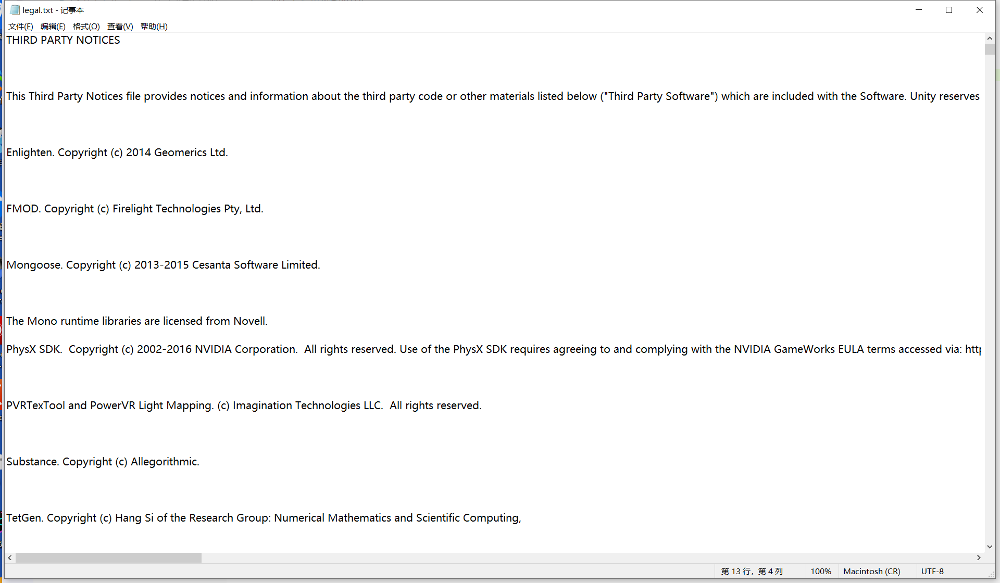

##1.1 暗中观察unity

一个大型的软件，不可能每行代码都自己写，Unity这样一个大型的商用游戏引擎，也依赖特别多的开源库。

点击Unity菜单的 Help - Software Licensee，就会打开Unity使用的三方库版权声明文件。

这里面很多开源库，都是我们后面需要用到的，例如 字体引擎freetype2、stb单头文件库、fmod音效库、freeimage图片解析库。

这上百个开源库，再加上Unity自己写的逻辑层，就组成了Unity引擎核心部分。

<table border=0 cellpadding=0 cellspacing=0 width=1026 style='border-collapse:
 collapse;table-layout:fixed;width:769pt'>
 <col width=147 style='mso-width-source:userset;mso-width-alt:5233;width:110pt'>
 <col width=687 style='mso-width-source:userset;mso-width-alt:24433;width:515pt'>
 <col width=64 span=3 style='width:48pt'>
 <tr height=18 style='height:13.8pt'>
  <td height=18 class=xl66 width=147 style='height:13.8pt;width:110pt'>7z</td>
  <td class=xl66 width=687 style='width:515pt'>Lzma压缩算法，打包Assetbundle用Lzma压缩。</td>
 </tr>
 <tr height=18 style='height:13.8pt'>
  <td height=18 class=xl66 style='height:13.8pt'>Allegorithmic</td>
  <td class=xl66 colspan=4 style='mso-ignore:colspan'>Substance系列软件协同工作插件，解析PBR材质。</td>
  
 </tr>

 <tr height=18 style='height:13.8pt'>
  <td height=18 class=xl66 style='height:13.8pt'>Allocator/tlsf</td>
  <td class=xl66 colspan=4 style='mso-ignore:colspan'>内存分配管理器，类似的有jemalloc。</td>
  
 </tr>

 <tr height=18 style='height:13.8pt'>
  <td height=18 class=xl66 style='height:13.8pt'>Audio/FMOD</td>
  <td class=xl66 colspan=4 style='mso-ignore:colspan'>3D音效</td>
  
 </tr>
 <tr height=18 style='height:13.8pt'>
  <td height=18 class=xl66 style='height:13.8pt'>Audio/fsbtool</td>
  <td class=xl66 colspan=4 style='mso-ignore:colspan'>解析fsb音效文件</td>
  
 </tr>
 <tr height=18 style='height:13.8pt'>
  <td height=18 class=xl66 style='height:13.8pt'>Audio/libvorbis</td>
  <td class=xl66 colspan=4 style='mso-ignore:colspan'>ogg音频解析</td>
  
 </tr>

 <tr height=18 style='height:13.8pt'>
  <td height=18 class=xl66 style='height:13.8pt'>Box2D</td>
  <td class=xl66 colspan=4 style='mso-ignore:colspan'>物理引擎，碰撞检测用。</td>
  
 </tr>
 <tr height=18 style='height:13.8pt'>
  <td height=18 class=xl66 style='height:13.8pt'>Cinema4DPlugin</td>
  <td class=xl66 colspan=4 style='mso-ignore:colspan'>Cinema4D导入插件</td>
  
 </tr>
 <tr height=18 style='height:13.8pt'>
  <td height=18 class=xl66 style='height:13.8pt'>Clipper</td>
  <td class=xl66 colspan=4 style='mso-ignore:colspan'>多边形裁剪，http://www.angusj.com/delphi/clipper.php</td>
  
 </tr>

 <tr height=18 style='height:13.8pt'>
  <td height=18 class=xl66 style='height:13.8pt'>Compression/Brotli</td>
  <td class=xl66 colspan=4 style='mso-ignore:colspan'>压缩算法</td>
  
 </tr>
 <tr height=18 style='height:13.8pt'>
  <td height=18 class=xl66 style='height:13.8pt'>Compression/gzip</td>
  <td class=xl66 colspan=4 style='mso-ignore:colspan'>压缩算法</td>
  
 </tr>
 <tr height=18 style='height:13.8pt'>
  <td height=18 class=xl66 style='height:13.8pt'>Compression/lz4</td>
  <td class=xl66 colspan=4 style='mso-ignore:colspan'>压缩算法</td>
  
 </tr>
 <tr height=18 style='height:13.8pt'>
  <td height=18 class=xl66 style='height:13.8pt'>Compression/lzma</td>
  <td class=xl66 colspan=4 style='mso-ignore:colspan'>压缩算法</td>
  
 </tr>
 <tr height=18 style='height:13.8pt'>
  <td height=18 class=xl66 style='height:13.8pt'>Compression/smol-v</td>
  <td class=xl66 colspan=4 style='mso-ignore:colspan'>SPIR-V压缩工具，SPIR-V是OpenCL和OpenGL的中间语言。</td>
  
 </tr>

 <tr height=18 style='height:13.8pt'>
  <td height=18 class=xl66 style='height:13.8pt'>Facebook.CSSLayout</td>
  <td class=xl66 colspan=4 style='mso-ignore:colspan'>CSS语法解析，一般用于UI界面制作。</td>
  
 </tr>
 <tr height=18 style='height:13.8pt'>
  <td height=18 class=xl66 style='height:13.8pt'>DirectX</td>
  <td class=xl66 colspan=4 style='mso-ignore:colspan'>DX</td>
  
 </tr>
 <tr height=18 style='height:13.8pt'>
  <td height=18 class=xl66 style='height:13.8pt'>DotNetZip</td>
  <td class=xl66 colspan=4 style='mso-ignore:colspan'>压缩</td>
  
 </tr>
 <tr height=18 style='height:13.8pt'>
  <td height=18 class=xl66 style='height:13.8pt'>double-conversion</td>
  <td class=xl66 colspan=4 style='mso-ignore:colspan'>double与string相互转换</td>
  
 </tr>
 <tr height=18 style='height:13.8pt'>
  <td height=18 class=xl66 style='height:13.8pt'>ExCSS</td>
  <td class=xl66 colspan=4 style='mso-ignore:colspan'>CSS语法解析，https://github.com/Unity-Technologies/ExCSS</td>
  
 </tr>

 <tr height=18 style='height:13.8pt'>
  <td height=18 class=xl66 style='height:13.8pt'>FBXSDK</td>
  <td class=xl66 colspan=4 style='mso-ignore:colspan'>fbxsdk，Autodesk提供lib，用来从fbx中读取模型数据，然后转换成引擎自定义格式</td>
  
 </tr>
 <tr height=18 style='height:13.8pt'>
  <td height=18 class=xl66 style='height:13.8pt'>FreeImage</td>
  <td class=xl66 colspan=4 style='mso-ignore:colspan'>图片文件解析库</td>
  
 </tr>
 <tr height=18 style='height:13.8pt'>
  <td height=18 class=xl66 style='height:13.8pt'>freetype2</td>
  <td class=xl66 colspan=4 style='mso-ignore:colspan'>ttf字体解析库</td>
  
 </tr>

 <tr height=18 style='height:13.8pt'>
  <td height=18 class=xl66 style='height:13.8pt'>google/sparsehash</td>
  <td class=xl66 colspan=4 style='mso-ignore:colspan'>省内存的hash实现</td>
  
 </tr>
 <tr height=18 style='height:13.8pt'>
  <td height=18 class=xl66 style='height:13.8pt'>HashFunctions</td>
  <td class=xl66 colspan=4 style='mso-ignore:colspan'>各种hash函数</td>
  
 </tr>

 <tr height=18 style='height:13.8pt'>
  <td height=18 class=xl66 style='height:13.8pt'>Json.NET</td>
  <td class=xl66 colspan=4 style='mso-ignore:colspan'>json库</td>
  
 </tr>
 <tr height=18 style='height:13.8pt'>
  <td height=18 class=xl66 style='height:13.8pt'>JsonParsers</td>
  <td class=xl66 colspan=4 style='mso-ignore:colspan'>json库</td>
  
 </tr>
 <tr height=18 style='height:13.8pt'>
  <td height=18 class=xl66 style='height:13.8pt'>libart</td>
  <td class=xl66 colspan=4 style='mso-ignore:colspan'>基数树 https://github.com/armon/libart/</td>
  
 </tr>
 <tr height=18 style='height:13.8pt'>
  <td height=18 class=xl66 style='height:13.8pt'>libcurl</td>
  <td class=xl66 colspan=4 style='mso-ignore:colspan'>网络库</td>
  
 </tr>

 <tr height=18 style='height:13.8pt'>
  <td height=18 class=xl66 style='height:13.8pt'>libjpeg-turbo</td>
  <td class=xl66 colspan=4 style='mso-ignore:colspan'>解析jpeg库，libjpeg升级版</td>
  
 </tr>
 <tr height=18 style='height:13.8pt'>
  <td height=18 class=xl66 style='height:13.8pt'>libpng</td>
  <td class=xl66 colspan=4 style='mso-ignore:colspan'>png解析库</td>
  
 </tr>
 <tr height=18 style='height:13.8pt'>
  <td height=18 class=xl66 style='height:13.8pt'>libtess2</td>
  <td class=xl66 colspan=4 style='mso-ignore:colspan'>细分曲面库</td>
  
 </tr>
 <tr height=18 style='height:13.8pt'>
  <td height=18 class=xl66 style='height:13.8pt'>libunwind</td>
  <td class=xl66 colspan=4 style='mso-ignore:colspan'>ibunwind库提供堆栈辗转开解功能。包括用于输出堆栈跟踪的API、用于以编程方式辗转开解堆栈的API以及支持C++异常处理机制的API。</td>
 </tr>

 <tr height=18 style='height:13.8pt'>
  <td height=18 class=xl66 style='height:13.8pt'>libwebsockets</td>
  <td class=xl66 colspan=4 style='mso-ignore:colspan'>websocket网络库</td>
  
 </tr>
 <tr height=18 style='height:13.8pt'>
  <td height=18 class=xl66 style='height:13.8pt'>LMDB</td>
  <td class=xl66 colspan=3 style='mso-ignore:colspan'>Lightning Memory-Mapped
  Database,就是非常快的内存映射型数据库,LMDB使用内存映射文件,可以提供更好的输入/输出性能</td>
  
 </tr>

 <tr height=18 style='height:13.8pt'>
  <td height=18 class=xl66 style='height:13.8pt'>MeshOptimizer</td>
  <td class=xl66 colspan=4 style='mso-ignore:colspan'>Mesh优化</td>
  
 </tr>
 <tr height=18 style='height:13.8pt'>
  <td height=18 class=xl66 style='height:13.8pt'>mikktspace</td>
  <td class=xl66 colspan=4 style='mso-ignore:colspan'>切线空间和法线生成的标准。这个名字是Mikkelsen切线空间的缩写。</td>
  
 </tr>
 <tr height=18 style='height:13.8pt'>
  <td height=18 class=xl66 style='height:13.8pt'>Mongoose</td>
  <td class=xl66 colspan=4 style='mso-ignore:colspan'>嵌入式Web服务器 https://github.com/cesanta/mongoose</td>
  
 </tr>

 <tr height=18 style='height:13.8pt'>
  <td height=18 class=xl66 style='height:13.8pt'>Mono</td>
  <td class=xl66 colspan=4 style='mso-ignore:colspan'>开源c#虚拟机</td>
  
 </tr>
 <tr height=18 style='height:13.8pt'>
  <td height=18 class=xl66 style='height:13.8pt'>Mono.Cecil</td>
  <td class=xl66 colspan=4 style='mso-ignore:colspan'></td>
  
 </tr>
 <tr height=18 style='height:13.8pt'>
  <td height=18 class=xl66 style='height:13.8pt'>Mono.Options</td>
  <td class=xl66 colspan=4 style='mso-ignore:colspan'></td>
  
 </tr>
 <tr height=18 style='height:13.8pt'>
  <td height=18 class=xl66 style='height:13.8pt'>MonoBleedingEdge</td>
  <td class=xl66 colspan=4 style='mso-ignore:colspan'></td>
  
 </tr>
 <tr height=18 style='height:13.8pt'>
  <td height=18 class=xl66 style='height:13.8pt'>MonoConsolesStandalone</td>
  <td class=xl66 colspan=4 style='mso-ignore:colspan'></td>
 </tr>
 <tr height=18 style='height:13.8pt'>
  <td height=18 class=xl66 style='height:13.8pt'>MonoResources</td>
  <td class=xl66 colspan=4 style='mso-ignore:colspan'></td>
  
 </tr>

 <tr height=18 style='height:13.8pt'>
  <td height=18 class=xl66 style='height:13.8pt'>Nasm</td>
  <td class=xl66 colspan=4 style='mso-ignore:colspan'>汇编环境</td>
  
 </tr>
 <tr height=18 style='height:13.8pt'>
  <td height=18 class=xl66 style='height:13.8pt'>Ndecompiler</td>
  <td class=xl66 colspan=4 style='mso-ignore:colspan'>.net 反编译
  https://github.com/Unity-Technologies/ILSpy/tree/unity</td>
  
 </tr>

 <tr height=18 style='height:13.8pt'>
  <td height=18 class=xl66 style='height:13.8pt'>NiceIO</td>
  <td class=xl66 colspan=4 style='mso-ignore:colspan'>一套文件读写接口 https://github.com/scottbilas/NiceIO</td>
  
 </tr>
 <tr height=18 style='height:13.8pt'>
  <td height=18 class=xl66 style='height:13.8pt'>Ninject</td>
  <td class=xl66 colspan=4 style='mso-ignore:colspan'>IOC框架</td>
  
 </tr>

 <tr height=18 style='height:13.8pt'>
  <td height=18 class=xl66 style='height:13.8pt'>nodejs</td>
  <td class=xl66 colspan=4 style='mso-ignore:colspan'>nodejs</td>
  
 </tr>
 <tr height=18 style='height:13.8pt'>
  <td height=18 class=xl66 style='height:13.8pt'>NRefactory</td>
  <td class=xl66 colspan=4 style='mso-ignore:colspan'>反射c#代码的库</td>
  
 </tr>

 <tr height=18 style='height:13.8pt'>
  <td height=18 class=xl66 style='height:13.8pt'>openexr</td>
  <td class=xl66>OpenEXR，或简称为exr格式，是一种开放标准的高动态范围图像格式<ruby><rt class=font5></rt></ruby></td>
  
 </tr>
 <tr height=18 style='height:13.8pt'>
  <td height=18 class=xl66 style='height:13.8pt'>OpenRL</td>
  <td class=xl66 colspan=4 style='mso-ignore:colspan'>全称Open Ray Tracing Language，开放光线追踪语言</td>
  
 </tr>
 <tr height=18 style='height:13.8pt'>
  <td height=18 class=xl66 style='height:13.8pt'>OpenSSL</td>
  <td class=xl66 colspan=4 style='mso-ignore:colspan'>加密算法库</td>
  
 </tr>
 
 <tr height=18 style='height:13.8pt'>
  <td height=18 class=xl66 style='height:13.8pt'>optool</td>
  <td class=xl66 colspan=4 style='mso-ignore:colspan'>ios代码注入库 https://github.com/alexzielenski/optool</td>
  
 </tr>

 <tr height=18 style='height:13.8pt'>
  <td height=18 class=xl66 style='height:13.8pt'>ParserGenerators</td>
  <td class=xl66 colspan=4 style='mso-ignore:colspan'>一套语法解析库</td>
  
 </tr>

 <tr height=18 style='height:13.8pt'>
  <td height=18 class=xl66 style='height:13.8pt'>PhysX3</td>
  <td class=xl66 colspan=4 style='mso-ignore:colspan'>physx物理加速驱动</td>
  
 </tr>
 <tr height=18 style='height:13.8pt'>
  <td height=18 class=xl66 style='height:13.8pt'>PLCrashReporter</td>
  <td class=xl66 colspan=4 style='mso-ignore:colspan'>ios崩溃日志收集 https://github.com/microsoft/plcrashreporter</td>
  
 </tr>

 <tr height=18 style='height:13.8pt'>
  <td height=18 class=xl66 style='height:13.8pt'>postgresql</td>
  <td class=xl66 colspan=4 style='mso-ignore:colspan'>postgresql数据库</td>
  
 </tr>
 <tr height=18 style='height:13.8pt'>
  <td height=18 class=xl66 style='height:13.8pt'>ProphecySDK</td>
  <td class=xl66 colspan=4 style='mso-ignore:colspan'>一套多媒体库，提供模型加载、图片解析、键盘鼠标接口 https://www.twilight3d.com/</td>
  
 </tr>
 <tr height=18 style='height:13.8pt'>
  <td height=18 class=xl66 style='height:13.8pt'>pubnub</td>
  <td class=xl66 colspan=4 style='mso-ignore:colspan'>用于聊天的库 pubnub是一家提供反馈信息收集的公司 https://www.pubnub.com/</td>
  
 </tr>
 <tr height=18 style='height:13.8pt'>
  <td height=18 class=xl66 style='height:13.8pt'>qmc</td>
  <td class=xl66 colspan=4 style='mso-ignore:colspan'>QMC，全名是Quasi-Monte Carlo（准蒙特卡罗)，这其实是纯蒙特卡罗算法的一个变种</td>
  
 </tr>

 <tr height=18 style='height:13.8pt'>
  <td height=18 class=xl66 style='height:13.8pt'>Qt</td>
  <td class=xl66 colspan=4 style='mso-ignore:colspan'>开源C++ GUI框架，历史悠久。</td>
  
 </tr>
 <tr height=18 style='height:13.8pt'>
  <td height=18 class=xl66 style='height:13.8pt'>RakNet</td>
  <td class=xl66 colspan=4 style='mso-ignore:colspan'>开源网络库，Facebook收购。</td>
  
 </tr>
 <tr height=18 style='height:13.8pt'>
  <td height=18 class=xl66 style='height:13.8pt'>RapidJSON</td>
  <td class=xl66 colspan=4 style='mso-ignore:colspan'>腾讯开源的Json库。</td>
  
 </tr>

 <tr height=18 style='height:13.8pt'>
  <td height=18 class=xl66 style='height:13.8pt'>Recast</td>
  <td class=xl66 colspan=4 style='mso-ignore:colspan'>使用navmesh作为模型的库，支持建网格、寻路、添加动态障碍、群体寻路等特性
  https://github.com/recastnavigation/recastnavigation</td>
 </tr>
 <tr height=18 style='height:13.8pt'>
  <td height=18 class=xl66 style='height:13.8pt'>renderdoc</td>
  <td class=xl66 colspan=4 style='mso-ignore:colspan'>开源的渲染分析工具</td>
  
 </tr>
 <tr height=18 style='height:13.8pt'>
  <td height=18 class=xl66 style='height:13.8pt'>Roslyn</td>
  <td class=xl66 colspan=4 style='mso-ignore:colspan'>代码静态分析工具</td>
  
 </tr>

 <tr height=18 style='height:13.8pt'>
  <td height=18 class=xl66 style='height:13.8pt'>SDL2</td>
  <td class=xl66 colspan=4 style='mso-ignore:colspan'>跨平台的多媒体库,提供了针对音频、视频、键盘、鼠标、控制杆及3D硬件的低级别的访问接口。</td>
  
 </tr>
 <tr height=18 style='height:13.8pt'>
  <td height=18 class=xl66 style='height:13.8pt'>ShaderCompilers</td>
  <td class=xl66 colspan=4 style='mso-ignore:colspan'>cg代码编译工具，将unityshader转hlsl，glsl等gpu程序代码。</td>
  
 </tr>

 <tr height=18 style='height:13.8pt'>
  <td height=18 class=xl66 style='height:13.8pt'>SketchUp</td>
  <td class=xl66 colspan=4 style='mso-ignore:colspan'>SketchUp导入插件</td>
  
 </tr>

 <tr height=18 style='height:13.8pt'>
  <td height=18 class=xl66 style='height:13.8pt'>SonarQube</td>
  <td class=xl66 colspan=4 style='mso-ignore:colspan'>代码静态分析工具</td>
  
 </tr>

 <tr height=18 style='height:13.8pt'>
  <td height=18 class=xl66 style='height:13.8pt'>SpeedTree</td>
  <td class=xl66 colspan=2 style='mso-ignore:colspan'>Speedtree是由SpeedTree
  Modeler、SpeedTree Compiler和SpeedTree SDK三部分构成的一款三维树木建模的软件</td>
  
 </tr>
 <tr height=18 style='height:13.8pt'>
  <td height=18 class=xl66 style='height:13.8pt'>sqlite</td>
  <td class=xl66 colspan=4 style='mso-ignore:colspan'>嵌入式数据库</td>
  
 </tr>
 <tr height=18 style='height:13.8pt'>
  <td height=18 class=xl66 style='height:13.8pt'>stb</td>
  <td class=xl66 colspan=3 style='mso-ignore:colspan'>stb
  是由一个个单文件组成的&nbsp;C/C++ 库。其中包含音频处理、图形处理、3D图形处理、游戏开发、数学库、解析器等。<ruby><rt class=font5></rt></ruby></td>
  
 </tr>

 <tr height=18 style='height:13.8pt'>
  <td height=18 class=xl66 style='height:13.8pt'>tetgen</td>
  <td class=xl66 colspan=4 style='mso-ignore:colspan'>TetGen
  是一款网格剖分的软件，可以生成高质量的非结构四面体网格,可以用来切割模型。https://www.xuebuyuan.com/2190962.html</td>
 </tr>

 <tr height=18 style='height:13.8pt'>
  <td height=18 class=xl66 style='height:13.8pt'>TextureCompressors</td>
  <td class=xl66 colspan=4 style='mso-ignore:colspan'>压缩图片工具集合 etc/etc2/pvr/astc</td>
  
 </tr>
 <tr height=18 style='height:13.8pt'>
  <td height=18 class=xl66 style='height:13.8pt'>theora</td>
  <td class=xl66>Theora 是一个开源的视频编解码器，属于Ogg项目的一部分。<ruby><rt class=font5></rt></ruby></td>
  
 </tr>

 <tr height=18 style='height:13.8pt'>
  <td height=18 class=xl66 style='height:13.8pt'>ThreadSanitizer</td>
  <td class=xl66 colspan=2 style='mso-ignore:colspan'>ThreadSanitizer(TSAN)是一种C/C++数据竞争检测工具。https://blog.csdn.net/itcomeghgh/article/details/78711039<ruby><rt class=font5></rt></ruby></td>
  

 <tr height=18 style='height:13.8pt'>
  <td height=18 class=xl66 style='height:13.8pt'>tinyexr</td>
  <td class=xl66 colspan=4 style='mso-ignore:colspan'>单个头文件的OpenEXR解析库 https://github.com/syoyo/tinyexr</td>
  
 </tr>

 <tr height=18 style='height:13.8pt'>
  <td height=18 class=xl66 style='height:13.8pt'>TinyXML</td>
  <td class=xl66 colspan=4 style='mso-ignore:colspan'>xml解析库</td>
  

 <tr height=18 style='height:13.8pt'>
  <td height=18 class=xl66 style='height:13.8pt'>Tristripper</td>
  <td class=xl66 colspan=4 style='mso-ignore:colspan'>三角形条带化</td>
  
 </tr>
 <tr height=18 style='height:13.8pt'>
  <td height=18 class=xl66 style='height:13.8pt'>udis86</td>
  <td class=xl66 colspan=4 style='mso-ignore:colspan'>反汇编引擎</td>
  
 </tr>
 <tr height=18 style='height:13.8pt'>
  <td height=18 class=xl66 style='height:13.8pt'>umbra</td>
  <td class=xl66 colspan=4 style='mso-ignore:colspan'>好像是做遮挡剔除的</td>
  

 <tr height=37 style='page-break-before:always;height:27.6pt'>
  <td height=37 class=xl66 style='height:27.6pt'>UsymTool</td>
  <td class=xl67 width=687 style='width:515pt'>Unity Symbol Tool，转换symbols
  (PDB, Mach-O and ELF)为通用格式，用来做崩溃日志收集。 
   
  https://gitlab-prod1.eu-cph-1.unityops.net/cloudservices/unitycloud-go-crash</td>
  

 <tr height=18 style='height:13.8pt'>
  <td height=18 class=xl66 style='height:13.8pt'>VersionControl</td>
  <td class=xl66 colspan=4 style='mso-ignore:colspan'>版本管理svn</td>
  
 </tr>
 <tr height=18 style='height:13.8pt'>
  <td height=18 class=xl66 style='height:13.8pt'>videoInput</td>
  <td class=xl66 colspan=4 style='mso-ignore:colspan'>win平台的视频捕捉库 https://github.com/ofTheo/videoInput</td>
  
 </tr>
 <tr height=18 style='height:13.8pt'>
  <td height=18 class=xl66 style='height:13.8pt'>vpx</td>
  <td class=xl66 colspan=4 style='mso-ignore:colspan'>一套多媒体库 https://github.com/webmproject/libvpx</td>
  
 </tr>
 <tr height=18 style='height:13.8pt'>
  <td height=18 class=xl66 style='height:13.8pt'>vrpn</td>
  <td class=xl66 colspan=4 style='mso-ignore:colspan'>vr设备网络库 https://github.com/vrpn/vrpn</td>
  

 <tr height=18 style='height:13.8pt'>
  <td height=18 class=xl66 style='height:13.8pt'>Vulkan</td>
  <td class=xl66 colspan=4 style='mso-ignore:colspan'>下一代OpenGL图形库</td>
  
 </tr>
 <tr height=18 style='height:13.8pt'>
  <td height=18 class=xl66 style='height:13.8pt'>websockify</td>
  <td class=xl66 colspan=4 style='mso-ignore:colspan'>websocket库 https://github.com/novnc/websockify</td>
  
 </tr>
 <tr height=18 style='height:13.8pt'>
  <td height=18 class=xl66 style='height:13.8pt'>Wintermute</td>
  <td class=xl66 colspan=4 style='mso-ignore:colspan'>Imagination Technologies开发的OpenRL驱动</td>
  
 </tr>
 <tr height=18 style='height:13.8pt'>
  <td height=18 class=xl66 style='height:13.8pt'>xercesc</td>
  <td class=xl66 colspan=4 style='mso-ignore:colspan'>xml解析库 http://xerces.apache.org/xerces-c/</td>
  
 </tr>
 <tr height=18 style='height:13.8pt'>
  <td height=18 class=xl66 style='height:13.8pt'>xsec</td>
  <td class=xl66 colspan=4 style='mso-ignore:colspan'>Apache XML安全性库</td>
  
 </tr>
 <tr height=18 style='height:13.8pt'>
  <td height=18 class=xl66 style='height:13.8pt'>yaml</td>
  <td class=xl66 colspan=4 style='mso-ignore:colspan'>yaml解析库，prefab就是一个yaml格式文件</td>
  
 </tr>
 <tr height=18 style='height:13.8pt'>
  <td height=18 class=xl66 style='height:13.8pt'>Yasm</td>
  <td class=xl66 colspan=4 style='mso-ignore:colspan'>汇编</td>
  
 </tr>
 <tr height=18 style='height:13.8pt'>
  <td height=18 class=xl66 style='height:13.8pt'>zlib</td>
  <td class=xl66 colspan=4 style='mso-ignore:colspan'>压缩库</td>
  
 </tr>
 <![if supportMisalignedColumns]>
 <tr height=0 style='display:none'>
  <td width=147 style='width:110pt'></td>
  <td width=687 style='width:515pt'></td>
  <td width=64 style='width:48pt'></td>
  <td width=64 style='width:48pt'></td>
  <td width=64 style='width:48pt'></td>
 </tr>
 <![endif]>
</table>
