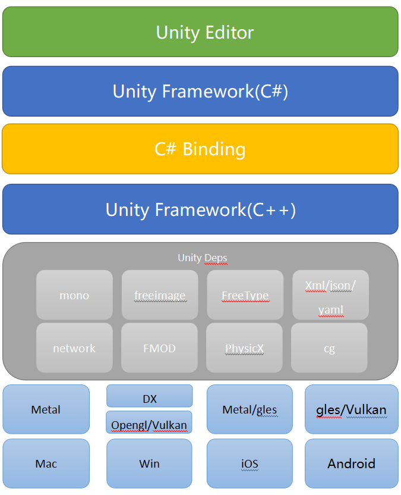
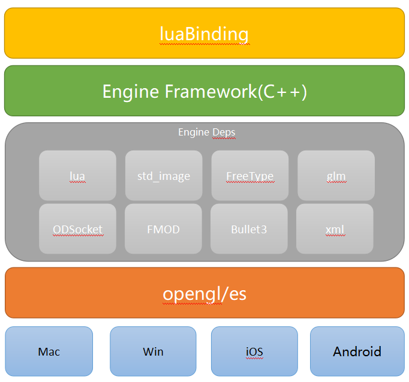

##1.2 游戏引擎组成

一个游戏引擎，大致分为4层，下面列出来Unity作为对比。

| 引擎结构 | Unity         |
| :------------------ | :---------------------- |
| 引擎框架层（脚本） | UnityEngine C#         |
| 脚本引擎           | Unity Mono Wrap        |
| 引擎框架层（C++）  | Unity Native + Depends |
| 底层图形库         | 底层图形库             |

Unity引擎的大致结构如下图：

后续我们自己编写的游戏引擎，结构如下：

麻雀虽小，五脏俱全。