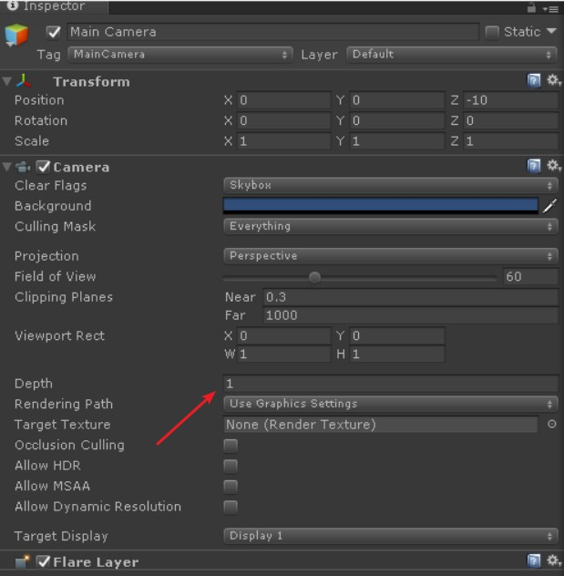
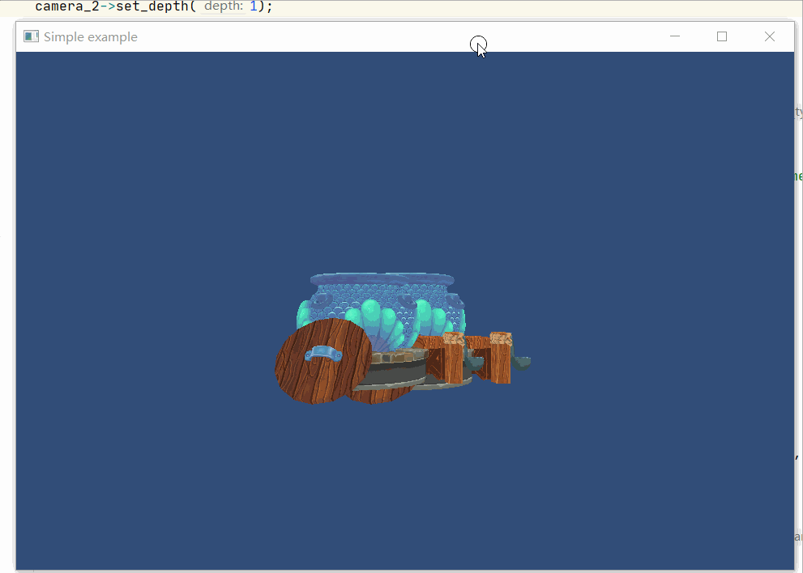

## 10.3 相机排序

    CLion项目文件位于 samples\camera\camera_depth

上一节创建了2个Camera，在遍历Camera的时候，第一个Camera清除了颜色和深度，第二个Camera只清除深度，保留了之前的颜色，效果是MeshRenderer 2次渲染的画面都正常显示出来。

虽然两次渲染的画面都正常显示出来，但是仍然有不正常的地方 -- 第一次渲染的深度信息被清除了。

第一次渲染的深度信息没有了，那么第二次渲染的时候，就不能和第一次的深度进行比较。结果就是，第二次渲染的所有物体，直接覆盖了原来的颜色。其实就是，第二次渲染的物体，处于最上层，这就是游戏UI相机的模式。

总结一下UI相机的特点：
1. UI相机处于相机队列的尾端。
2. UI相机只清除深度信息。

相机添加与删除都是动态的，那么靠什么维护相机队列的顺序呢？

在Unity里Camera是靠 `Depth` 来维护顺序的，按照惯例从后往前，`Depth`越小越先。



### 1.相机 depth 管理

给Camera添加`depth`成员变量，每当修改`depth`，对Camera列表按`depth`重新排序。

```c++
///file:source/renderer/camera.cpp line:55

/// 设置 depth，触发相机排序
/// \param depth 相机深度，多相机按从后往前排序，按depth从小往大遍历，depth越大的越上层。
void Camera::set_depth(unsigned char depth) {
    if(depth_==depth){
        return;
    }
    depth_=depth;
    Sort();
}

/// 按 depth_ 排序
void Camera::Sort() {
    std::sort(all_camera_.begin(),all_camera_.end(),[](Camera* a, Camera* b){
        return a->depth() < b->depth();
    });
}
```

### 2.实例测试

在 `main.cpp` 中，调换2个Camera创建的顺序，并设置`depth`。

```c++
///file:source/main.cpp line:77

//创建相机2 GameObject
auto go_camera_2=new GameObject("main_camera");
//挂上 Transform 组件
auto transform_camera_2=dynamic_cast<Transform*>(go_camera_2->AddComponent("Transform"));
transform_camera_2->set_position(glm::vec3(1, 0, 10));
//挂上 Camera 组件
auto camera_2=dynamic_cast<Camera*>(go_camera_2->AddComponent("Camera"));
//第二个相机不能清除之前的颜色。不然用第一个相机矩阵渲染的物体就被清除 没了。
camera_2->set_clear_flag(GL_DEPTH_BUFFER_BIT);
camera_2->set_depth(1);

//创建相机1 GameObject
auto go_camera_1=new GameObject("main_camera");
//挂上 Transform 组件
auto transform_camera_1=dynamic_cast<Transform*>(go_camera_1->AddComponent("Transform"));
transform_camera_1->set_position(glm::vec3(0, 0, 10));
//挂上 Camera 组件
auto camera_1=dynamic_cast<Camera*>(go_camera_1->AddComponent("Camera"));
camera_1->set_depth(0);
```

结果是Camera2的画面覆盖在Camera1之上，因为它的`depth`最大。



