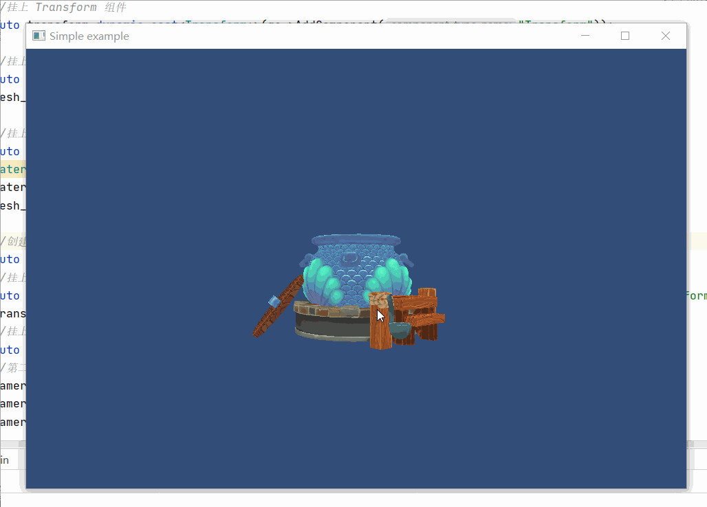

## 11.2 鼠标控制

```bash
CLion项目文件位于 samples\control\key_mouse_callback
```

鼠标包括按键、滚轮、移动三种事件，glfw 提供了3个接口用于注册对应的回调，分别如下：

```c++
//注册鼠标按键回调
glfwSetMouseButtonCallback(window,mouse_button_callback);
//注册滚轮回调
glfwSetScrollCallback(window,mouse_scroll_callback);
//注册鼠标移动回调
glfwSetCursorPosCallback(window,mouse_move_callback);
```

注册好这3个回调，就可以获取到鼠标的数据。

这一节来模仿Unity中按下Alt+鼠标坐标+鼠标移动 旋转场景视角。

### 1. 记录鼠标按键、滚轮、坐标

鼠标一般处理左、中、右三个按键，在glfw中，鼠标按键值范围是 0-7，键盘按键范围是32-348，不重复，所以鼠标按键直接复用键盘按键逻辑即可。

鼠标滚轮glfw回调的是offset，每滚动一次都是 1 或者 -1，用变量`mouse_scroll_`存储当前滚轮值。

鼠标移动，记录 x、y坐标。

对上面的3种事件，Input中新增接口和变量如下：

```c++
///file:source/control/input.h line:49

/// 指定鼠标按键是否处于按下的状态
/// \param mouse_button_index   0 表示主按钮（通常为左按钮），1 表示副按钮，2 表示中间按钮。
/// \return
static bool GetMouseButtonDown(unsigned short mouse_button_index);

static vec2_ushort mousePosition(){return mouse_position_;}
/// 设置鼠标位置
/// \param x
/// \param y
static void set_mousePosition(unsigned short x,unsigned short y){ mouse_position_.x_=x;mouse_position_.y_=y;}

static short mouse_scroll(){return mouse_scroll_;}
/// 记录鼠标滚轮事件
/// \param mouse_scroll
static void RecordScroll(short mouse_scroll){mouse_scroll_+=mouse_scroll;}

private:
    ......
    static vec2_ushort mouse_position_;//鼠标位置
    static short mouse_scroll_;//鼠标滚轮值
```

然后在glfw鼠标事件回调中，调用Input接口记录返回的数据。

```c++
///file:source/main.cpp line:44

/// 鼠标按键回调
/// \param window
/// \param button
/// \param action
/// \param mods
void mouse_button_callback(GLFWwindow* window, int button, int action, int mods)
{
    Input::RecordKey(button,action);
    std::cout<<"mouse_button_callback:"<<button<<","<<action<<std::endl;
}
/// 鼠标移动回调
/// \param window
/// \param x
/// \param y
void mouse_move_callback(GLFWwindow* window, double x, double y)
{
    Input::set_mousePosition(x,y);
    std::cout<<"mouse_move_callback:"<<x<<","<<y<<std::endl;
}
/// 鼠标滚轮回调
/// \param window
/// \param x
/// \param y
void mouse_scroll_callback(GLFWwindow* window, double x, double y)
{
    Input::RecordScroll(y);
    std::cout<<"mouse_scroll_callback:"<<x<<","<<y<<std::endl;
}
```

最后向glfw注册回调。

```c++
///file:source/main.cpp line:97

//初始化OpenGL
void init_opengl()
{
    ......

    glfwSetMouseButtonCallback(window,mouse_button_callback);
    glfwSetScrollCallback(window,mouse_scroll_callback);
    glfwSetCursorPosCallback(window,mouse_move_callback);
}
```

### 2. 使用鼠标事件实例

拿到鼠标按键、滚轮、坐标数据后，可以将其与键盘事件组合，实现下面功能：

1. 滚轮控制相机距离，实现画面缩放。
2. Alt+鼠标左键+鼠标移动旋转相机。

```c++
///file:source/main.cpp line:102

int main(void)
{
    ......

    //上一帧的鼠标位置
    vec2_ushort last_frame_mouse_position=Input::mousePosition();

    while (!glfwWindowShouldClose(window))
    {
        ......

        //旋转相机
        if(Input::GetKeyDown(KEY_CODE_LEFT_ALT) && Input::GetMouseButtonDown(MOUSE_BUTTON_LEFT)){
            float degrees= Input::mousePosition().x_ - last_frame_mouse_position.x_;

            glm::mat4 old_mat4=glm::mat4(1.0f);
            std::cout<<glm::to_string(old_mat4)<<std::endl;

            //以相机所在坐标系位置，计算用于旋转的矩阵，这里是零点，所以直接用方阵。
            glm::mat4 rotate_mat4=glm::rotate(old_mat4,glm::radians(degrees),glm::vec3(0.0f,1.0f,0.0f));
            glm::vec4 old_pos=glm::vec4(transform_camera_1->position(),1.0f);
            glm::vec4 new_pos=rotate_mat4*old_pos;//旋转矩阵 * 原来的坐标 = 相机以零点做旋转。
            std::cout<<glm::to_string(new_pos)<<std::endl;

            transform_camera_1->set_position(glm::vec3(new_pos));
        }
        last_frame_mouse_position=Input::mousePosition();

        //鼠标滚轮控制相机远近
        transform_camera_1->set_position(transform_camera_1->position() *(10 - Input::mouse_scroll())/10.f);

        Input::Update();

        ......
    }
    ......
}
```

