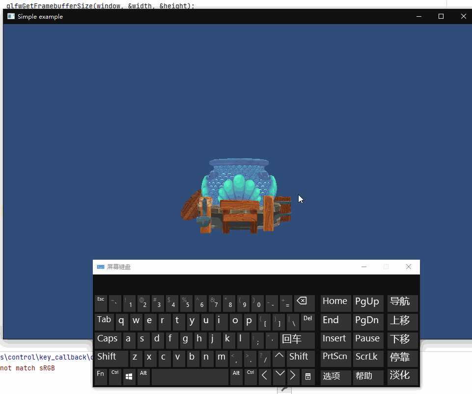

## 11.1 键盘控制

    CLion项目文件位于 samples\control\key_callback

glfw提供接口 `glfwSetKeyCallback`，在初始化OpenGL完毕后，调用接口注册键盘回调。

```c++
/// 键盘回调
/// \param window
/// \param key 键盘按键编码
/// \param scancode
/// \param action 0松开 1按下 2一直按下
/// \param mods
static void key_callback(GLFWwindow* window, int key, int scancode, int action, int mods)
{
    Input::RecordKey(key,action);
}
```

仿照Unity的写法，将键盘事件存入到 `Input` 类中，需要的时候再通过`Input::GetKeyDown`等接口获取按键状态。

### 1.设计Input类

Input类从glfw接受按键事件存储后，向逻辑代码提供接口获取按键状态。

其实是个挺简单的功能，但是我花了一个礼拜，历经多个版本才完善。

- 版本一
    
    设计使用`vector<map<key,action>>`存储每一帧的按键事件，在渲染完毕之后清理掉。
    
    测试发现glfw按键回调并不是每一帧都有，持续按下的按键状态，2帧或更长事件才会回调一次，那么会有一半的帧，获取不到按键状态。


- 版本二
    
    设计使用`unordered_map<key,action>`存储按键状态，按键松开后 action == 0，每一帧将 action == 0 的项清理掉。
    
    这样通过获取 action 的值`[ 0:松开 1:按下 2:一直按下 ]`就可以判断按键状态。 
    
    目前使用这个版本。

Input类提供以下接口：

```c++
///file:source/control/input.h

class Input {
public:
    /// 判断当前帧 键盘按键是否按下
    /// \param key_code
    /// \return
    static bool GetKey(unsigned char key_code);

    /// 判断当前帧 键盘按键是否处于按下状态
    /// \param key_code
    /// \return
    static bool GetKeyDown(unsigned char key_code);

    /// 判断当前帧 键盘按键是否按下并松开
    /// \param key_code
    /// \return
    static bool GetKeyUp(unsigned char key_code);

    /// 记录按键事件，键盘按下记录数+1，键盘弹起记录数-1，当记录数为0，说明此时没有按键。
    /// \param key_code
    /// \param action 0松手 1按下 2持续按下
    static void RecordKey(unsigned short key_code,unsigned char key_action);

    /// 刷帧
    static void Update();
private:
    static std::unordered_map<unsigned short,unsigned char> key_event_map_;//按键状态 0弹起 1按下 2持续按下
};

```

### 2.使用Input类

修改之前实例的代码，将自动旋转改为按 `R` 旋转。

```c++
///file:source/main.cpp line:124

//旋转物体
if(Input::GetKeyDown(KEY_CODE_R)){
    static float rotate_eulerAngle=0.f;
    rotate_eulerAngle+=0.1f;
    glm::vec3 rotation=transform->rotation();
    rotation.y=rotate_eulerAngle;
    transform->set_rotation(rotation);
}

//将状态为弹起的按键清理掉
Input::Update();
```

测试一下。

