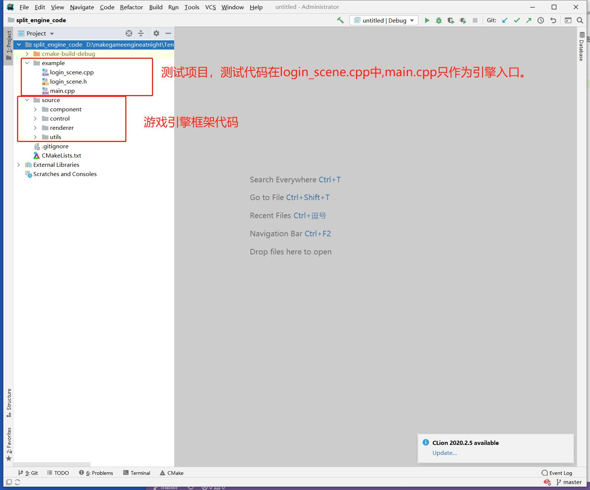

## 12. 拆分引擎和项目

```bash
CLion项目文件位于 samples\make_engine_as_framework\split_engine_code
```

截止上一章节，已经有一定的代码量了，但是引擎框架源码和测试项目代码是放在一起的，比较乱，所以我对代码进行一次整理，项目有一些变化，这里提一下。

### 1.项目结构变化



项目整理后，有2个大文件夹。

- source ：引擎代码
- example: 测试代码


### 2.引擎结构变化

引擎入口整合到 `Application` 中，来看 main.cpp 代码：

```c++
///file:example/main.cpp line:6

int main(void){
    Application::set_data_path("../data/");//设置资源目录
    Application::InitOpengl();//初始化引擎

    GameObject* go=new GameObject("LoginSceneGo");
    go->AddComponent("Transform");
    go->AddComponent("LoginScene");

    Application::Run();//开始引擎主循环
}
```

### 3.测试代码变化

现在测试代码编写和Unity比较类似，创建GameObject之后挂上Component，然后在Awake、Update中编写逻辑。

具体请参照 `LoginScene.h` `LoginScene.cpp`。