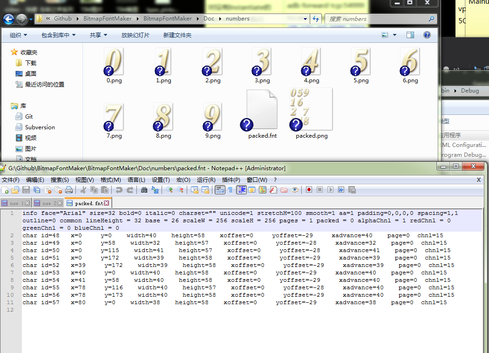
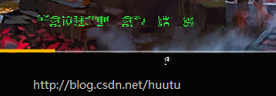

## 13. 绘制文字

自最初的MUD游戏，到如今的3A大作，文字一直是游戏不可或缺的一种表现。

虽然看得多，或许在工作中用的很多，但是文字是如何绘制出来的呢？

显卡最后决定了显示器上显示的画面，但是显卡却只能接受顶点、纹理，这种限制决定了文字的渲染方案，只能是以下3种。

<b>1. 美术同学PS制作文字图片，直接渲染图片。</b>

这就是BMFont。
美术可以任意修改颜色以及效果，不过由于美术给的文字图片是固定大小的，所以放大后会变糊。
所以这种一般用在UI上，做一些彩色字。

上图是我写的一个BMFont生成工具，托管在Github：https://github.com/ThisisGame/BitmapFontMaker

<b>2. 从ttf获取字形，生成文字图片，渲染文字图片。</b>

Unity的UGUI Text就是这个原理，几乎所有的游戏引擎都是使用这种方式绘制文字，一般使用FreeType库来解析ttf。

问题是生成文字图片，也是指定尺寸的，所以也会有变糊的问题。
我们一般将文字Size设置为2倍，然后将scale变为1/2，这样就会生成大尺寸的文字图片，会很清晰。

但是这带来另一个问题，生成的文字图片是在一张动态图集上的，大尺寸的文字图片，会造成图集空间浪费。
图集满了之后需要删除创建新的尺寸更大的图集，这就会出现文字破碎的现象。

<b>3. 从ttf获取字形，生成n多顶点组成文字形状，进行渲染。</b>

从ttf获取字形对应的顶点，传入GPU进行绘制。

暂时没确定到哪个引擎用了这种方式做字体渲染。

本章主要介绍第二种 ：从ttf获取字形，生成文字图片，渲染文字图片。