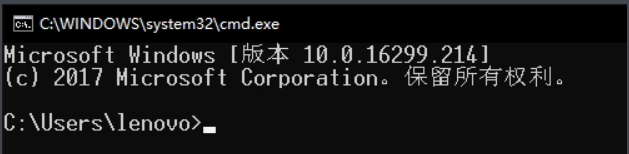
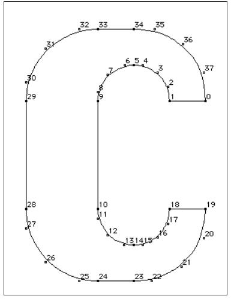

## 13.1 TrueType简介

我们使用的ttf字体，全称是TrueTypeFont。

### 1. 点阵字体

早期的计算机系统中，文字都是以像素点阵形式存储，称之为点阵字体。

点阵字体渲染快，但是容量过大、放大了模糊。

DOS系统中就使用的点阵字体。




### 2. TrueType字体

后期Apple公司开发了TrueType形式的字体结构，在TrueType中，每个字都是以直线和贝塞尔曲线组成，存储数据更少，并且可以任意放大。



不过由于显卡只能处理顶点和纹理，所以必须预先对TrueType中文字的直线和曲线数据做处理，生成对应形状的bitmap，然后才能以纹理的形式进行渲染。

这个生成bitmap的操作是很复杂的，所以在游戏中要避免频繁显示新的文字。

例如在Unity中，我一般会在Loading的时候创建一个看不见的Label，将游戏中需要的文字都放进去，这样在Loading的时候就生成了bitmap。

当然文字太多就不行了，会将FontTexture撑爆。

几乎所有的引擎都选择使用FreeType2来做ttf解析，我也不例外。

```bash
字体渲染仅做功能介绍，想了解更多关于TrueType，可以参考以下资料：
TrueType Reference Manual:https://developer.apple.com/fonts/TrueType-Reference-Manual/
wikipedia:https://zh.wikipedia.org/wiki/TrueType
truetype规范:http://www.truetype-typography.com/
freetype:https://www.freetype.org/freetype2/docs/glyphs/index.html
```