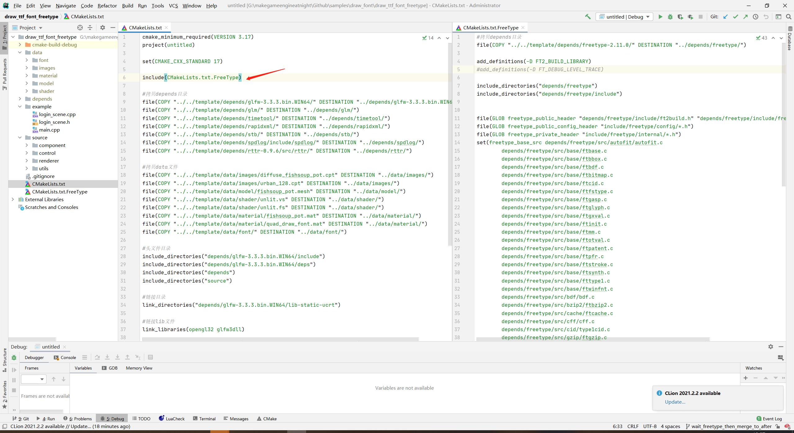
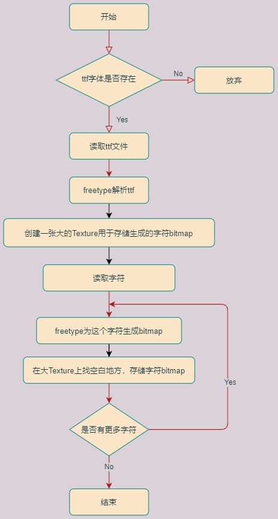
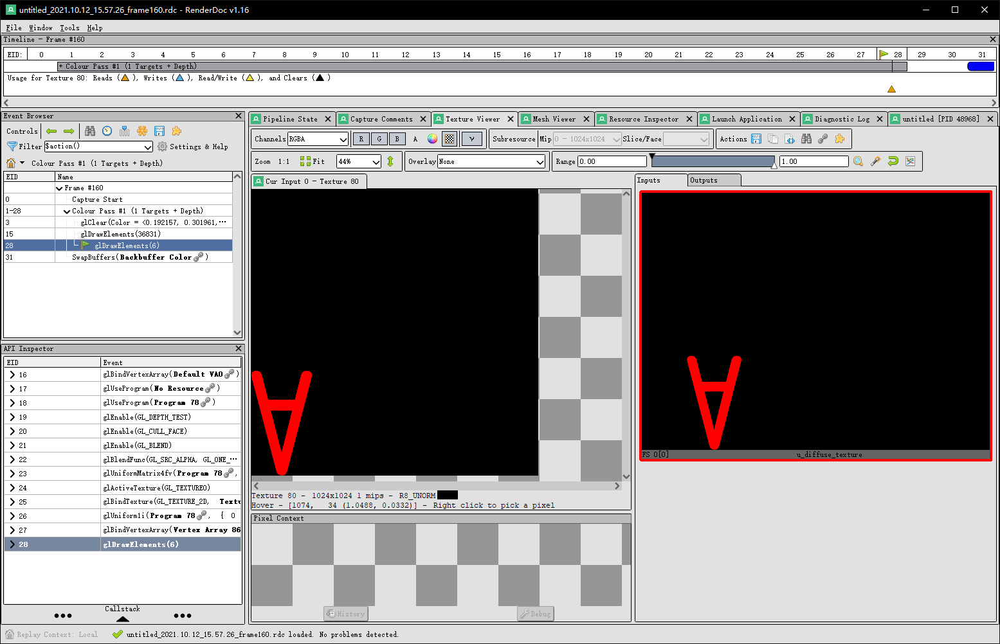

## 13.1 绘制TrueType

```bash
CLion项目文件位于 samples\draw_font\draw_ttf_font_freetype
```
### 1. 了解TrueType

我们使用的ttf字体，全称是TrueTypeFont。

早期的计算机系统中，文字都是以像素点阵形式存储，这带来一系列的问题，容量过大、放大了模糊。

后期Apple公司开发了TrueType形式的字体结构，在TrueType中，每个字都是以直线和贝塞尔曲线组成，存储数据更少，并且可以任意放大。

不过由于显卡只能处理顶点和纹理，所以必须预先对TrueType中文字的直线和曲线数据做处理，生成对应形状的bitmap，然后才能以纹理的形式进行渲染。

这个生成bitmap的操作是很复杂的，所以在游戏中要避免频繁显示新的文字。

在Unity中，我一般会在Loading的时候创建一个看不见的Label，将游戏中需要的文字都放进去，这样在Loading的时候就生成了bitmap。

当然文字太多就不行了，会将FontTexture撑爆。

几乎所有的引擎都选择使用FreeType2来做ttf解析，我也不例外。

```bash
字体渲染仅做功能介绍，想了解更多关于TrueType，可以参考以下资料：
TrueType Reference Manual:https://developer.apple.com/fonts/TrueType-Reference-Manual/
wikipedia:https://zh.wikipedia.org/wiki/TrueType
truetype规范:http://www.truetype-typography.com/
freetype:https://www.freetype.org/freetype2/docs/glyphs/index.html
```

### 2. 引入freetype到项目

`freetype`很庞大，一般来说都是编译成library到项目中link。

但是我想参考SDL，尽量不使用library，所以将`freetype`直接编译。

由于`freetype`代码很多，所以单独创建了`CMakeLists.txt.FreeType`，然后在项目`CMakeLists.txt`进行引用。




freetype主要流程如下图。



主要分2步：

1. 解析ttf字体
2. 对单个字符生成bitmap

下面进行介绍。

### 3. 解析ttf字体

游戏中可能使用多种字体，这里创建`Font`类，加载解析字体文件，然后以字体文件路径为key进行存储。

```c++
//file:source/renderer/font.cpp line:

/// 加载一个字体文件并解析
/// \param image_file_path ttf字体文件路径
/// \param font_size 默认文字尺寸
/// \return
Font* Font::LoadFromFile(std::string font_file_path,unsigned short font_size){
    Font* font=GetFont(font_file_path);
    if(font!= nullptr){
        return font;
    }

    //读取 ttf 字体文件
    ifstream input_file_stream(Application::data_path()+ font_file_path,ios::in | ios::binary);
    input_file_stream.seekg(0,std::ios::end);
    int len = input_file_stream.tellg();
    input_file_stream.seekg(0,std::ios::beg);
    char *font_file_buffer = new char[len];
    input_file_stream.read(font_file_buffer , len);

    //将ttf 传入FreeType解析
    FT_Library ft_library= nullptr;
    FT_Face ft_face= nullptr;
    FT_Init_FreeType(&ft_library);//FreeType初始化;
    FT_Error error = FT_New_Memory_Face(ft_library, (const FT_Byte*)font_file_buffer, len, 0, &ft_face);
    if (error != 0){
        spdlog::error("FT_New_Memory_Face return error {}!",error);
        return nullptr;
    }

    FT_Select_Charmap(ft_face, FT_ENCODING_UNICODE);

    FT_F26Dot6 ft_size = (FT_F26Dot6)(font_size*(1 << 6));

    FT_Set_Char_Size(ft_face, ft_size, 0, 72, 72);

    if (ft_face == nullptr){
        spdlog::error("FT_Set_Char_Size error!");
        return nullptr;
    }

    //创建Font实例，保存Freetype解析字体结果。
    font=new Font();
    font->font_size_=font_size;
    font->font_file_buffer_=font_file_buffer;
    font->ft_library_=ft_library;
    font->ft_face_=ft_face;
    font_map_[font_file_path]=font;

    //创建空白的、仅Alpha通道纹理，用于生成文字。
    unsigned char * pixels = (unsigned char *)malloc(font->font_texture_size_ * font->font_texture_size_);
    memset(pixels, 0,font->font_texture_size_*font->font_texture_size_);
    font->font_texture_=Texture2D::Create(font->font_texture_size_,font->font_texture_size_,GL_ALPHA,GL_ALPHA,GL_UNSIGNED_BYTE,pixels);
    delete pixels;

    return font;
}
```

`freetype`解析ttf字体文件之后，创建了一张1024的Texture：`font->font_texture_`。

这其实就是一张图集，和普通的小图打包成大图唯一的不同之处就是，这里的小图是`freetype`动态生成的bitmap。

当`freetype`为字符动态生成bitmap后，可以使用`OpenGL`提供的API，对图集进行局部更新。

```c
Unity中对UI做DrawCall合并时，也有动态图集的做法，差不多的逻辑。
```

下面就来看下如何为字符动态生成bitmap吧。

### 4. 对单个字符生成bitmap

```c++
//file:source/renderer/font.cpp line:

/// freetype为字符生成bitmap
/// \param c
void Font::LoadCharacter(char ch) {
    //加载这个字的字形,加载到 m_FTFace上面去;Glyph：字形，图形字符 [glif];
    FT_Load_Glyph(ft_face_, FT_Get_Char_Index(ft_face_, ch), FT_LOAD_DEFAULT);

    //从 FTFace上面读取这个字形  到 ft_glyph 变量;
    FT_Glyph ft_glyph;
    FT_Get_Glyph(ft_face_->glyph, &ft_glyph);
    //渲染为256级灰度图
    FT_Glyph_To_Bitmap(&ft_glyph, ft_render_mode_normal, 0, 1);

    FT_BitmapGlyph ft_bitmap_glyph = (FT_BitmapGlyph)ft_glyph;
    FT_Bitmap& ft_bitmap = ft_bitmap_glyph->bitmap;
    font_texture_->UpdateSubImage(0, 0, ft_bitmap.width, ft_bitmap.rows, GL_ALPHA, GL_UNSIGNED_BYTE, ft_bitmap.buffer);
}
```

`FT_Bitmap`结构里就保存着freetype为字符生成的bitmap，从它里面拿到bitmap尺寸、二进制数据，就可以上传到GPU对大的图集局部更新。


可以使用`RenderDoc`对程序进行截屏分析，就可以看到GPU中大图集。



### 5. 绘制

有了`Texture`，那只要像普通图片一样渲染出来就行了。


```c++
//file:example/login_scene.cpp line:

/// 创建文字
void LoginScene::CreateFont() {
    vector<MeshFilter::Vertex> vertex_vector={
            {{-1.0f, -1.0f, 1.0f}, {1.0f,1.0f,1.0f,1.0f},   {0.0f, 0.0f}},
            {{ 1.0f, -1.0f, 1.0f}, {1.0f,1.0f,1.0f,1.0f},   {1.0f, 0.0f}},
            {{ 1.0f,  1.0f, 1.0f}, {1.0f,1.0f,1.0f,1.0f},   {1.0f, 1.0f}},
            {{-1.0f,  1.0f, 1.0f}, {1.0f,1.0f,1.0f,1.0f},   {0.0f, 1.0f}}
    };
    vector<unsigned short> index_vector={
            0,1,2,
            0,2,3
    };
    //创建模型 GameObject
    auto go=new GameObject("quad_draw_font");
    go->set_layer(0x01);

    //挂上 Transform 组件
    auto transform=dynamic_cast<Transform*>(go->AddComponent("Transform"));
    transform->set_position({2.f,0.f,0.f});

    //挂上 MeshFilter 组件
    auto mesh_filter=dynamic_cast<MeshFilter*>(go->AddComponent("MeshFilter"));
    mesh_filter->CreateMesh(vertex_vector,index_vector);

    //创建 Material
    material=new Material();//设置材质
    material->Parse("material/quad_draw_font.mat");

    //挂上 MeshRenderer 组件
    auto mesh_renderer=dynamic_cast<MeshRenderer*>(go->AddComponent("MeshRenderer"));
    mesh_renderer->SetMaterial(material);

    //生成文字贴图
    Font* font=Font::LoadFromFile("font/hkyuan.ttf",500);
    font->LoadCharacter('A');

    //使用文字贴图
    material->SetTexture("u_diffuse_texture", font->font_texture());
}
```

