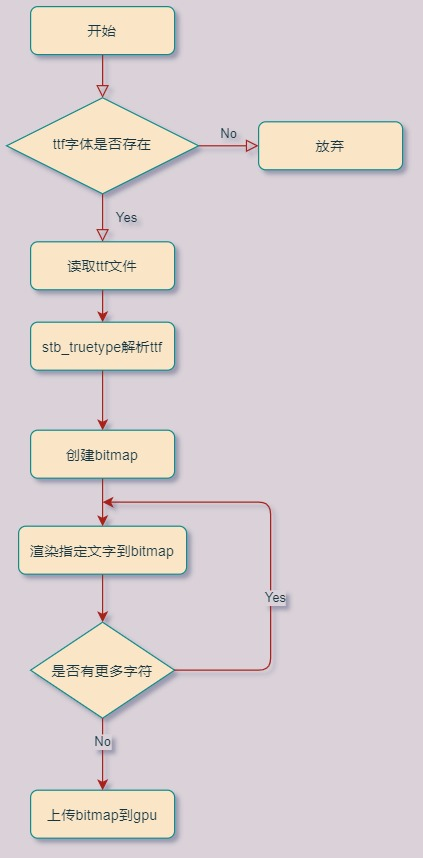
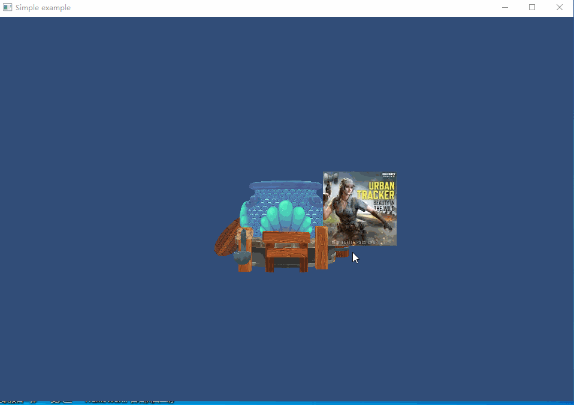

## 13.1 绘制TrueType

```bash
CLion项目文件位于 samples\draw_font\draw_ttf_font
```


我们使用的ttf字体，全称是TrueTypeFont。

早期的计算机系统中，文字都是以像素点阵形式存储，这带来一系列的问题，容量过大、放大了模糊。

后期Apple公司开发了TrueType形式的字体结构，在TrueType中，每个字都是以直线和贝塞尔曲线组成，存储数据更少，并且可以任意放大。

不过由于显卡只能处理顶点和纹理，所以必须预先对TrueType中文字的直线和曲线数据做处理，生成对应形状的bitmap，然后才能以纹理的形式进行渲染。

常用的ttf字体渲染库是FreeType2，强大也庞大。

这里只做一些简单应用，所以选择stb_truetype 这个简洁的库。

```bash
字体渲染仅做简单介绍，后续GUI功能直接集成开源框架CEGUI。
想了解更多关于TrueType，可以参考以下资料：
wikipedia:https://zh.wikipedia.org/wiki/TrueType
truetype规范:http://www.truetype-typography.com/
freetype:https://www.freetype.org/freetype2/docs/glyphs/index.html
```

### 1. 使用stb_truetype生成bitmap

主要流程如下图。



在`Texture2D`类里面添加函数`CreateFromTrueTypeFont`，从ttf字体中创建bitmap。

```c++
//file:source/renderer/texture2d.cpp line:73

Texture2D *Texture2D::CreateFromTrueTypeFont(std::string ttf_file_path, const char* word) {
    //加载ttf字体文件
    FILE* font_file = fopen((Application::data_path()+ ttf_file_path).c_str(), "rb");
    fseek(font_file, 0, SEEK_END);
    long ttf_file_size = ftell(font_file);
    fseek(font_file, 0, SEEK_SET);

    unsigned char* font_buffer = static_cast<unsigned char *>(malloc(ttf_file_size));

    fread(font_buffer, ttf_file_size, 1, font_file);
    fclose(font_file);

    //初始化stb ttf
    stbtt_fontinfo font_info;
    if (!stbtt_InitFont(&font_info, font_buffer, 0))
    {
        spdlog::error("Texture2D::CreateFromTrueTypeFont stbtt_InitFont failed\n");
        delete (font_buffer);
        return nullptr;
    }

    int bitmap_width = 512; /* bitmap width */
    int bitmap_height = 512; /* bitmap height */
    int line_height = 64; /* line height */

    //创建一张bitmap，用来存储stb创建的文字图像
    unsigned char* bitmap = static_cast<unsigned char *>(calloc(bitmap_width * bitmap_height, sizeof(unsigned char)));

    //根据指定的行高，计算 font_info
    float scale = stbtt_ScaleForPixelHeight(&font_info, line_height);

    int x = 0;

    int ascent, descent, lineGap;
    stbtt_GetFontVMetrics(&font_info, &ascent, &descent, &lineGap);

    ascent = roundf(ascent * scale);
    descent = roundf(descent * scale);

    for (int i = 0; i < strlen(word); ++i)
    {
        /* how wide is this character */
        int ax;
        int lsb;
        stbtt_GetCodepointHMetrics(&font_info, word[i], &ax, &lsb);

        /* get bounding box for character (may be offset to account for chars that dip above or below the line */
        int c_x1, c_y1, c_x2, c_y2;
        stbtt_GetCodepointBitmapBox(&font_info, word[i], scale, scale, &c_x1, &c_y1, &c_x2, &c_y2);

        /* compute y (different characters have different heights */
        int y = ascent + c_y1;

        /* render character (stride and offset is important here) */
        int byteOffset = x + roundf(lsb * scale) + (y * bitmap_width);
        stbtt_MakeCodepointBitmap(&font_info, bitmap + byteOffset, c_x2 - c_x1, c_y2 - c_y1, bitmap_width, scale, scale, word[i]);

        /* advance x */
        x += roundf(ax * scale);

        /* add kerning */
        int kern;
        kern = stbtt_GetCodepointKernAdvance(&font_info, word[i], word[i + 1]);
        x += roundf(kern * scale);
    }

    //上下翻转
    for (int i = 0; i < bitmap_width; ++i) {
        for (int j = 0; j < bitmap_height/2; ++j) {
            unsigned char top_char=bitmap[bitmap_width*j+i];
            unsigned char bottom_char=bitmap[bitmap_width*(bitmap_height-j-1)+i];

            bitmap[bitmap_width*(bitmap_height-j-1)+i]=top_char;
            bitmap[bitmap_width*j+i]=bottom_char;
        }
    }

    Texture2D* texture2d=new Texture2D();

    texture2d->gl_texture_format_=GL_RED;
    texture2d->width_=bitmap_width;
    texture2d->height_=bitmap_height;

    //1. 通知显卡创建纹理对象，返回句柄;
    glGenTextures(1, &(texture2d->gl_texture_id_));

    //2. 将纹理绑定到特定纹理目标;
    glBindTexture(GL_TEXTURE_2D, texture2d->gl_texture_id_);

    //3. 将图片rgb数据上传到GPU;
    glTexImage2D(GL_TEXTURE_2D, 0, GL_RED, texture2d->width_, texture2d->height_, 0, texture2d->gl_texture_format_, GL_UNSIGNED_BYTE, bitmap);

    //4. 指定放大，缩小滤波方式，线性滤波，即放大缩小的插值方式;
    glTexParameteri(GL_TEXTURE_2D, GL_TEXTURE_MAG_FILTER, GL_LINEAR);
    glTexParameteri(GL_TEXTURE_2D, GL_TEXTURE_MIN_FILTER, GL_LINEAR);

    delete (bitmap);
    delete (font_buffer);

    return texture2d;
}
```

由于生成的文字bitmap是单通道的，所以这里以 `GL_RED`即R通道上传到GPU，后续渲染出来就是红色的。

### 2.创建Mesh进行渲染

有了文字bitmap后，还需要创建Mesh，展示图片的话只需要4个顶点组成一个面片即可。

```c++
//file:example/login_scene.cpp line:69

void LoginScene::CreateQuad() {
    vector<MeshFilter::Vertex> vertex_vector={
            {{-1.0f, -1.0f, 1.0f}, {1.0f,1.0f,1.0f,1.0f},   {0.0f, 0.0f}},
            {{ 1.0f, -1.0f, 1.0f}, {1.0f,1.0f,1.0f,1.0f},   {1.0f, 0.0f}},
            {{ 1.0f,  1.0f, 1.0f}, {1.0f,1.0f,1.0f,1.0f},   {1.0f, 1.0f}},
            {{-1.0f,  1.0f, 1.0f}, {1.0f,1.0f,1.0f,1.0f},   {0.0f, 1.0f}}
    };
    vector<unsigned short> index_vector={
            0,1,2,
            0,2,3
    };
    //创建模型 GameObject
    auto go=new GameObject("quad_draw_font");
    go->set_layer(0x01);

    //挂上 Transform 组件
    auto transform=dynamic_cast<Transform*>(go->AddComponent("Transform"));
    transform->set_position({2.f,0.f,0.f});

    //挂上 MeshFilter 组件
    auto mesh_filter=dynamic_cast<MeshFilter*>(go->AddComponent("MeshFilter"));
    mesh_filter->CreateMesh(vertex_vector,index_vector);

    //创建 Material
    material=new Material();//设置材质
    material->Parse("material/quad_draw_font.mat");

    //挂上 MeshRenderer 组件
    auto mesh_renderer=dynamic_cast<MeshRenderer*>(go->AddComponent("MeshRenderer"));
    mesh_renderer->SetMaterial(material);
}
```

然后在Update里检测按键`C`弹起，创建文字bitmap用于渲染。

```c++
//file:example/login_scene.cpp line:106

void LoginScene::Update() {
    ......

    //更换贴图
    if(Input::GetKeyUp(KEY_CODE_C)){
        auto texture2D=Texture2D::CreateFromTrueTypeFont("font/hkyuan.ttf","Hello World");
        material->SetTexture("u_diffuse_texture", texture2D);
    }
    ......
}
```

实例运行如下图。

