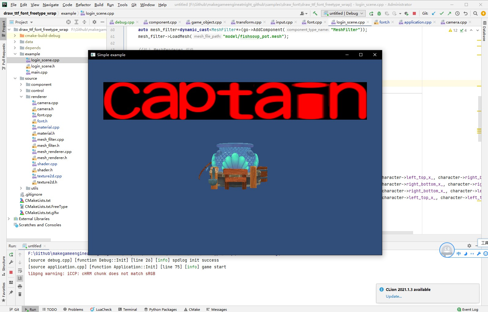

## 13.3 绘制多个文字

```bash
CLion项目文件位于 samples\draw_font\draw_ttf_font_freetype_wrap
```

上一节通过渲染一个字符，来熟悉FreeType的使用方式。

本小节介绍如何渲染多个字符，主要有以下2点：
1. 多个文字生成的bitmap在FontTexture图集的排列
2. 渲染多个文字图片

渲染多个文字，其实就是遍历字符串，为每个字符创建对象渲染。

要渲染字符的图片，需要知道字符bitmap在图集中的坐标，即UV信息，我创建`Character`结构来存储。

```c++
//file:source/renderer/font.h line:23

/// 记录单个字符在图集上的坐标、宽高，用于生成同尺寸的顶点数据，1：1渲染。
struct Character{
    float left_top_x_;
    float left_top_y_;
    float right_bottom_x_;
    float right_bottom_y_;
    Character(float left_top_x,float left_top_y,float right_bottom_x,float right_bottom_y){
        left_top_x_=left_top_x;
        left_top_y_=left_top_y;
        right_bottom_x_=right_bottom_x;
        right_bottom_y_=right_bottom_y;
    }
};
```

### 1. bitmap在文字图集的排列

在日常工作里做UI的时候，总是要打包图集。

图集一般是1024大小，如何将小图合理的排布在这张1024大图上，这是一门学问。

我这里就做最简单的，从左往右排，排满了一行就换一行。

创建变量`font_texture_fill_x`记录当前行的起始点。

创建变量`font_texture_fill_y`记录新的一行的纵向起始点。

```c++
//file:source/renderer/font.h line:48

unsigned short font_texture_fill_x=0;//当前行的起始点
unsigned short font_texture_fill_y=0;//新的一行的纵向起始点
```

修改`LoadCharacter`，为字符生成bitmap之后，判断是否换新的一行用来放置字符bitmap。

字符bitmap成功更新到图集后，记录到`Character`实例Map中，方便后面遍历渲染时通过字符查找UV信息。

```c++
//file:source/renderer/font.cpp line:73

/// freetype为字符生成bitmap
void Font::LoadCharacter(char ch) {
    if(character_map_[ch]!= nullptr){
        return;
    }
    //加载这个字的字形,加载到 m_FTFace上面去;Glyph：字形，图形字符 [glif];
    FT_Load_Glyph(ft_face_, FT_Get_Char_Index(ft_face_, ch), FT_LOAD_DEFAULT);

    //从 FTFace上面读取这个字形  到 ft_glyph 变量;
    FT_Glyph ft_glyph;
    FT_Get_Glyph(ft_face_->glyph, &ft_glyph);
    //渲染为256级灰度图
    FT_Glyph_To_Bitmap(&ft_glyph, ft_render_mode_normal, 0, 1);

    FT_BitmapGlyph ft_bitmap_glyph = (FT_BitmapGlyph)ft_glyph;
    FT_Bitmap& ft_bitmap = ft_bitmap_glyph->bitmap;

    //计算新生成的字符，在图集中的排列。
    if(font_texture_fill_x+ft_bitmap.width>=font_texture_size_){//从左上角往右上角填充，满了就换一行。
        font_texture_fill_x=0;
        font_texture_fill_y+=font_size_;
    }
    if(font_texture_fill_y+font_size_>=font_texture_size_){
        spdlog::error("{} is out of font_texture y",ch);
        return;
    }
    font_texture_->UpdateSubImage(font_texture_fill_x, font_texture_fill_y, ft_bitmap.width, ft_bitmap.rows,  GL_RED, GL_UNSIGNED_BYTE, ft_bitmap.buffer);

    //存储字符信息
    Character* character=new Character(font_texture_fill_x*1.0f/font_texture_size_,font_texture_fill_y*1.0f/font_texture_size_,(font_texture_fill_x+ft_bitmap.width)*1.0f/font_texture_size_,(font_texture_fill_y+ft_bitmap.rows)*1.0f/font_texture_size_);
    character_map_[ch]=character;

    font_texture_fill_x+=ft_bitmap.width;
}
```

### 2. 渲染多个文字图片

首先是对传入的字符串遍历，生成字符bitmap。

```c++
//file:source/renderer/font.cpp line:107

/// 为字符串生成bitmap，返回字符串每个字符的Character数据。
/// \param str
/// \return
std::vector<Font::Character*> Font::LoadStr(std::string str) {
    //生成所有的字符 bitmap
    for(auto ch : str){
        LoadCharacter(ch);
    }
    //返回所有字符信息
    std::vector<Character*> character_vec;
    for(auto ch : str){
        auto character=character_map_[ch];
        if(character==nullptr){
            spdlog::error("LoadStr error,no bitmap,ch:{}",ch);
            continue;
        }
        character_vec.push_back(character);
    }
    return character_vec;
}
```

最后是返回了一个`Character`实例列表，里面记录了每个字符的UV信息。

那么接口准备好了，直接调用生成，然后直接遍历渲染。

```c++
//file:example/login_scene.cpp line:70

void LoginScene::CreateFont() {
    std::string str="Captain";
    //生成文字贴图
    Font* font=Font::LoadFromFile("font/hkyuan.ttf",100);
    std::vector<Font::Character*> character_vec=font->LoadStr(str);

    //遍历每个字符进行绘制
    int offset_x=0;
    for(auto character : character_vec){
        offset_x+=2;
        //因为FreeType生成的bitmap是上下颠倒的，所以这里UV坐标也要做对应翻转，将左上角作为零点。
        vector<MeshFilter::Vertex> vertex_vector={
                { {-1.0f+offset_x, 2.0f, 1.0f}, {1.0f,1.0f,1.0f,1.0f},   {character->left_top_x_, character->right_bottom_y_} },
                { { 1.0f+offset_x, 2.0f, 1.0f}, {1.0f,1.0f,1.0f,1.0f},   {character->right_bottom_x_, character->right_bottom_y_} },
                { { 1.0f+offset_x,  4.0f, 1.0f}, {1.0f,1.0f,1.0f,1.0f},   {character->right_bottom_x_, character->left_top_y_} },
                { {-1.0f+offset_x,  4.0f, 1.0f}, {1.0f,1.0f,1.0f,1.0f},   {character->left_top_x_, character->left_top_y_} }
        };
        vector<unsigned short> index_vector={
                0,1,2,
                0,2,3
        };
        //创建模型 GameObject
        auto go=new GameObject("quad_draw_font");
        go->set_layer(0x01);

        //挂上 Transform 组件
        auto transform=dynamic_cast<Transform*>(go->AddComponent("Transform"));
        transform->set_position({-8.f,0.f,0.f});

        //挂上 MeshFilter 组件
        auto mesh_filter=dynamic_cast<MeshFilter*>(go->AddComponent("MeshFilter"));
        mesh_filter->CreateMesh(vertex_vector,index_vector);

        //创建 Material
        auto material=new Material();//设置材质
        material->Parse("material/quad_draw_font.mat");

        //挂上 MeshRenderer 组件
        auto mesh_renderer=dynamic_cast<MeshRenderer*>(go->AddComponent("MeshRenderer"));
        mesh_renderer->SetMaterial(material);

        //使用文字贴图
        material->SetTexture("u_diffuse_texture", font->font_texture());
    }
}
```

运行效果：

