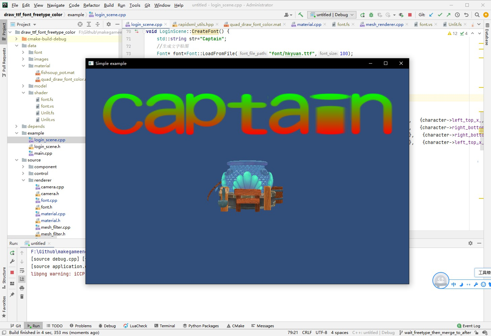

## 13.4 彩色字

```bash
CLion项目文件位于 samples\draw_font\draw_ttf_font_freetype_color
```

`[13.2 绘制单个字符]`结尾介绍了为什么文字是红色的。

这是因为FreeType生成的是bitmap，作为单通道即可，而OpenGL对单通道可选的format只有GL_RED，所以在创建Texture的时候就使用了GL_RED，那么在片段Shader中就读取到R通道，就是RED，红色通道。

那现在要渲染彩色的文字怎么办呢？

FreeType生成的是bitmap，其实是Alpha数据，那我只要将片段Shader中的R通道数据，作为A通道使用。

然后另外再传入一个颜色进来作为最终RGB颜色输出即可。

而顶点颜色，就可以作为颜色传入。

### 1. 使用顶点颜色作为文字颜色

创建文字专用的`font.vs` `font.fs`，内容分别如下：

```glsl
#version 330 core

uniform mat4 u_mvp;

layout(location = 0) in  vec3 a_pos;
layout(location = 1) in  vec4 a_color;
layout(location = 2) in  vec2 a_uv;

out vec4 v_color;
out vec2 v_uv;

void main()
{
    gl_Position = u_mvp * vec4(a_pos, 1.0);
    v_color = a_color;
    v_uv = a_uv;
}
```

```glsl
#version 330 core

uniform sampler2D u_diffuse_texture;

in vec4 v_color;
in vec2 v_uv;
layout(location = 0) out vec4 o_fragColor;
void main()
{
    vec4 pixColor=texture(u_diffuse_texture,v_uv);
    o_fragColor = vec4(v_color.x,v_color.y,v_color.z,pixColor.r);
}
```

顶点Shader和之前章节用的一致，有区别的在片段Shader。

```glsl
vec4 pixColor=texture(u_diffuse_texture,v_uv);
```

借助`texture()`函数从纹理取出颜色数据，字体纹理是`GL_RED`格式，那么只有R通道有数据。

```glsl
o_fragColor = vec4(v_color.x,v_color.y,v_color.z,pixColor.r);
```

所以这里将顶点颜色`v_color`作为最终RGB，然后将文字图集的R通道作为Alpha，组合输出。

### 2. 测试

修改顶点颜色数据。

```c++
//file:example/login_scene.cpp line:82

void LoginScene::CreateFont() {
    ......

    //遍历每个字符进行绘制
    int offset_x=0;
    for(auto character : character_vec){
        offset_x+=2;
        //因为FreeType生成的bitmap是上下颠倒的，所以这里UV坐标也要做对应翻转，将左上角作为零点。
        vector<MeshFilter::Vertex> vertex_vector={
                { {-1.0f+offset_x, 2.0f, 1.0f}, {1.0f,0.0f,0.0f,1.0f},   {character->left_top_x_, character->right_bottom_y_} },
                { { 1.0f+offset_x, 2.0f, 1.0f}, {1.0f,0.0f,0.0f,1.0f},   {character->right_bottom_x_, character->right_bottom_y_} },
                { { 1.0f+offset_x,  4.0f, 1.0f}, {0.0f,1.0f,0.0f,1.0f},   {character->right_bottom_x_, character->left_top_y_} },
                { {-1.0f+offset_x,  4.0f, 1.0f}, {0.0f,1.0f,0.0f,1.0f},   {character->left_top_x_, character->left_top_y_} }
        };
        ......
    }
}
```

顶点颜色如下:

```c++
{1.0f,0.0f,0.0f,1.0f}, 
{1.0f,0.0f,0.0f,1.0f}, 
{0.0f,1.0f,0.0f,1.0f},
{0.0f,1.0f,0.0f,1.0f},
```

这里就是将底部颜色修改为`RED`，顶部颜色修改为`GREEN`。

由于顶点颜色是从顶点Shader传输到片段Shader的，在介绍Shader的章节提到过，从顶点Shader传输到片段Shader的数据都是经过插值的。

所以上面的修改，会得到渐变效果。

测试效果如下图：



