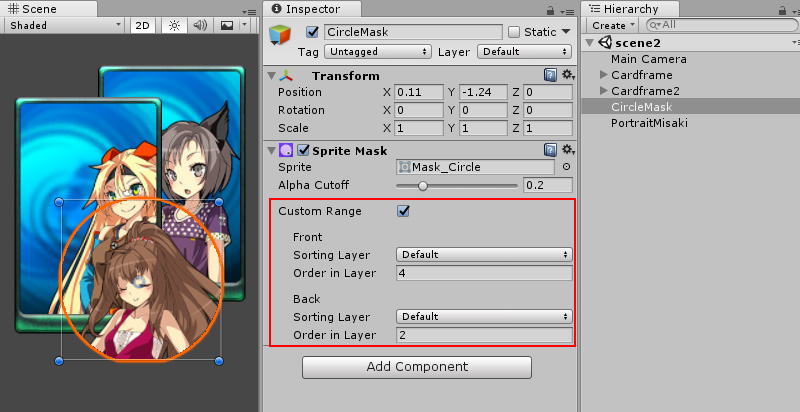

## 14. GUI

觉得GUI主要有下面3个基本单元：
1. 图片
2. 文字
3. Mask

图片是GUI的基本单元，一个漂亮的UI都是由一个个的图片拼成的。

文字是GUI动态的体现，按钮上的文字，对话中的文字都是动态设置的。

Mask则让GUI有了更多的变化,如下图Unity圆形Mask，让被Mask的图片只显示圆形范围。

复杂的UI也是由基本单元组成，例如`Button`是由图片和文字组成，`ScrollView`是由图片、文字、Mask组成。

这一章介绍GUI基础控件实现。
1. Sprite
2. Text
3. Button
4. Mask