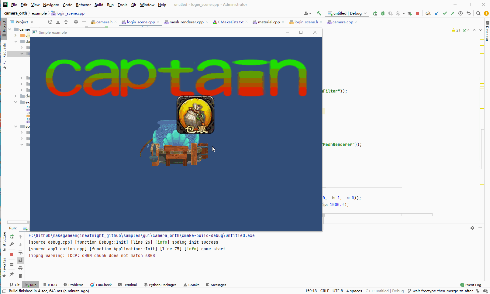

## 14.1 正交相机

GUI和3D场景物体的区别：

1. 场景物体需要近大远小的效果，而GUI是忽略Z的，不管距离相机多远，都是相同的大小。
2. GUI里的图片，显示出来在屏幕上占的像素尺寸，就是图片实际的尺寸，所以构造的顶点坐标使用屏幕实际坐标。例如在1920x1080屏幕中心显示100x100的图片，以屏幕中心为零点，那么构造的顶点可以是(-50,-50),(50,-50),(50,50),(-50,50)。

一般用正交相机来做UI相机。

### 1. 正交相机矩阵实现

在前面的`10. 相机` 介绍了，相机就是提供一个矩阵的。

一般正交相机尺寸就等于游戏界面尺寸，以屏幕中心为零点，计算得到左右上下的坐标代入`glm::ortho`就可以获得一个正交相机矩阵。

在`Camera`里添加函数。

```c++
//file:source/renderer/camera.cpp line:50

/// 设置正交相机矩阵
/// \param left
/// \param right
/// \param bottom
/// \param top
/// \param z_near
/// \param z_far
void Camera::SetOrthographic(float left,float right,float bottom,float top,float z_near,float z_far) {
    projection_mat4_=glm::ortho(left,right,bottom,top,z_near,z_far);
}
```

### 2. 使用正交相机

创建`GameObject`，挂上`Camera`组件并设置正交相机矩阵参数，作为UI相机。

因为存在多个相机，相互负责显示的物体不一样，所以设置不同的`culling_mask`。

UI是显示在最上层的，所以UI相机的`depth`也要比场景相机大。

具体代码如下：

```c++
//file:example/login_scene.cpp line:118

/// 创建UI
void LoginScene::CreateUI() {
    //创建UI相机 GameObject
    auto go_camera_ui=new GameObject("ui_camera");
    //挂上 Transform 组件
    auto transform_camera_ui=dynamic_cast<Transform*>(go_camera_ui->AddComponent("Transform"));
    transform_camera_ui->set_position(glm::vec3(0, 0, 10));
    //挂上 Camera 组件
    auto camera_ui=dynamic_cast<Camera*>(go_camera_ui->AddComponent("Camera"));
    camera_ui->set_depth(1);
    camera_ui->set_culling_mask(0x02);
    //UI相机不能清除之前的颜色。不然用第一个相机矩阵渲染的物体就被清除 没了。
    camera_ui->set_clear_flag(GL_DEPTH_BUFFER_BIT);
    //设置正交相机
    camera_ui->SetView(glm::vec3(0, 0, 0), glm::vec3(0, 1, 0));
    camera_ui->SetOrthographic(-Screen::width()/2,Screen::width()/2,-Screen::height()/2,Screen::height()/2,-100,100);

    //加载图片
    auto texture2D=Texture2D::LoadFromFile("images/mod_bag.cpt");

    //生成顶点数据
    vector<MeshFilter::Vertex> vertex_vector={
            { {0.f, 0.0f, 0.0f}, {1.0f,1.0f,1.0f,1.0f},   {0.f, 0.f} },
            { {texture2D->width(), 0.0f, 0.0f}, {1.0f,1.0f,1.0f,1.0f},   {1.f, 0.f} },
            { {texture2D->width(),  texture2D->height(), 0.0f}, {1.0f,1.0f,1.0f,1.0f},   {1.f, 1.f} },
            { {0.f,  texture2D->height(), 0.0f}, {1.0f,1.0f,1.0f,1.0f},   {0.f, 1.f} }
    };
    vector<unsigned short> index_vector={
            0,1,2,
            0,2,3
    };
    //创建UI GameObject
    auto go=new GameObject("image_mod_bag");
    go->set_layer(0x02);

    //挂上 Transform 组件
    go->AddComponent("Transform");

    //挂上 MeshFilter 组件
    auto mesh_filter=dynamic_cast<MeshFilter*>(go->AddComponent("MeshFilter"));
    mesh_filter->CreateMesh(vertex_vector,index_vector);

    //创建 Material
    auto material=new Material();//设置材质
    material->Parse("material/ui_image.mat");

    //挂上 MeshRenderer 组件
    auto mesh_renderer=dynamic_cast<MeshRenderer*>(go->AddComponent("MeshRenderer"));
    mesh_renderer->SetMaterial(material);
    material->SetTexture("u_diffuse_texture", texture2D);
}
```

测试结果如下图：



物体坐标示意：

