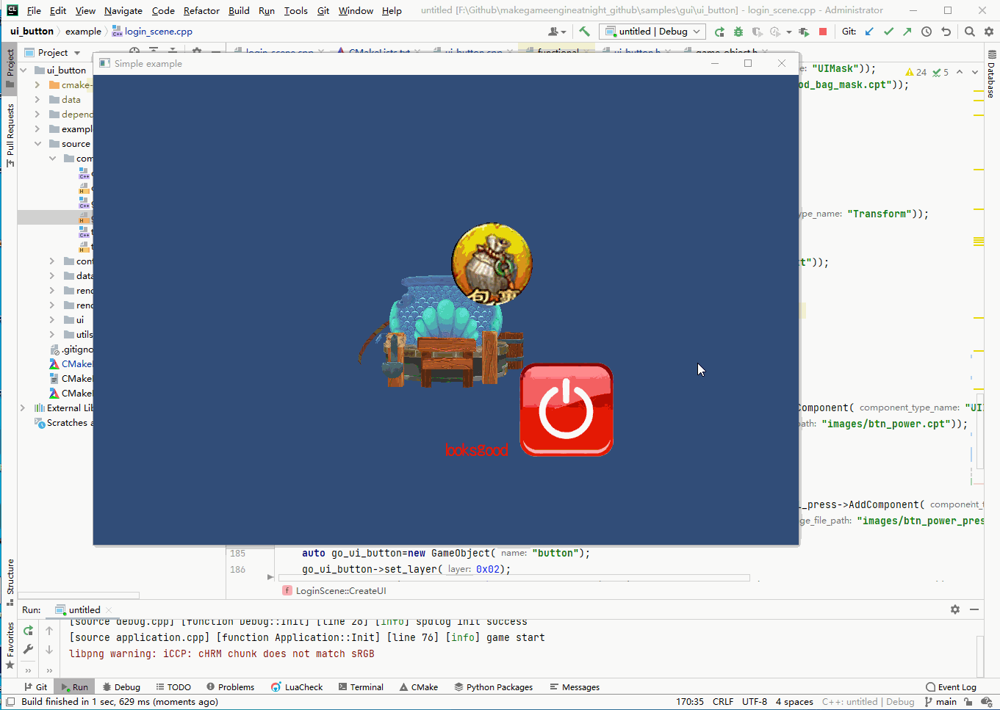

## 14.5 UIButton

```bash
CLion项目文件位于 samples\gui\ui_button
```

按钮，简单实现就是一张可以点击的图片，即`UIImage`+`Input`。

### 1. UIButton实现

做了一个简单的实现。

```c++
//file:source/ui/ui_button.h line:13

class UIButton : public Component {
public:
    UIButton();
    ~UIButton();

    void set_image_normal(UIImage* image){image_normal_=image;}
    void set_image_press(UIImage* image){image_press_=image;}
    /// 设置按钮点击回调
    /// \param callback
    void set_click_callback(std::function<void()> click_callback){click_callback_=click_callback;}
public:
    void Update() override;
private:
    UIImage* image_normal_;//普通状态显示图片
    UIImage* image_press_;//按压状态显示图片
    bool pressed_;//当前按钮状态是否按下
    std::function<void()> click_callback_;//按钮点击回调
};
```
头文件就看出`UIButton`核心要素：
1. 普通状态图片
2. 按下状态图片
3. 按钮点击回调

因为`GameObject`节点管理目前尚未完成，还没有`position`、`local_position`坐标计算。
所以这里先将两个`UIImage`保存为成员变量，在`Update`里同步为父节点坐标。

```c++
//file:source/ui/ui_button.cpp line:31

void UIButton::Update() {
    Component::Update();

    if(image_normal_== nullptr || image_press_== nullptr){
        return;
    }

    Transform* transform=dynamic_cast<Transform*>(game_object()->GetComponent("Transform"));
    //按钮的图片 与 按钮坐标同步
    Transform* transform_image_normal=dynamic_cast<Transform*>(image_normal_->game_object()->GetComponent("Transform"));
    Transform* transform_image_press=dynamic_cast<Transform*>(image_press_->game_object()->GetComponent("Transform"));
    transform_image_normal->set_position(transform->position());
    transform_image_press->set_position(transform->position());

    if(Input::GetMouseButtonDown(MOUSE_BUTTON_LEFT)){
        auto transform_position=transform->position();
        //获取鼠标坐标，并从左上角零点，转换为屏幕中心零点。
        auto mouse_position=Input::mousePosition();
        mouse_position.x=mouse_position.x-Screen::width()/2;
        mouse_position.y=Screen::height()/2-mouse_position.y;
        //获取按钮图片宽高
        float image_normal_width=image_normal_->texture2D()->width();
        float image_normal_height=image_normal_->texture2D()->height();
        //计算鼠标点击是否在按钮图片范围内
        if((mouse_position.x>transform_position.x && mouse_position.x<transform_position.x+image_normal_width)&&
            (mouse_position.y>transform_position.y && mouse_position.y<transform_position.y+image_normal_height)){
            if(pressed_){
                return;
            }
            pressed_=true;
            //触发按钮点击回调
            if(click_callback_){
                click_callback_();
            }
        }else{
            pressed_=false;
        }
    }else{
        pressed_=false;
    }
    //当press为true 关闭普通状态图片，激活按下状态图片.否则反转。
    transform_image_normal->game_object()->set_active(!pressed_);
    transform_image_press->game_object()->set_active(pressed_);
}
```

在`Update()`里，通过`Input::mousePosition()`获取鼠标坐标，然后判断鼠标左键按下。

如果在按钮图片范围内，就触发了按钮回调。

需要提一下的是，`Input::mousePosition()`获取鼠标坐标是以屏幕左上角为零点的，而按钮、图片都是以屏幕中心为零点的，需要做转换。

### 2. 测试

在`LoginScene::CreateUI()`中，创建`UIButton`。
设置按钮回调函数，当按钮点击时，切换之前的`UIMask`激活状态。

```c++
//file:example/login_scene.cpp line:172

void LoginScene::CreateUI() {
    ......

    //创建按钮普通状态图片
    auto go_button_image_normal=new GameObject("btn_power");
    go_button_image_normal->set_layer(0x02);
    go_button_image_normal->AddComponent("Transform");
    auto ui_image_button_image_normal=dynamic_cast<UIImage*>(go_button_image_normal->AddComponent("UIImage"));
    ui_image_button_image_normal->set_texture(Texture2D::LoadFromFile("images/btn_power.cpt"));
    //创建按钮按下状态图片
    auto go_button_image_normal_press=new GameObject("btn_power_press");
    go_button_image_normal_press->set_layer(0x02);
    go_button_image_normal_press->AddComponent("Transform");
    auto ui_image_button_image_normal_press=dynamic_cast<UIImage*>(go_button_image_normal_press->AddComponent("UIImage"));
    ui_image_button_image_normal_press->set_texture(Texture2D::LoadFromFile("images/btn_power_press.cpt"));
    //创建按钮
    auto go_ui_button=new GameObject("button");
    go_ui_button->set_layer(0x02);
    auto transform_ui_button =dynamic_cast<Transform*>(go_ui_button->AddComponent("Transform"));
    transform_ui_button->set_position({100.f,-200.f,0});
    auto ui_button=dynamic_cast<UIButton*>(go_ui_button->AddComponent("UIButton"));
    ui_button->set_image_normal(ui_image_button_image_normal);
    ui_button->set_image_press(ui_image_button_image_normal_press);
    ui_button->set_click_callback([=](){
        go_ui_mask->set_active(!go_ui_mask->active());
    });
}
```

测试结果如下：

