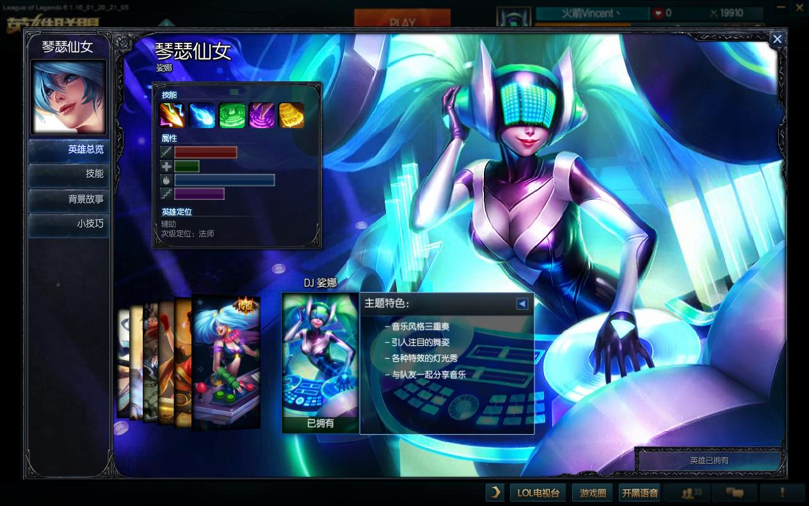
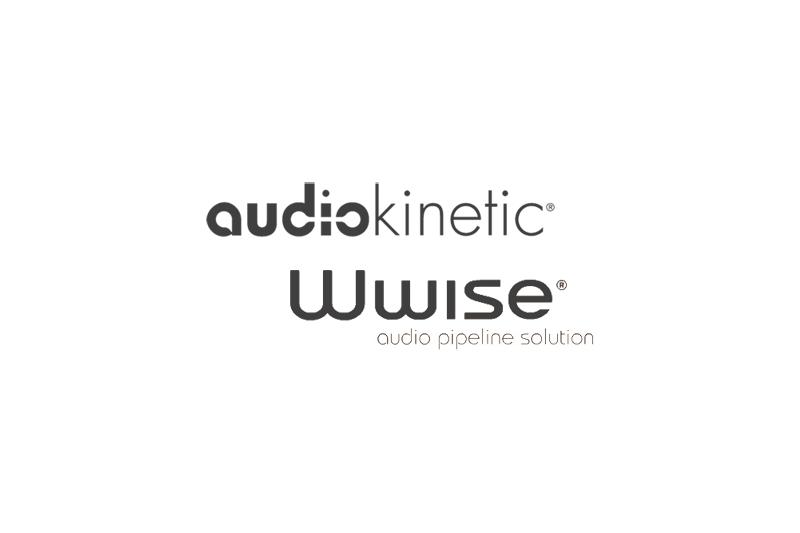

## 14. 播放音效

每到新赛季，LOL都会更换BGM，新出的英雄有专属角色歌曲，以至于玩家戏称音乐大厂拳头公司。

从登录界面开始到对局的每一秒，音乐将玩家带入到紧张刺激的战场。

现代游戏中的重要性越来越突出，每个角色、每个技能、每一句话都需要单独录制音效，以LOL为例，游戏内音效多达上万条。

庞大的音效数量给项目管理带来了巨大挑战，游戏安装包体也越来大，旧时代直接播放mp3/ogg文件的形式不能适应这种情况，现代化的音效引擎应运而生，FMOD和Wwise是最热门的两款。

<table>
<tr>
<td></td>
<td></td>
</tr>
</table>

FMOD和Wwise十分相像，都有以下特点：

1. 提供音频编辑器。
2. 音频资产最终打包为.bank文件。
3. 以Event形式触发音频播放。
4. 支持3d音效。

两者商业非开源音效引擎，但是又都对独立开发者免费开放，具体限制如下：

<table>
<tr ><td bgcolor="AliceBlue"><b></td><td bgcolor="AliceBlue"><b>免费独立授权</td></tr>
<tr><td><b>FMOD</td><td>需要注册项目，年收入低于20万美元，开发预算较少(低于50万美元)。</td></tr>
<tr><td rowspan="6"><b>Wwise</td><td>需要注册项目，开发预算低于15万美元，有500个音频资源的限制。</td></tr>
</table>

两者并无太大优劣之分，目前来看大型游戏项目选择Wwise居多，FMOD也有很多开发者在使用，我这里选择FMOD，主要是它下载使用很方便、lib文件少。

FMOD分为两个部分：

1. 音频解析，直接解析mp3/ogg等文件，直接播放。
2. 对fmod studio项目打包的bank文件解析，通过event触发播放。

另外需要关注的是3个概念：

1. System：管理 fmod系统，设置声卡、加载plugin等。
2. Sound：托管加载的音效文件。
3. Channel：正在播放的音频实例，音效播放后分配一个Channel，播放完毕后回收，用来设定音量、控制播放暂停等。

本章逐一介绍。

