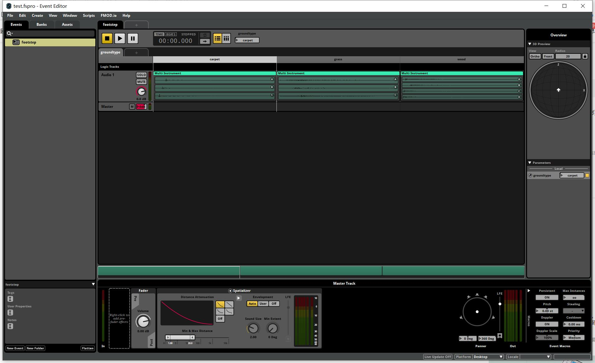

## 14.3 使用FMOD Studio音频引擎

```bash
CLion项目文件位于 samples/audio/load_bank
```

前面两小节介绍了如何使用FMOD提供的库，来解析播放音频文件，并实现了类似Unity中的AudioSource组件。

但是这仅仅是FMOD Studio提供的基础功能，作为一款商用音频引擎，FMOD提供了音频解析、编辑、打包整个流程。

更为主要的是，FMOD通过Event的形式，将音频的效果配置工作完全交给了策划，程序只需要播放Event即可。

隔离不同工种之间的联系，将音频工作流水线化，这是大型项目所必备的。

FMOD Studio分为两部分：音频编辑器和解析库。

我这里通过一个小项目，根据地面类型，切换不同的脚步声，来分别介绍这两部分。

### 1.FMOD Studio音频编辑

在FMOD Studio中，可以创建项目、加载音效文件、创建Event、设置切换音频条件参数、设置混音效果。



上图是打开项目的主界面图。

本小节用到的FMOD Studio项目制作以及打包bank全过程，已经录制了视频在B站：

```bash
https://www.bilibili.com/video/BV1yv411K7kU
```

项目文件存放在：

```bash
files\audio\load_bank\test\test.fspro
```


### 2.加载bank并播放

<font color=red>注意：使用FMOD Studio打包bank并播放的形式，和前2节直接播放wav文件不提供兼容，只能选一种使用。

在`CMakeList.txt`中添加了预处理器`USE_FMOD_STUDIO`，用来标记是否使用FMOD Studio打包bank并播放。</font>

```c++
///file:samples/audio/load_bank/CMakeLists.txt line:5

add_definitions(-D USE_FMOD_STUDIO)#是否使用fmod studio，加载bank文件的形式。
```

为此创建新的结构 `AudioStudio` 来封装FMOD Studio的相关接口。

对FMOD Studio加载bank并播放，按照下图流程走：


#### 2.1 初始化FMOD Studio

首先调用API `FMOD_Studio_System_Create` 创建 `FMOD_STUDIO_SYSTEM`。
然后调用API `FMOD_Studio_System_Initialize` 进行初始化。

```c++
///file:source/audio/studio/audio_studio.cpp line:11

/// 初始化FMOD Studio
FMOD_RESULT AudioStudio::Init() {
    FMOD_RESULT result=FMOD_Studio_System_Create(&system_, FMOD_VERSION);
    if(result!=FMOD_OK){
        return result;
    }
    result=FMOD_Studio_System_Initialize(system_, 1024, FMOD_STUDIO_INIT_NORMAL, FMOD_INIT_NORMAL, nullptr);
    if(result!=FMOD_OK){
        return result;
    }
    return FMOD_OK;
}
```

#### 2.2 加载bank

调用`FMOD_Studio_System_LoadBankFile`就可以加载bank文件了。

```c++
///file:source/audio/studio/audio_studio.cpp line:30

/// 加载 bank 文件
/// \param file_name
/// \return
FMOD_RESULT AudioStudio::LoadBankFile(string file_name) {
    string bank_path=Application::data_path()+file_name;
    FMOD_STUDIO_BANK* bank= nullptr;
    return FMOD_Studio_System_LoadBankFile(system_, bank_path.c_str(), FMOD_STUDIO_LOAD_BANK_NORMAL, &bank);
}
```

#### 2.3 创建Event实例

Event就是一个音效，只不过这个音效包含：一个或多个音频文件、混音、参数等信息。

创建Event实例后，就可以对其进行播放暂停，以及更高级的调整参数操作。

这里创建新的结构 `AudioStudioEvent` 来封装Event实例的相关操作。

```c++
///file:source/audio/studio/audio_studio.cpp line:38

/// 获取Event实例，如果没有就创建。
/// \param event_path
/// \return
AudioStudioEvent* AudioStudio::CreateEventInstance(const char *event_path) {
    FMOD_STUDIO_EVENTDESCRIPTION* event_description= nullptr;
    FMOD_RESULT result= FMOD_Studio_System_GetEvent(system_, event_path, &event_description);
    if(result!=FMOD_OK){
        DEBUG_LOG_ERROR("FMOD_Studio_System_GetEvent result:{},event_path:{}",result,event_path);
        return nullptr;
    }
    FMOD_STUDIO_EVENTINSTANCE* event_instance=nullptr;
    result= FMOD_Studio_EventDescription_CreateInstance(event_description,&event_instance);
    if(result!=FMOD_OK){
        DEBUG_LOG_ERROR("FMOD_Studio_EventDescription_CreateInstance result:{},event_path:{}",result,event_path);
        return nullptr;
    }
    AudioStudioEvent* audio_studio_event=new AudioStudioEvent();
    audio_studio_event->set_event_instance(event_instance);
    return audio_studio_event;
}
```

这里其实分了2步：

1. 调用`FMOD_Studio_System_GetEvent` 通过Event名，获取`FMOD_STUDIO_EVENTDESCRIPTION`Event描述。
2. 调用`FMOD_Studio_EventDescription_CreateInstance`创建Event实例。

然后将Event实例，交给`AudioStudioEvent`。

#### 2.4 播放Event实例

Event实例的播放、暂停、设置参数操作，都在`AudioStudioEvent`中进行。

调用`FMOD_Studio_EventInstance_Start`即可对Event实例进行播放。

```c++
///file:source/audio/studio/audio_studio_event.cpp line:23

/// 播放Event实例
void AudioStudioEvent::Start() {
    if(event_instance_== nullptr){
        DEBUG_LOG_ERROR("event_instance_== nullptr");
        return;
    }
    FMOD_RESULT result=FMOD_Studio_EventInstance_Start(event_instance_);
    if(result!=FMOD_OK){
        DEBUG_LOG_ERROR("FMOD_Studio_EventInstance_Start result:{}",result);
        return;
    }
}
```

如果只是播放音效，那么在这里就已经可以了。

不过这次的项目是，根据地面类型，切换不同的脚步声，在FMOD编辑器中已经添加好了地面类型这个参数，所以要继续对Event实例设置参数。

#### 2.5 设置Event参数


