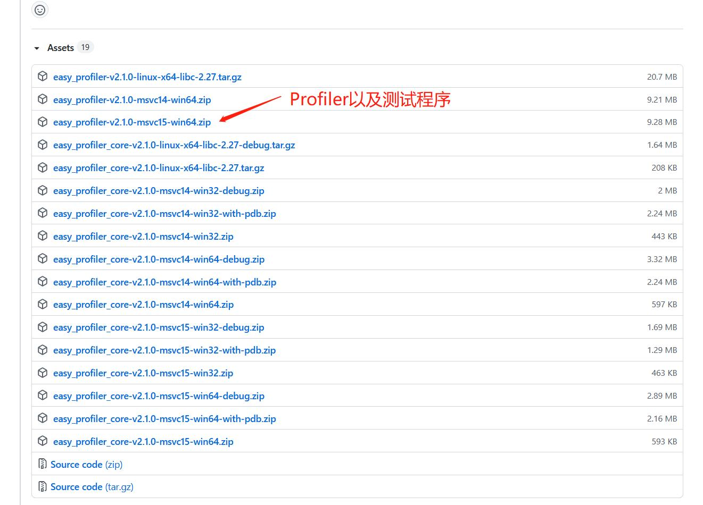
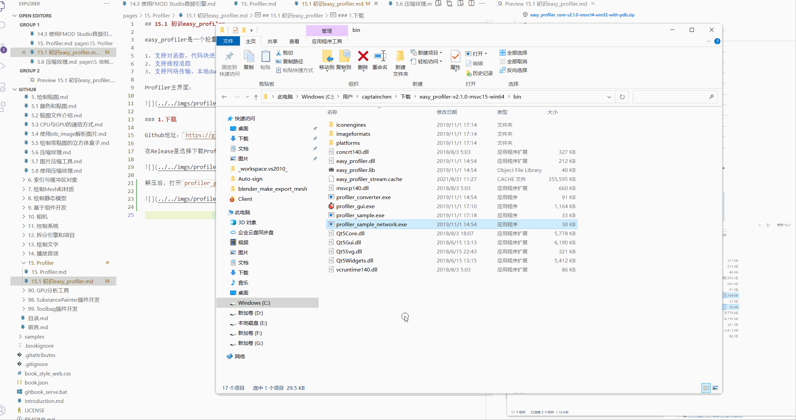
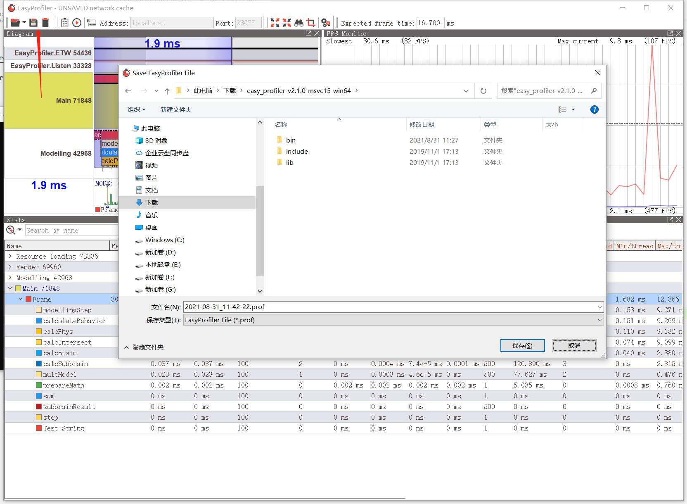

## 15.1 初识easy_profiler

easy_profiler是一个轻量的性能分析器，实现了以下功能：

1. 支持对函数、代码块进行追踪
2. 支持线程追踪
3. 支持网络传输、本地dump的形式传输数据

Profiler主界面：

这一节来熟悉下easy_profiler的使用。

### 1.下载

Github地址：`https://github.com/yse/easy_profiler`

在Release里选择下载Profiler以及测试程序。

### 2.使用

解压后，打开`profiler_gui.exe`、`profiler_sample_network.exe`进行测试。

easy_profiler使用分3步：

1. 启动`profiler_sample_network.exe`程序用于模拟游戏程序，监听`profiler_gui.exe`连接。
2. 启动`profiler_gui.exe`，点击左侧Connect按钮，连接到`profiler_sample_network.exe`，成功后即可显示fps信息。
3. 点击左侧录制按钮，开始录制帧数据。录制几秒后，点击中间按钮，结束录制，开始分析。

参考动图：

点击保存按钮，可以将当前Profiler数据保存为文件。

