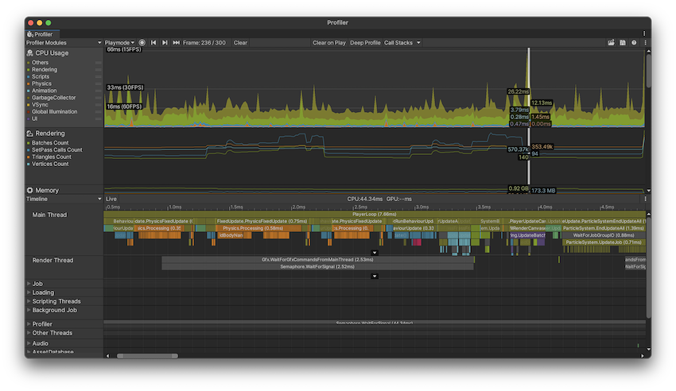

## 16. Profiler

截止现在已经实现了引擎中的一些系统，是时候开始对性能做一些分析。

在`5.6 压缩纹理` 这一节中，为了测试`stbi_load`加载并解析png图片的耗时，使用了`StopWatch`，用法如下：

```c++
StopWatch stopwatch;
stopwatch.start();
......

stopwatch.stop();
```

如果再对输出的log加上层次关系，那么也可以成为不错的性能分析工具，实际项目中也经常这么干。

不过更期待的，是类似`Unity Profiler`可视化的性能分析器，有FPS、函数堆栈、耗时占比等详细信息。



在Github上搜索`c++ profiler`，还是能找到挺多的。

这里选择了`easy_profiler`，主要是考虑到API接入简单，Profiler界面是Qt编写，方便跨平台移植。


本章介绍`easy_profiler`的下载安装、build、融入引擎过程。


