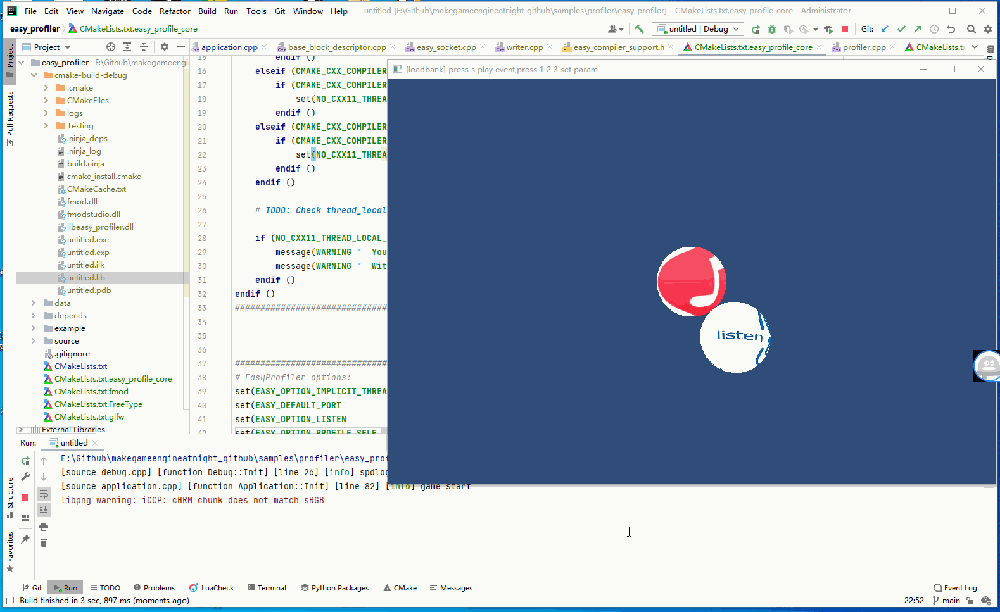
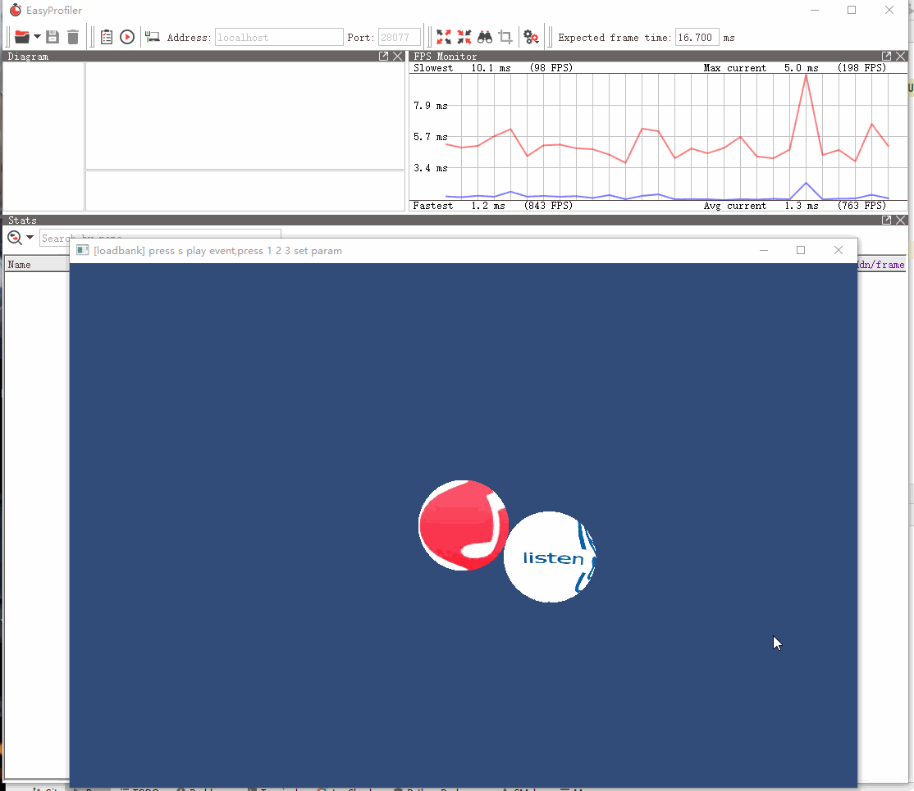
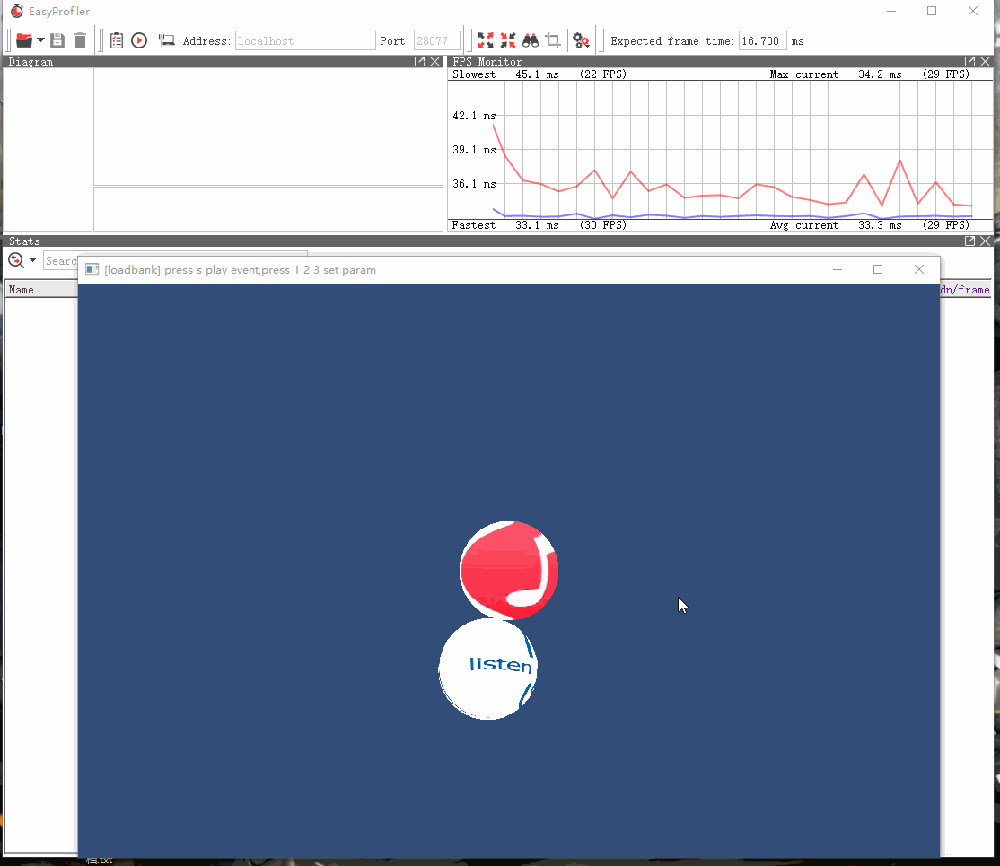

## 16.2 集成easy_profiler

```bash
CLion项目文件位于 samples/profiler/easy_profiler
```

要将`easy_profiler`作为引擎的性能分析器，需要将`easy_profiler`集成引擎调用。

下面开始集成。

### 1. 初始化监听

代码如下：

```c++
///file:source/utils/application.cpp line:68

/// 初始化
void Application::Init() {
    EASY_MAIN_THREAD;
    profiler::startListen();// 启动profiler服务器，等待gui连接。
    ......
}
```

引擎中存在多个线程，使用`EASY_MAIN_THREAD`来标记这里是主线程，这个宏展开如下：

```c++
# define EASY_MAIN_THREAD EASY_THREAD("Main")
```

那么其他线程，例如文件加载线程就可以这样标记：`EASY_THREAD("Load")`。

游戏端是作为`easy_profiler`的Server端，监听`profiler_gui.exe`的连接，所以启动游戏时就要调用`profiler::startListen()`，等待连接。

### 2. 收集每帧的函数耗时

在主循环里，使用`EASY_BLOCK`标记代码块，就可以收集这段代码(一帧)的性能数据。

```c++
///file:source/utils/application.cpp line:148

void Application::Run() {
    while (true)
    {
        EASY_BLOCK("Frame"){
            if(glfwWindowShouldClose(glfw_window_)){
                break;
            }
            Update();
            Render();

            EASY_BLOCK("glfwSwapBuffers"){
                glfwSwapBuffers(glfw_window_);
            }
            EASY_END_BLOCK;

            EASY_BLOCK("glfwPollEvents"){
                glfwPollEvents();
            }
            EASY_END_BLOCK;
        }EASY_END_BLOCK;
    }
    ......
}
```

然后再使用 `EASY_FUNCTION` 标记 `Update`、`Render` 这2个函数。

```c++
///file:source/utils/application.cpp line:112

void Application::Update(){
    EASY_FUNCTION(profiler::colors::Magenta); // 标记函数
    ......
}
```

现在我就收集了一帧的性能信息，而且有调用层次：

```c++
>Frame
-->Update
-->Render
-->glfwSwapBuffers
-->glfwPollEvents
```

### 3. 测试

运行项目，再打开`profiler_gui.exe`连接，如下图：



可以看到FPS在60帧左右。

从每一帧的堆栈中可以看出，`glfwSwapBuffers`占用了最长的时间，引擎逻辑消耗很小。

这是因为开启了垂直同步，帧率被限制到显示器的刷新率。

```c++
//file:application.cpp line:111

glfwSwapInterval(1);//垂直同步，0关闭 1：每帧交换，帧率=显示器刷新率 2：每2帧交换，帧率=显示器刷新率/2
```

由于我的显示器帧率是60，所以帧率最高就只有60帧。

当关闭垂直同步后，帧率就上来了。

```c++
//file:application.cpp line:111

glfwSwapInterval(0);
```



当设置为`glfwSwapInterval(2);`，就只有30帧了。


