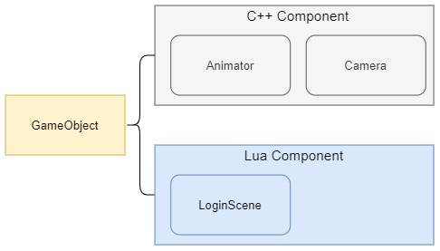

## 16.1 LuaBridge与C++交互

```bash
CLion项目文件位于 samples/integrate_lua/integrate_lua/lua_call_cpp_luabridge_component
```

LuaBridge是一个Lua绑定库，用于将C++的类、函数、数据映射到Lua中，这样就可以在Lua中创建C++实例、访问C++实例、调用C++函数。
也对Lua数据进行封装提供一系列接口给C++，在C++中访问Lua数据也变得很方便。

```bash
Github：https://github.com/vinniefalco/LuaBridge
文档：http://vinniefalco.github.io/LuaBridge/Manual.html
```

LuaBridge作为一个轻量级的绑定库，原始版本不支持以下功能：

1. 一个函数或方法的参数超过 8 个（可以自行修改 添加更多 TypeListValues 特化来增加）。
2. 重载的函数、方法或构造函数。
3. STL 容器类型和 Lua 表之间的自动转换（可以自己写转换 )
4. 从 C++ 类继承 Lua 类。
5. 将 nil 传递给需要指针或引用的 C++ 函数。
6. 标准容器，如 std::shared_ptr。 

不过在我使用LuaBridge的这一个月里，已经有人提交了一些特性。

LuaBridge还很活跃，这也是我选择它的原因之一。

本小节通过对LuaBridge提供的一系列特性，来学习介绍LuaBridge与C++交互逻辑。

### 1.项目介绍

项目将之前章节的`GameObject`-`Component`架构提取出来，用作测试，并创建了`Animator`、`Camera`两个组件。

另外实现了Lua Component逻辑，并创建了`LoginScene` 这个Lua组件。

这一小节的项目，其实就是引擎的基础架构，在这个基础上，集成LuaBridge，实现Lua Component。




### 2.LuaBridge特性介绍

介绍对类、函数、数据的绑定。

#### 2.1 绑定类

下面是绑定`GameObject`的代码：

```c++
//绑定 GameObject
{
    luabridge::getGlobalNamespace(lua_state)
            .beginClass<GameObject>("GameObject")
            .addConstructor<void (*) ()>() //绑定 构造函数
            .addFunction("__eq", &GameObject::operator==)// 操作符重载
            .addFunction("AddComponent", &GameObject::AddComponentFromLua)//绑定 成员函数
            .addFunction("GetComponent",&GameObject::GetComponentFromLua)//绑定 成员函数
            .endClass();
}
```
上述代码执行后，就可以在lua中编写下面的代码：

```lua
---创建GameObject实例
local game_object=GameObject()

--调用GameObject函数
local component=game_object:AddComponent("Camera")

--重载操作符，判断2个GameObject是否相等
local game_object_player=GameObject()
print(game_object==game_object_player)
```

#### 2.2 绑定基类与子类

对于有继承关系的类，则需要先绑定基类，然后再绑定子类。
参考`Camera`的注册代码：

```c++
//注册基类
luabridge::getGlobalNamespace(lua_state)
        .beginClass<Component>("Component")
        .addConstructor<void (*) ()>()
        .addFunction("Awake",&Component::Awake)
        .addFunction("Update",&Component::Update)
        .addFunction("game_object",&Component::game_object)
        .addFunction("set_game_object",&Component::set_game_object)
        .endClass();
    
//注册子类
luabridge::getGlobalNamespace(lua_state)
    .deriveClass<Camera,Component>("Camera")//指明继承自 Component
    .addConstructor<void (*) ()>()//绑定 构造函数
    .addFunction("position",&Camera::position)//绑定 子类函数
    .addFunction("set_position",&Camera::set_position)
    .endClass();
```

子类中是不用绑定基类函数的。

#### 2.3 绑定操作符重载

如果需要大量的操作符重载，那可以参考`glm::vec3`的绑定过程，代码如下：

```c++
luabridge::getGlobalNamespace(lua_state)
    .beginNamespace("glm")//指定NameSpace
    .beginClass<glm::vec3>("vec3")//绑定类
    .addConstructor<void(*)(const float&, const float&, const float&)>()//绑定 构造函数
    .addData("x", &glm::vec3::x)//绑定 成员变量
    .addData("y", &glm::vec3::y)
    .addData("z", &glm::vec3::z)
    .addData("r", &glm::vec3::r)
    .addData("g", &glm::vec3::g)
    .addData("b", &glm::vec3::b)
    .addFunction ("__tostring", std::function <std::string (const glm::vec3*)> ([] (const glm::vec3* vec) {return glm::to_string(*vec);}))//指定Lua Meta Function
    .addFunction ("__add", std::function <glm::vec3 (const glm::vec3*,const glm::vec3*)> ([] (const glm::vec3* vec_a,const  glm::vec3* vec_b) {return (*vec_a)+(*vec_b);}))
    .addFunction ("__sub", std::function <glm::vec3 (const glm::vec3*,const glm::vec3*)> ([] (const glm::vec3* vec_a,const  glm::vec3* vec_b) {return (*vec_a)-(*vec_b);}))
    .addFunction ("__mul", std::function <glm::vec3 (const glm::vec3*,const float)> ([] (const glm::vec3* vec,const float a) {return (*vec)*a;}))
    .addFunction ("__div", std::function <glm::vec3 (const glm::vec3*,const float)> ([] (const glm::vec3* vec,const float a) {return (*vec)/a;}))
    .addFunction ("__unm", std::function <glm::vec3 (const glm::vec3*)> ([] (const glm::vec3* vec) {return (*vec)*-1;}))
    .addFunction ("__eq", std::function <bool (const glm::vec3*,const glm::vec3*)> ([] (const glm::vec3* vec_a,const  glm::vec3* vec_b) {return (*vec_a)==(*vec_b);}))
    .endClass();
```

上述代码中，以`__`为前缀的，就是Lua提供的操作符重载元方法，只要对其赋值即可实现操作符重载。

### 2.4 绑定普通函数

简单的直接绑定，例如：

```c++
GameObject* game_object_;
void CompareGameObject(GameObject* game_object){
    std::cout<<"CompareGameObject: "<<std::endl;
    game_object_=game_object;
}

luabridge::getGlobalNamespace(lua_state)
    .addFunction("CompareGameObject", &CompareGameObject);
```


对付复杂函数的绑定，需要写lambda表达式的，可以参考对 glm 提供的API的绑定。

```c++
luabridge::getGlobalNamespace(lua_state)
    .beginNamespace("glm")
    .addFunction("to_string",std::function <std::string (const glm::mat4*)> ([] (const glm::mat4* m) {return glm::to_string((*m));}))
    .addFunction("to_string",std::function <std::string (const glm::vec3*)> ([] (const glm::vec3* v) {return glm::to_string((*v));}))//同名覆盖，不支持函数重载。应该使用 __tostring注册。
    .addFunction("rotate",std::function <glm::mat4 (const glm::mat4*,const float,const glm::vec3*)> ([] (const glm::mat4* m,const float f,const glm::vec3* v) {return glm::rotate(*m,f,*v);}))
    .addFunction("radians",std::function <float (const float)> ([] (const float f) {return glm::radians(f);}));
```

### 2.5 绑定枚举