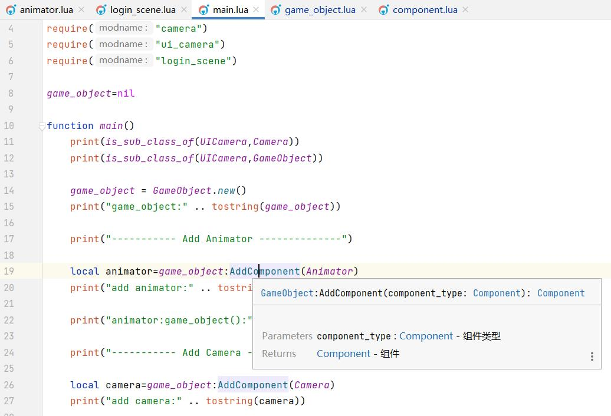
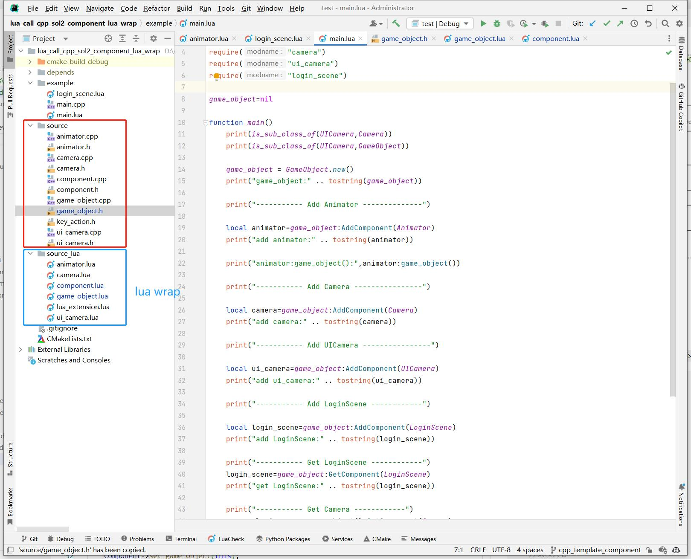
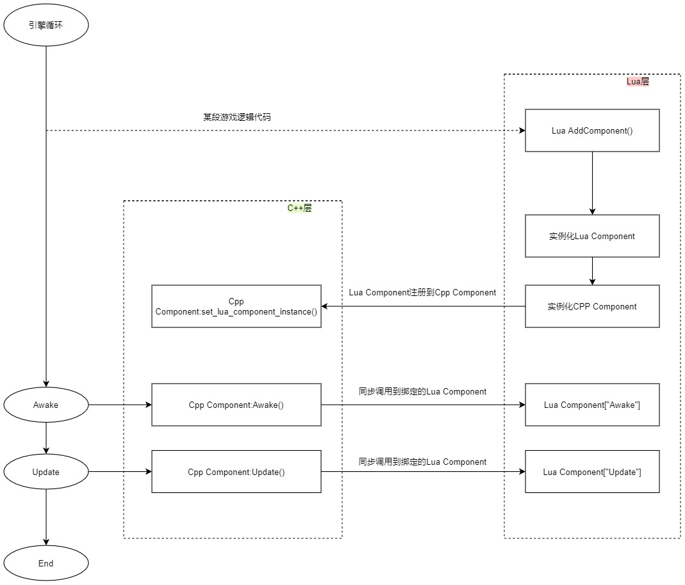

## 17.2 更加友好的Lua框架设计

```bash
CLion项目文件位于 samples/integrate_lua/integrate_lua/lua_call_cpp_sol2_component_lua_wrap
```

虽然上一节集成了Lua，并融入到了GameObject-Component的模式中，但是有很多槽点：
1. <font color=red>GameObject同时管理着Cpp Component和Lua Component，并且两者是以Lua Table存在的。</font>
2. <font color=red>Lua逻辑代码直接调用了导出的Cpp接口，没有隔离Lua逻辑与Cpp Native底层接口，且没有代码提示。</font>

另外还有GameObject-Component的老问题：
1. <font color=red>AddComponent传入的参数是组件名，而不是`AddComponent<Type>()`这种形式。</font>
2. <font color=red>GetComponent也是上面这个问题。</font>

新老问题凑一堆，编写代码让人十分不爽，于是花了很久设计了更加友好的Lua框架。

新框架的目的：
1. 支持使用`AddComponent<Type>()`
   ```lua
   local animator=game_object:AddComponent(Animator)
   ```
2. 隔离，引擎使用者不需要接触到Cpp Native底层接口
3. 有代码提示
   


### 1. 项目结构



从项目文件结构就看出，对每个C++ Class，都有对应的Lua Wrap，这样就可以实现目的2、3，对引擎使用者隔离了CPP Native底层接口，并且可以添加代码提示。


### 2. AddComponent模板驱动

在C++侧，使用模板，来实现`AddComponent<Type>()`。

```c++
//file:source/game_object.h line:36

/// 添加组件，仅用于C++中添加组件。
/// \tparam T 组件类型
/// \return 组件实例
template <class T=Component>
T* AddComponent(){
    T* component=new T();
    AttachComponent(component);
    component->Awake();
    return dynamic_cast<T*>(component);
}

/// 附加组件实例
/// \param component_instance_table
void AttachComponent(Component* component){
    component->set_game_object(this);
    //获取类名
    type t=type::get(*component);
    std::string component_type_name=t.get_name().to_string();

    if(components_map_.find(component_type_name)==components_map_.end()){
        std::vector<Component*> component_vec;
        component_vec.push_back(component);
        components_map_[component_type_name]=component_vec;
    }else{
        components_map_[component_type_name].push_back(component);
    }
}
```

在Lua侧，也有着单独的一套Component管理机制。

```lua
--file:source_lua/game_object.lua line:27

---@param component_type Component @组件类型
---@return Component @组件
function GameObject:AddComponent(component_type)
    local component_instance=component_type.new()
    if self.components_map_[component_type]==nil then
        self.components_map_[component_type]={}
    end
    table.insert(self.components_map_[component_type],component_instance)
    component_instance:set_game_object(self)
    return component_instance
end

--- 从GameObject上获取组件
--- @param component_type table @组件类型
--- @return table @组件实例
function GameObject:GetComponent(component_type)
    if self.components_map_[component_type] and #self.components_map_[component_type]>0 then
        return self.components_map_[component_type][1]
    end
    return nil
end
```

Lua侧单独的Component管理机制，管理的其实是Lua侧的Component，而不是C++ 的Component。

来看下Lua Component的设计。

```lua
---file:source_lua/component.lua

---@class Component @组件
Component={}

function Component:ctor()
    self.game_object_=nil
    self:InitCppComponent()
    self:SetToCpp()
end

--- 创建对应的C++实例
function Component:InitCppComponent()
    self.cpp_component_instance_=Cpp.Component()
end

--- 将Lua Component绑定到C++端
function Component:SetToCpp()
    self.cpp_component_instance_:set_lua_component_instance(self)
end

--- 返回组件所属的GameObject
--- @return GameObject @返回组件所属的GameObject
function Component:game_object()
    return self.game_object_
end

function Component:set_game_object(game_object)
    self.game_object_=game_object
    game_object:cpp_game_object_instance():AttachComponent(self.cpp_component_instance_)
    self.cpp_component_instance_:Awake()
end

function Component:Awake()
    print("Component:Awake")
end

function Component:Update()
    print("Component:Update")
end
```

以`Animator`这个C++ Component为例，当如下代码添加`Animator`：

```lua
--file:example/main.lua line:19

local animator=game_object:AddComponent(Animator)
```

首先走Lua `GameObject:AddComponent(component_type)` 接口。

```lua
--file:source_lua/game_object.lua line:27

---@param component_type Component @组件类型
---@return Component @组件
function GameObject:AddComponent(component_type)
    local component_instance=component_type.new()
    if self.components_map_[component_type]==nil then
        self.components_map_[component_type]={}
    end
    table.insert(self.components_map_[component_type],component_instance)
    component_instance:set_game_object(self)
    return component_instance
end
```

这里实例化了Lua Component，首先执行构造函数。

```lua
---file:source_lua/component.lua

---@class Component @组件
Component={}

function Component:ctor()
    self.game_object_=nil
    self:InitCppComponent()
    self:SetToCpp()
end
```

先执行子类 `Animator:InitCppComponent()`，创建对应的C++实例。

```lua
--file:source_lua/animator.lua line:15

function Animator:InitCppComponent()
    ---@type Cpp.Animator
    self.cpp_component_instance_=Cpp.Animator() --创建对应的C++实例
end
```

然后将Lua Animator实例，注册到C++ Animator对象中。

```lua
--file:source_lua/component.lua line:22

--- 将Lua Component绑定到C++端
function Component:SetToCpp()
    self.cpp_component_instance_:set_lua_component_instance(self)
end
```

```c++
//file:source/component.h line:25

/// 设置对应的Lua组件
/// \param lua_component_instance
void set_lua_component_instance(sol::table& lua_component_instance){
    lua_component_instance_=lua_component_instance;
}
```

此时，Lua Animator 与 C++ Animator 就关联起来了，后续对 C++ Animator 的`Awake()` `Update()`就可以很方便的同步到 Lua Animator。

然后再让 C++ Animator 对象，挂到 GameObject 上。

```lua
function Component:set_game_object(game_object)
    self.game_object_=game_object
    game_object:cpp_game_object_instance():AttachComponent(self.cpp_component_instance_)
    self.cpp_component_instance_:Awake()
end
```

这样，在Lua AddComponent的同时，也在C++ AddComponent了一份。

当C++ Animator调用`Awake()`时，同步到Lua Animator实例。

```c++
//file:source/component.h line:31

/// 同步调用Lua组件函数
/// \param function_name
void SyncLuaComponent(const char* function_name){
    if (!lua_component_instance_.valid()){
        return;
    }
    sol::protected_function function_awake=lua_component_instance_[function_name];
    if(!function_awake.valid()){
        return;
    }
    auto result=function_awake();
    if(result.valid()== false){
        sol::error err = result;
        type t=type::get(this);
        std::string component_type_name=t.get_name().to_string();
        SPDLOG_ERROR("\n---- RUN LUA_FUNCTION ERROR ----\nComponent call Awake error,type:{}\n{}\n------------------------",component_type_name,err.what());
    }
}

virtual void Awake(){
    std::cout<<"Cpp.Component Awake"<<std::endl;
    SyncLuaComponent("Awake");
};
virtual void Update(){
    std::cout<<"Cpp.Component Update"<<std::endl;
    SyncLuaComponent("Update");
};
```

以`AddComponent<Type>()`这个接口，来描述新的框架设计：



觉得比较绕的话，多调试几次就理解了。