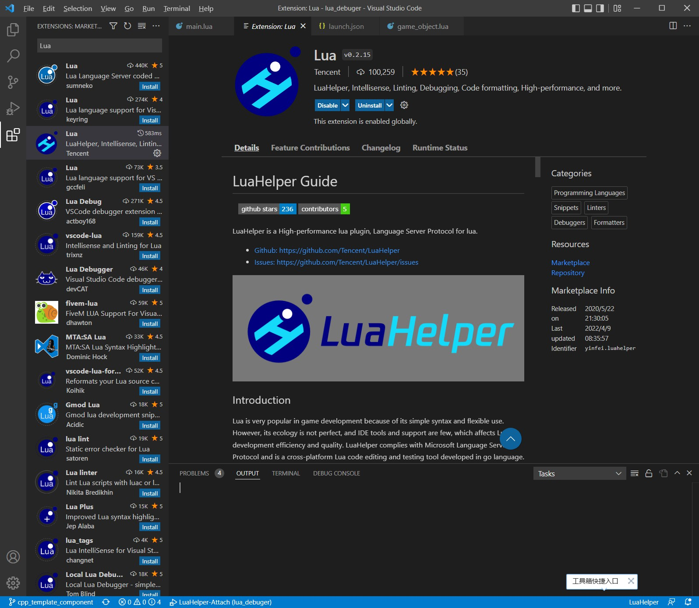
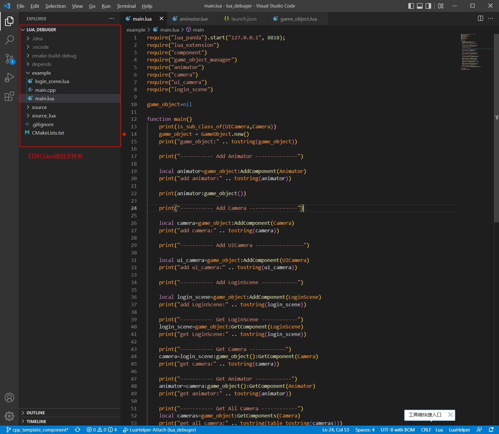
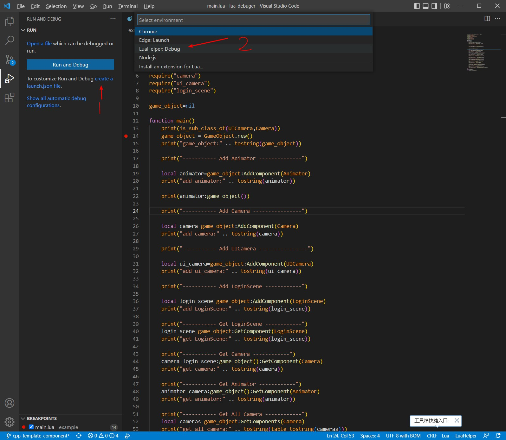
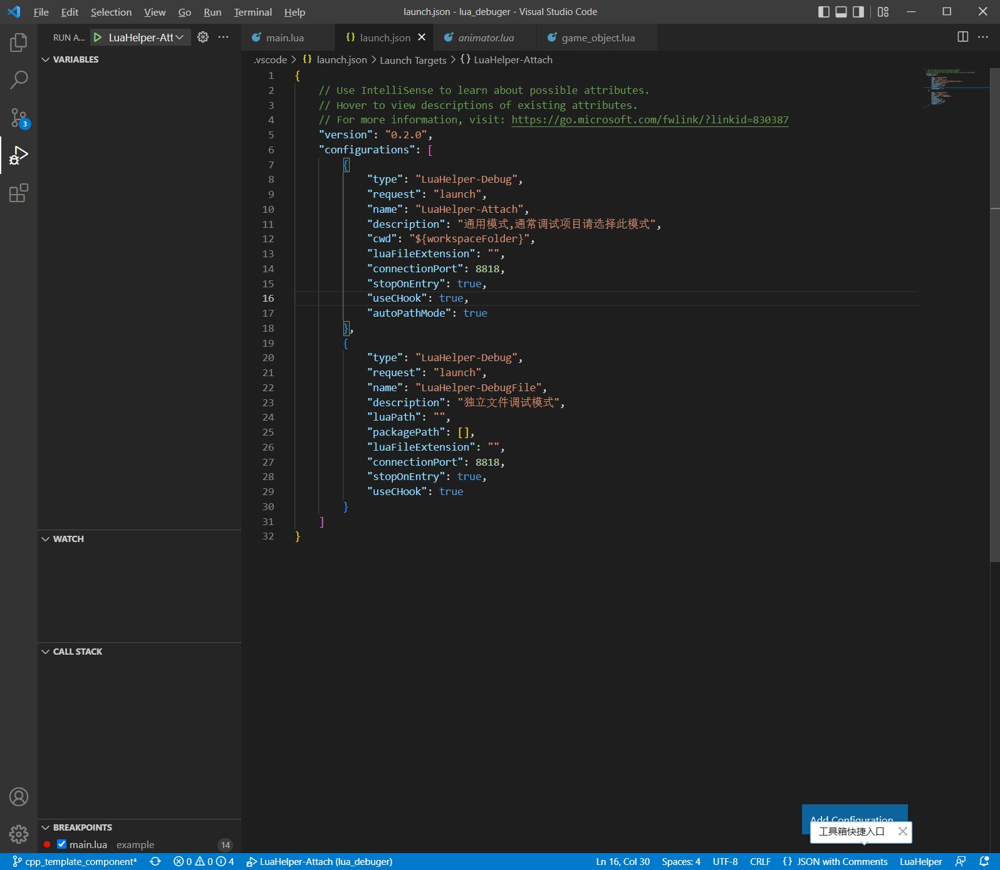
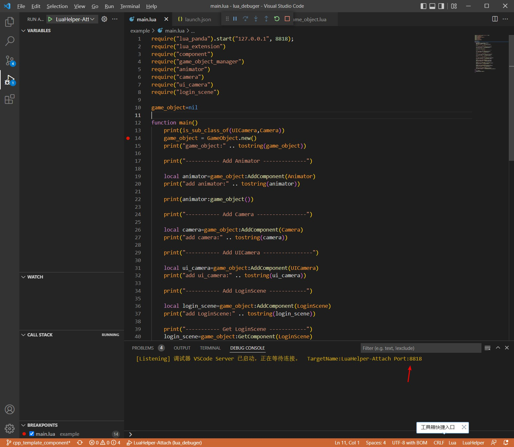
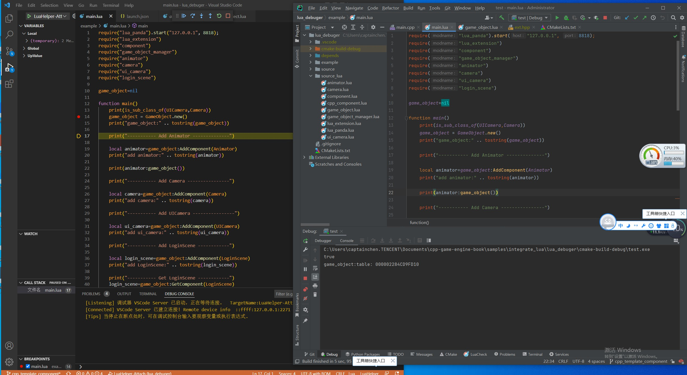

## 17.4 调试Lua

对游戏项目来说断点调试是必不可少的，Lua是支持调试功能的。

一般来说调试Lua都是远程调试，首先在PC上的编辑器(VSCode)启动一个Debuger Server，等待游戏客户端连接。

连接成功后，Debuger Server收集编辑器的断点状态，然后发给游戏客户端。

游戏客户端执行到断点处，将Lua的函数调用堆栈发送到Debuger Server，然后在编辑器中展示出来断点以及堆栈信息。

远程调试的好处是，不管是在电脑上、还是手机上，不管内网、外网都可以调试。

这里选择腾讯开源的LuaHelper VSCode插件来作为Debuger Server。

Lua默认是不带网络库的，这里集成luasocket来传输远程调试的网络数据。

### 1.LuaHelper安装与使用

```diff
为了方便大家使用，我将LuaHelper打包到了VSCode中，这样大家下载之后直接使用，而不用再去搜索安装LuaHelper。

打包好的VSCode下载地址：https://github.com/ThisisGame/vscode/releases/download/code-oss-with-luahelper-builtin/VSCode-win32-x64.7z
```

首先在VSCode中搜索`lua`安装,作者是Tencent，别装错了。



在VSCode中打开CLion项目文件夹。



切换到调试页面，创建调试配置。



默认有2个配置，都不用管，唯一可能会修改的就是端口号，一般就用默认的就行，如果这个端口被占用了就要换一个新的。



F5开始调试，VSCode就创建了Debuger Server，等待游戏客户端连接。




### 2.luasocket集成

luasocket官网：`https://github.com/lunarmodules/luasocket`

网上有很多关于luasocket编译的文章，其实看它自带的Visual Studio项目也就能明白如何集成，只不过我用的是CLion，只要把VisualStudio项目里的源代码文件搬运到CMakeList里就行。

```makefile
#file:CMakeLists.txt line:21

if (MSVC)
    set(luasocket_c depends/luasocket/auxiliar.c
            depends/luasocket/buffer.c
            depends/luasocket/compat.c
            depends/luasocket/except.c
            depends/luasocket/inet.c
            depends/luasocket/io.c
            depends/luasocket/luasocket.c
            depends/luasocket/options.c
            depends/luasocket/select.c
            depends/luasocket/tcp.c
            depends/luasocket/timeout.c
            depends/luasocket/udp.c
            depends/luasocket/wsocket.c
            )
    link_libraries(ws2_32)
endif()
```

然后将luasocket这个库注册到lua中，这里要注意的是，sol2劫持了lua的注册lib代码，所以需要在sol2中进行luasocket的注册。

```c++
//file:example/main.cpp line:38

int main(int argc, char * argv[])
{
    sol_state.open_libraries(sol::lib::base,
                             sol::lib::package,
                             sol::lib::coroutine,
                             sol::lib::string,
                             sol::lib::os,
                             sol::lib::math,
                             sol::lib::table,
                             sol::lib::debug,
                             sol::lib::bit32,
                             sol::lib::io,
                             sol::lib::utf8
                             );

    //启用luasocket
    sol_state.require("socket.core",luaopen_socket_core,true);

    ......
}
```

编译通过后，可以`require("socket.core")` 测试一下。


### 3.调试实例

LuaHelper配套有一个 `LuaPanda.lua`脚本，按`Ctrl+Shift+P`调出命令，输入LuaHelper，找到LuaHelper:Copy debug file，将`LuaPanda.lua`拷贝到项目中。

章节实例项目中我已经拷过来了。

然后在lua入口第一行调用，连接LuaHelper Debuger Server。

```lua
--file:example/main.lua line:1

require("lua_panda").start("127.0.0.1", 8818);
```

VSCode中下好断点，CLion中运行项目，就看到VSCode中顺利断下来了。



更多关于LuaHelper知识，可以到Github主页了解：`https://github.com/Tencent/LuaHelper`

