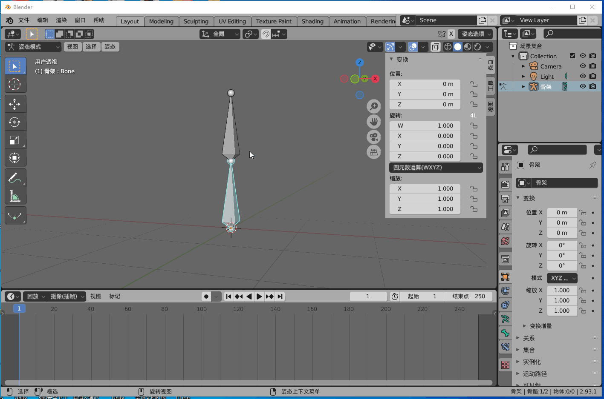
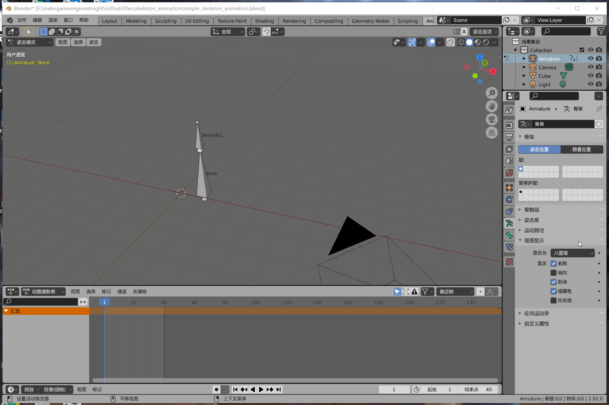

## 18. 骨骼动画

稚晖君的机械臂视频火出了圈，围观之后，大受震撼，感叹不愧是天才少年。

<table style="background:#F8F8FF">
<tr>
<td><image src="../../imgs/skeleton_animation/huizhijun.gif" /></td>
<td><image src="../../imgs/skeleton_animation/jixiebi_moni_small.gif" /></td>
</tr>
</table>

虽然从没有接触过机械，但是这个模拟软件，和游戏的骨骼动画有几分相似。

机械臂是模拟人类手臂的机器人，轴承等于手臂的关节，连接两个轴承之间的就是骨头。

骨骼动画(Skeleton Animation)也是对人类骨架的模拟，那么这三者原理相同吗？

我花了很多时间去找教程，想看看骨骼动画中的骨骼到底是怎么动起来的。

也曾经看着自己的手，想通过自己手臂的运动规律理解骨骼动画的原理。

最后发现，这都是白费时间，甚至完全走反了方向。

骨骼动画，这个名字有很大的误导性，让人以为动起来的原理和人体相似。

骨骼动画，正确的称呼应该是关节点动画。与人体结构原理是完全相反的。

<table>
    <tr>
        <td></td>
        <td bgcolor="AliceBlue"><b>人体结构</b></td>
        <td bgcolor="AliceBlue"><b>骨骼动画</b></td>
    </tr>
    <tr>
        <td><b>骨骼</b></td>
        <td>连接关节点，真实存在。</td>
        <td>想象中的物体，连接关节点，无任何实际用途。</td>
    </tr>
    <tr>
        <td><b>驱动方式</b></td>
        <td>肌肉收缩，带动骨骼。</td>
        <td>关节点坐标变化，带动子关节点移动。</td>
    </tr>
</table>

对比来看，骨骼动画称之为关节点动画是很正确的，因为它就是关节点在动，然后带动子关节点移动，形成了动画。

### 1. 制作播放骨骼动画

分为以下几步。

<b>制作骨骼动画:</b>

简单说就是创建几个关节点，然后每一帧设置关节点的位置，这样就形成了逐帧的动画。

<b>导出骨骼动画:</b>

以root关节点为零点，在第0帧导出每个关节点相对父节点的坐标。

然后导出每一帧所有关节点的位移。

<b>播放骨骼动画:</b>

每一帧,首先计算root节点的世界坐标，然后乘以子节点的相对坐标以及位移，得到子节点的世界坐标。

递归下去直到最后的关节点。

就计算得到了这一帧所有关节点的坐标。

### 2. 工具软件

游戏项目制作骨骼动画一般用3dsmax，我之前也是在3dsmax上学习的。

不过本书是开源项目，所以Blender就是最好的选择啦，而且之前也介绍了Blender。

上图是Blender骨骼动画编辑，可以看到是选中了锥形骨骼，然后旋转。

但其实只是旋转了球行关节点，锥形的骨骼只是起一个可视化的作用，并没有实际用处。

我可以将骨骼改成其他形状，例如一条直线，它的运动轨迹不会有变化，仍然是原来的动作。

记住：骨骼只是一个可视化的作用，真正旋转的是关节点。

骨骼动画一般都是对关节点做旋转，位移和缩放比较少用。

### 3. 本章目标

和其他教程不同，以我个人的学习过程来看，学习骨骼动画还是先做几个动画出来，然后再写代码去解析比较好。

所以本章学习流程是：先在Blender制作骨骼动画(关节点动画)，写Blender插件导出，然后在引擎解析播放。