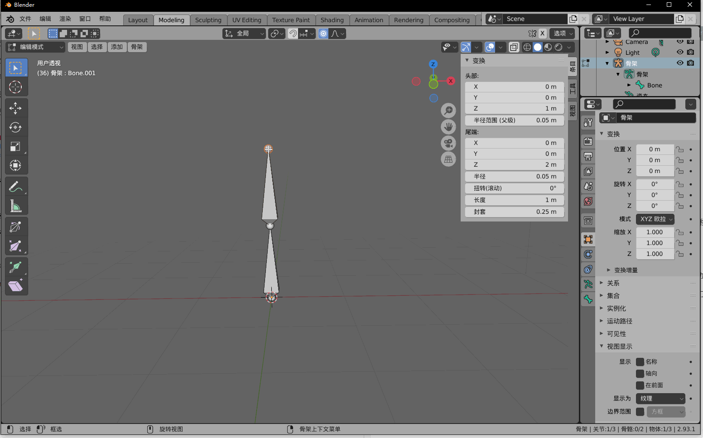
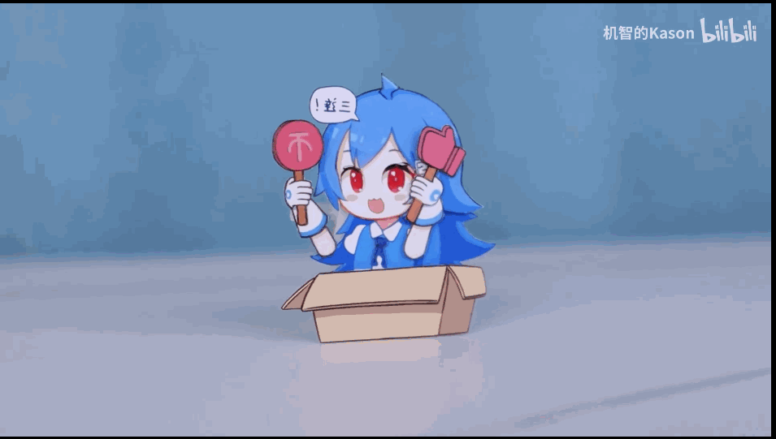

## 18. 骨骼动画

我花了很多时间去找教程，想看看这个骨骼到底是怎么动起来的。

也曾经看着自己的手，想通过自己手臂的运动规律理解骨骼动画的原理。

然后这都是白费时间，甚至完全走反了方向。

骨骼动画，这个名字有很大的误导性，让人以为动起来的原理和人体相似

骨骼动画，正确的称呼应该是关节点动画。与人体结构原理是完全相反的。

<table>
<tr ><td></td><td bgcolor="AliceBlue"><b>人体结构</td><td bgcolor="AliceBlue"><b>骨骼动画</td></tr>
<tr><td><b>骨骼</td><td>连接关节点，真实存在。</td><td>想象中的物体，连接关节点，无任何实际用途。</td></tr>
<tr><td><b>驱动方式</td><td>肌肉收缩，带动骨骼。</td><td>关节点坐标变化，带动附近的Mesh移动。</td></tr>
</table>

对比来看，骨骼动画称之为关节点动画是很正确的，因为它就是关节点在动，然后带动附近的Mesh移动，形成了动画。

### 1. 制作播放骨骼动画

制作骨骼动画，简单说就是创建几个关节点，然后每一帧设置关节点的位置，这样就形成了逐帧的动画。

播放骨骼动画，每一帧根据关节点位置，计算关节点附近Mesh的坐标。因为关节点在动，所以带动了Mesh的形变或位移，这样就看到模型在动了。

### 2. 工具软件

游戏项目制作骨骼动画一般用3dsmax，我之前也是在3dsmax上学习的。

不过本书是开源项目，所以Blender就是最好的选择啦，而且之前也介绍了Blender。

上图是Blender骨骼动画编辑，可以看到是移动了关节点，锥形的骨骼只是起一个可视化的作用，并没有实际用处。

骨骼动画一般都是对关节点做旋转，位移和缩放比较少用。

### 3. 本章目标

和其他教程不同，以我个人的学习过程来看，学习骨骼动画还是先做几个动画出来，然后再写代码去解析比较好。

所以本章学习流程是：先在Blender制作骨骼动画(关节点动画)，写Blender插件导出，然后在引擎解析播放。

