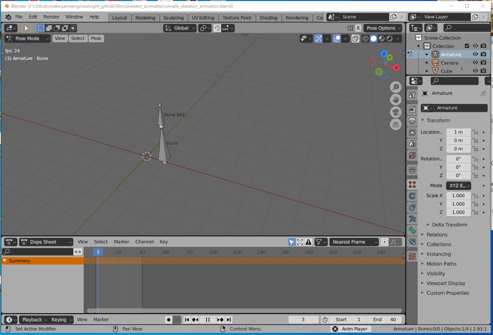

## 18.1 Blender制作骨骼动画

```bash
Blender项目文件位于 files\skeleton_animation\simple_skeleton_animation.blend
```

这一节制作简单的骨骼动画，最终效果如下图。



Blender制作骨骼动画，还是推荐B站顺子老师的教程：`https://www.bilibili.com/video/BV1bW411J75C`

那么这一节，就不写字了，我将制作过程录制了视频，看视频吧。

有疑问的在Github提issue。


视频地址：`https://www.bilibili.com/video/BV1bW411J75C`

<iframe 
    width="800" 
    height="450" 
    src="https://player.bilibili.com/player.html?aid=249699893&bvid=BV1mv411K7Js&cid=385784041&page=1" 
    frameborder="0"  
    allowfullscreen> 
</iframe>


作为程序，学习骨骼动画的制作并不是为了制作骨骼动画。

而是在制作的过程中，去了解到骨骼动画的本质。
<font color=red>
骨骼动画的本质就是子节点相对父节点的变换，和Unity中子节点相对父节点的变化是一个道理。</font>

在Unity中直接用Animator对GameObject进行K帧，也是可以制作骨骼动画的。