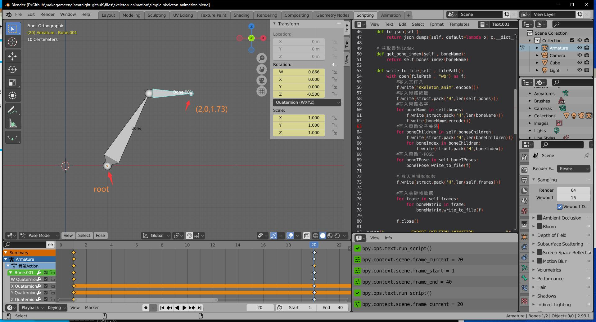
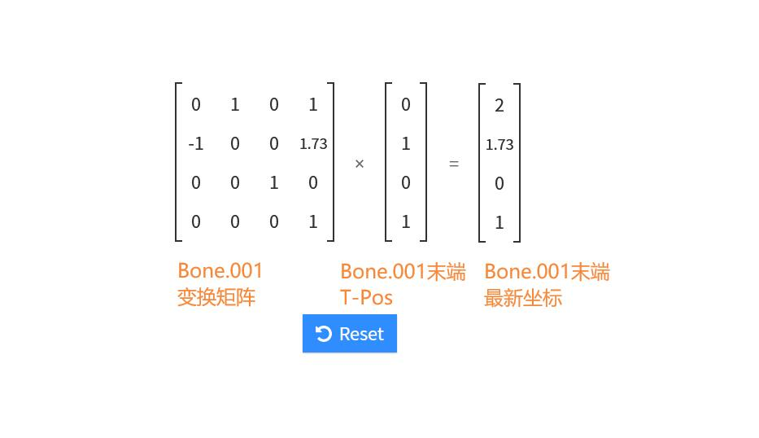
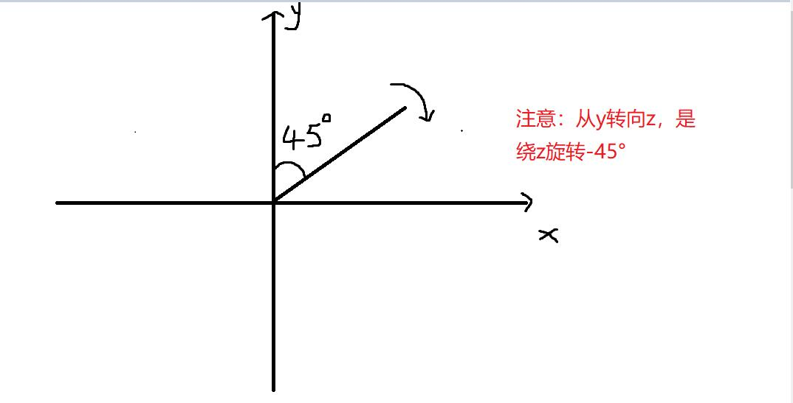

## 18.3 解析骨骼动画

```bash
CLion项目文件位于 samples\skeleton_animation\load_skeleton_animation
```

上一节从Blender中导出骨骼动画数据到自定义文件，这一节解析这个自定义文件，并播放骨骼动画。

解析自定义文件，就是加载进内存，并且按照上一节设计的文件格式，读取并存储到不同的变量。

例如读取骨骼数量保存到变量`bone_num`，读取关键帧数据保存到变量`all_frame_data`中。

播放骨骼动画，就是获取一帧的数据，计算出这一帧骨骼所在的位置。

每一帧都有新的位置变化，一秒钟播放24帧，就形成了动画。

下面来看具体实现吧。

### 1. 读取骨骼动画文件

新建类`AnimationClip`，创建以下成员变量存储骨骼动画数据,

```c++
//file:source/renderer/animation_clip.h line:43

private:
    /// 所有骨骼名字
    std::vector<std::string> bone_names_;
    /// 骨骼的子节点
    std::vector<std::vector<unsigned short>> bone_children_vector_;
    /// 骨骼T-pose
    std::vector<glm::mat4> bone_t_pose_vector_;
    /// 持续时间
    float duration_=0.0f;
    /// 总帧数
    unsigned short frame_count_=0;
    /// 骨骼动画
    std::vector<std::vector<glm::mat4>> bone_animation_vector_;
    /// 骨骼动画开始播放时间
    float start_time_=0.0f;
    /// 骨骼动画是否在播放
    bool is_playing_=false;
    /// 当前帧
    unsigned short current_frame_=-1;
```

在`void AnimationClip::LoadFromFile(const char *file_path)`中读取文件到内存，并按照文件格式进行解析，读取数据存储到成员变量中，为下一步计算骨骼位置坐准备。

```c++
//file:source/renderer/animation_clip.cpp line:27

/// 加载动画片段
/// \param file_path
void AnimationClip::LoadFromFile(const char *file_path) {
    //读取文件头
    ifstream input_file_stream(Application::data_path()+file_path,ios::in | ios::binary);
    if(!input_file_stream.is_open()) {
        DEBUG_LOG_ERROR("AnimationClip::LoadFromFile: open file failed,file_path:{}",file_path);
        return;
    }
    char file_head[14];
    input_file_stream.read(file_head,13);
    file_head[13]='\0';
    if(strcmp(file_head,SKELETON_ANIMATION_HEAD) != 0) {
        DEBUG_LOG_ERROR("AnimationClip::LoadFromFile: file head error,file_head:{},the right is:{}",file_head,SKELETON_ANIMATION_HEAD);
        return;
    }

    //读取骨骼数量
    unsigned short bone_count=0;
    input_file_stream.read(reinterpret_cast<char *>(&bone_count), sizeof(unsigned short));
    //读取骨骼名字数组
    for(unsigned short i=0;i<bone_count;i++) {
        //读取骨骼名字长度
        unsigned short bone_name_size=0;
        input_file_stream.read(reinterpret_cast<char *>(&bone_name_size), sizeof(unsigned short));

        char* bone_name=new char[bone_name_size+1];
        input_file_stream.read(bone_name,bone_name_size);
        bone_name[bone_name_size]='\0';
        bone_names_.push_back(bone_name);
        delete[] bone_name;
    }
    //读取骨骼子节点
    for(unsigned short bone_index=0; bone_index < bone_count; bone_index++) {
        //读取骨骼子节点数量
        unsigned short child_count=0;
        input_file_stream.read(reinterpret_cast<char *>(&child_count), sizeof(unsigned short));
        //读取骨骼子节点名字，在名字数组的序号。
        std::vector<unsigned short> child_indexes;
        for(unsigned short j=0;j<child_count;j++) {
            unsigned short child_index=0;
            input_file_stream.read(reinterpret_cast<char *>(&child_index), sizeof(unsigned short));
            child_indexes.push_back(child_index);
        }
        bone_children_vector_.push_back(child_indexes);
    }
    //读取骨骼T-pose
    for(unsigned short bone_index=0; bone_index < bone_count; bone_index++) {
        //读取骨骼T-pose
        glm::mat4 bone_t_pose;
        input_file_stream.read(reinterpret_cast<char *>(&bone_t_pose), sizeof(float) * 16);
        bone_t_pose_vector_.push_back(bone_t_pose);
    }
    //读取帧数
    input_file_stream.read(reinterpret_cast<char *>(&frame_count_), sizeof(unsigned short));

    //读取骨骼动画
    for (int frame_index = 0; frame_index < frame_count_; frame_index++) {
        //读取一帧的骨骼矩阵
        std::vector<glm::mat4> bone_matrices;
        for (unsigned short bone_index = 0; bone_index < 2; bone_index++) {
            glm::mat4 bone_matrix;
            input_file_stream.read(reinterpret_cast<char *>(&bone_matrix), sizeof(float) * 16);
            bone_matrices.push_back(bone_matrix);
        }
        bone_animation_vector_.push_back(bone_matrices);
    }
}
```

这其实就是上一节`18.2 Blender导出骨骼动画`的逆过程。

### 2. 骨骼动画刷帧计算

骨骼动画的本质就是帧动画，和Unity的Animation是一样的。

之所以是动画，是因为每一帧都修改了骨骼的位置。

在引擎中，要让骨骼动起来，就要在每一帧都计算出骨骼的正确位置。

即根据读取的T-Pos矩阵 以及 当前帧最新的offset矩阵，计算出当前位置矩阵。

因为父骨骼的位移会影响到子骨骼，所以需要用递归来将父骨骼矩阵传递下去。

具体实现如下：

```c++
void AnimationClip::Update() {
    if(!is_playing_) {
        return;
    }
    //计算当前时间对应的帧序号
    float current_time=Time::TimeSinceStartup()-start_time_;
    unsigned short current_frame_index=static_cast<unsigned short>(current_time*SKELETON_ANIMATION_FRAME_RATE);
    if(current_frame_index >= frame_count_) {
        current_frame_index=frame_count_-1;
        return;
    }
    if(current_frame_==current_frame_index) {
        return;
    }
    current_frame_=current_frame_index;

    DEBUG_LOG_INFO("current_frame_index:{}",current_frame_index);

    //计算当前帧的骨骼矩阵
    std::vector<glm::mat4> current_frame_bone_matrices=bone_animation_vector_[current_frame_index];
    CalculateBoneMatrix(current_frame_bone_matrices,0,glm::mat4(1.0f));
}

/// 递归计算骨骼矩阵,从根节点开始。Blender导出的时候要确保先导出父节点。
/// \param bone_name
/// \param parent_matrix
/// \param bone_matrix
void AnimationClip::CalculateBoneMatrix(std::vector<glm::mat4>& current_frame_bone_matrices,unsigned short bone_index, const glm::mat4 &parent_matrix) {
    glm::mat4 bone_matrix=current_frame_bone_matrices[bone_index];
    glm::mat4 bone_t_pos_matrix=bone_t_pose_vector_[bone_index];
    glm::mat4 bone_matrix_with_parent=parent_matrix*bone_t_pos_matrix*bone_matrix;

    DEBUG_LOG_INFO("{} bone_matrix:{}",bone_names_[bone_index],glm::to_string_beauty(bone_matrix_with_parent));

    current_frame_bone_matrices[bone_index]=bone_matrix_with_parent;
    std::vector<unsigned short> child_indexes=bone_children_vector_[bone_index];
    for(unsigned short child_index:child_indexes) {
        CalculateBoneMatrix(current_frame_bone_matrices,child_index,bone_matrix_with_parent);
    }
}
```

### 3. 测试

工程已经转向Lua了，所以后续所有新增类都要注册到Lua。

```c++
//file:source/lua_binding/lua_binding.cpp line:476

sol_state_.new_usertype<AnimationClip>("AnimationClip",sol::call_constructor,sol::constructors<AnimationClip()>(),
                                            "LoadFromFile", &AnimationClip::LoadFromFile,
                                            "duration", &AnimationClip::duration,
                                            "Play", &AnimationClip::Play,
                                            "Stop", &AnimationClip::Stop,
                                            "Update", &AnimationClip::Update
        );
```

后续章节我就不再提这个了。

修改`login_scene.lua`,在`Awake`中加载解析骨骼动画文件，然后在`Update`中计算帧数据。

```lua
--file:example/login_scene.lua line:12
function LoginScene:Awake()
    self.animation_clip_=AnimationClip()
    self.animation_clip_:LoadFromFile("animation/export.skeleton_anim")
    self.animation_clip_:Play()
end

......
......

function LoginScene:Update()
    --print("LoginScene:Update")
    self.animation_clip_:Update()
end
```


在Blender中我导出了`[1,40]`范围的帧数据，`[1-20]`变化，`[21,40]`还原，第20帧状态如下：



以第20帧来验证代码计算数据是否正确。

运行工程，log会输出每一帧每个骨骼最新的矩阵,查看第20帧的Log：

```log
[source animation_clip.cpp] [function AnimationClip::Update] [line 116] [info] current_frame_index:19
[source animation_clip.cpp] [function AnimationClip::CalculateBoneMatrix] [line 128] [info] Bone bone_matrix:mat4x4:
(0.866025, -0.500000, 0.000000, 0.000000),
(0.500000, 0.866025, -0.000000, 0.000000),
(0.000000, 0.000000, 1.000000, 0.000000),
(0.000000, 0.000000, 0.000000, 1.000000)
[source animation_clip.cpp] [function AnimationClip::CalculateBoneMatrix] [line 128] [info] Bone.001 bone_matrix:mat4x4:

(0.000000, -1.000000, 0.000000, 0.000000),
(1.000000, 0.000000, -0.000000, 0.000000),
(0.000000, 0.000000, 1.000000, 0.000000),
(1.000000, 1.732051, -0.000000, 1.000000)
```

所谓的骨骼矩阵，指的是骨骼的首端关节点矩阵。

拿`Bone.001`首端矩阵，乘以`Bone.001`末端的相对位移，计算得到`Bone.001`末端在第20帧的坐标，如下：



计算得到结果与Blender中一致，解析骨骼动画成功。


### 4. 怎么没有渲染出骨骼？

问：骨骼动画解析成功了，但是却没有渲染出来骨骼。难道骨骼动画就是这些东西？

你是对的，骨骼动画就是这些东西，本质就是父子之间的相对变换，是纯数据。

问：游戏中的骨骼动画不是会渲染出人物动画吗？

我们口头说的游戏中的骨骼动画，叫骨骼蒙皮动画。

骨骼动画代表动画数据。

蒙皮就是Mesh，每个顶点与一个骨骼绑定，当骨骼变换时，带动顶点变化，这样就有了每帧变化的Mesh，渲染形成动画。

下一章就介绍骨骼蒙皮动画。

### 5. 其他

有一些东西需要注意：

1. 绕Z轴旋转，从Y转向X，角度是负数。

    

2. Blender是行主序，和数学上的表现一致，可以直接用作代数运算。
3. GLM是列主序，做运算的时候记得转换。
   
一个矩阵乘法动画演示的网站：`http://matrixmultiplication.xyz/`