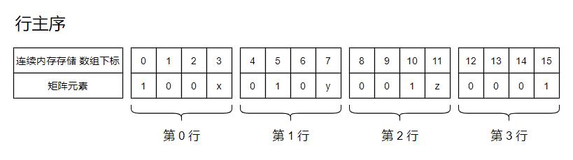
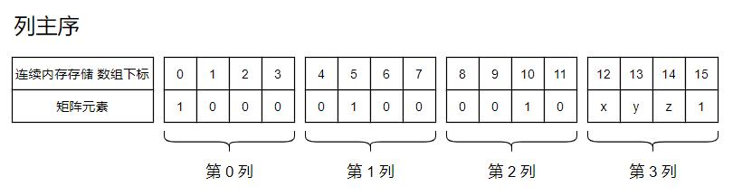
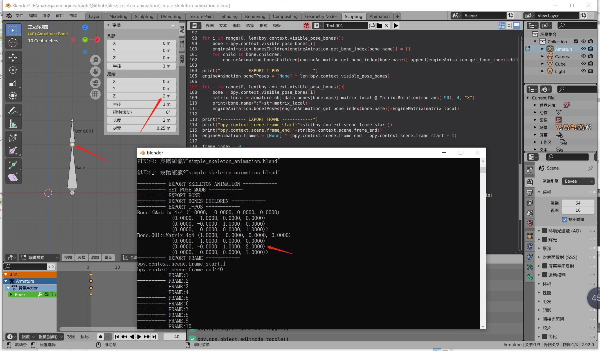
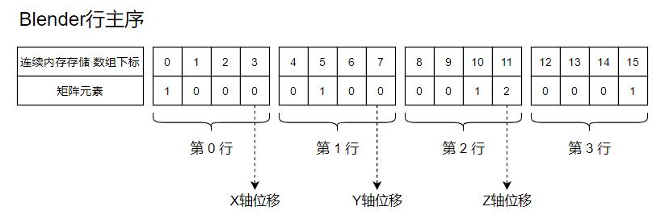
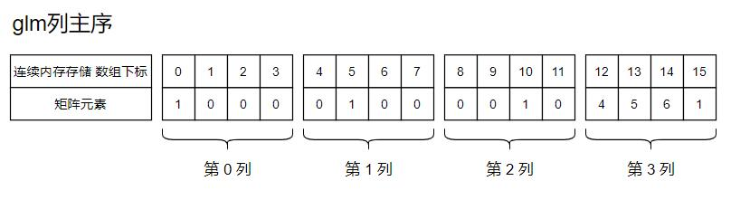

## 18.4 矩阵的主序

之前一直没有想过矩阵的主序问题，开始写Blender导出代码后，发现GLM和Blender矩阵格式不太一样，才开始学习这个。

### 1.数学上的矩阵

以位移举例来说明。

位移矩阵是作用于坐标向量的，所以是将矩阵放在向量前面，即`trans * pos`，表示如下：

$$
\left|
\begin{array}{cccc}
    1  &  0   & 0 & x\\
    0  &  1   & 0 & y\\ 
    0  &  0   & 1 & z\\ 
    0  &  0   & 0 & 1
\end{array}
\right| * \left|
\begin{array}{cccc} 
    x \\ 
    y \\ 
    z \\ 
    1
\end{array}
\right|
$$


数学上是没有行主序、列主序的定义的。

### 2.矩阵的内存布局

行主序、列主序指的是矩阵在内存中的存储方式。

以上面的矩阵为例，行主序就是一行一行存储。



列主序就是一列一列存储。



---


### 3.Blender是行主序存储

下面代码输出T-Pos状态关节点的矩阵。

```python
for i in range(0, len(bpy.context.visible_pose_bones)):
    bone = bpy.context.visible_pose_bones[i]
    matrix_local = armature_obj.data.bones[bone.name].matrix_local @ Matrix.Rotation(radians(-90), 4, "X")
    print(bone.name+":"+str(matrix_local))
```



可以看到位移数据位于右侧一列，是行主序存储。



### 4.GLM是列主序存储

定义一个位移矩阵，`x,y,z`分别移动`4,5,6`，如下：

$$
\left|
\begin{array}{cccc}
    1  &  0   & 0 & 4\\
    0  &  1   & 0 & 5\\ 
    0  &  0   & 1 & 6\\ 
    0  &  0   & 0 & 1
\end{array}
\right|
$$

glm构造这个矩阵并输出：

```c++
glm::mat4 mat=glm::translate(glm::vec3(4.f,5.f,6.f));
std::cout<<glm::to_string_beauty(mat)<<std::endl;
```

输出的`mat`变量：

```text
(1.000000, 0.000000, 0.000000, 0.000000),
(0.000000, 1.000000, 0.000000, 0.000000),
(0.000000, 0.000000, 1.000000, 0.000000),
(4.000000, 5.000000, 6.000000, 1.000000)
```



可以看到位移数据位于最下面一行，是列主序存储。

就是说数学上矩阵是这个形式：

$$
\left|
\begin{array}{cccc}
    1  &  0   & 0 & 4\\
    0  &  1   & 0 & 5\\ 
    0  &  0   & 1 & 6\\ 
    0  &  0   & 0 & 1
\end{array}
\right|
$$

只是glm用了列主序存储，所以打印出来是：

```text
(1.000000, 0.000000, 0.000000, 0.000000),
(0.000000, 1.000000, 0.000000, 0.000000),
(0.000000, 0.000000, 1.000000, 0.000000),
(4.000000, 5.000000, 6.000000, 1.000000)
```

将Blender的矩阵导出给glm使用，需要先转换一下。

<b>位移乘法</b>

如下代码：

```c++
glm::mat4 mat=glm::translate(glm::vec3(4.f,5.f,6.f));
std::cout<<glm::to_string_beauty(mat)<<std::endl;

glm::vec4 pos=glm::vec4(7.f,8.f,9.f,1.f);
std::cout<<glm::to_string(pos)<<std::endl;

std::cout<<glm::to_string(  mat * pos  )<<std::endl;
```

位移矩阵作用于向量，位移矩阵放左边，位移矩阵左乘坐标向量。

以glm列矩阵存储的格式，左乘是没有意义的，不过glm的乘法代码并不是数学中的。

```c++
template <typename T, precision P>
GLM_FUNC_QUALIFIER typename tmat4x4<T, P>::col_type operator*
(
	tmat4x4<T, P> const & m,
	typename tmat4x4<T, P>::row_type const & v
)
{
	typename tmat4x4<T, P>::col_type const Mov0(v[0]);
	typename tmat4x4<T, P>::col_type const Mov1(v[1]);
	typename tmat4x4<T, P>::col_type const Mul0 = m[0] * Mov0;
	typename tmat4x4<T, P>::col_type const Mul1 = m[1] * Mov1;
	typename tmat4x4<T, P>::col_type const Add0 = Mul0 + Mul1;
	typename tmat4x4<T, P>::col_type const Mov2(v[2]);
	typename tmat4x4<T, P>::col_type const Mov3(v[3]);
	typename tmat4x4<T, P>::col_type const Mul2 = m[2] * Mov2;
	typename tmat4x4<T, P>::col_type const Mul3 = m[3] * Mov3;
	typename tmat4x4<T, P>::col_type const Add1 = Mul2 + Mul3;
	typename tmat4x4<T, P>::col_type const Add2 = Add0 + Add1;
	return Add2;
}
```

以`pos`的每一位，构造了一个`vec4`，然后再和位移矩阵的每一行相乘，最后再相加。

整理一下代码，看的更明白。

```c++
template <typename T, precision P>
GLM_FUNC_QUALIFIER typename tmat4x4<T, P>::col_type operator*
(
	tmat4x4<T, P> const & m,
	typename tmat4x4<T, P>::row_type const & v
)
{
    typename tmat4x4<T, P>::col_type const Mov0(v[0]);//(7,7,7,7)
    typename tmat4x4<T, P>::col_type const Mov1(v[1]);//(8,8,8,8)
    typename tmat4x4<T, P>::col_type const Mov2(v[2]);//(9,9,9,9)
    typename tmat4x4<T, P>::col_type const Mov3(v[3]);//(1,1,1,1)

    typename tmat4x4<T, P>::col_type const Mul0 = m[0] * Mov0;//(1,0,0,0) * (7,7,7,7) = (7,0,0,0)
    typename tmat4x4<T, P>::col_type const Mul1 = m[1] * Mov1;//(0,1,0,0) * (8,8,8,8) = (0,8,0,0)
    typename tmat4x4<T, P>::col_type const Mul2 = m[2] * Mov2;//(0,0,1,0) * (9,9,9,9) = (0,0,9,0)
    typename tmat4x4<T, P>::col_type const Mul3 = m[3] * Mov3;//(4,5,6,1) * (1,1,1,1) = (4,5,6,1)

    //(7,0,0,0) + (0,8,0,0) + (0,0,9,0) + (4,5,6,1) = (7,8,9,0) + (4,5,6,1)
    typename tmat4x4<T, P>::col_type const Add2 = Mul0 + Mul1 + Mul2 + Mul3;
    return Add2;
}
```

一个矩阵乘法动画演示的网站：`http://matrixmultiplication.xyz/`


