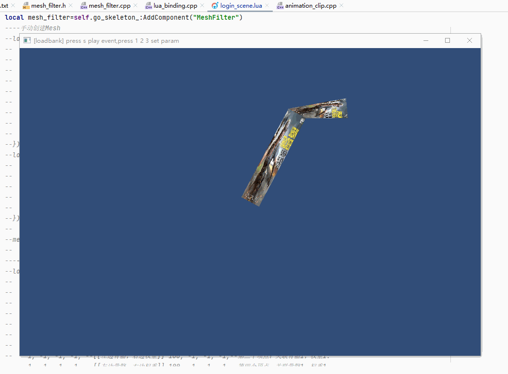

## 19.5 加载权重文件

```bash
CLion项目文件位于 samples\skinned_mesh_renderer\load_weight_file
```

在上一节`19.4 Blender导出蒙皮权重`从Blender导出了骨骼权重文件到`export.weight`文件，这个文件的内容，实际上就是将 `19.2 骨骼权重` 手动创建的数据，在Blender中复现一遍，格式如下：

```lua
--file:bone_weight/example/login_scene.lua line:69

--顶点关联骨骼信息,按照 bone_index_[4] bone_weight_[4] 的顺序存储
local vertex_relate_bone_infos={
    0, -1, -1, -1, --[[左边骨骼，右边权重]] 100, -1, -1, -1,--第一个顶点：关联骨骼0，权重是1。注意-1表示无骨骼。
    0, -1, -1, -1, --[[左边骨骼，右边权重]] 100, -1, -1, -1,--第二个顶点同理
    0, -1, -1, -1, --[[左边骨骼，右边权重]] 100, -1, -1, -1,--第三个顶点同理
    0, -1, -1, -1, --[[左边骨骼，右边权重]] 100, -1, -1, -1,--第四个顶点同理

    0,  1, -1, -1, --[[左边骨骼，右边权重]] 70,  30, -1, -1,--第一个顶点：关联骨骼0，权重0.7，关联骨骼1，权重0.3。
    0, -1, -1, -1, --[[左边骨骼，右边权重]] 100, -1, -1, -1,--第二个顶点：关联骨骼0，权重1.
    1, -1, -1, -1, --[[左边骨骼，右边权重]] 100, -1, -1, -1,--第三个顶点：关联骨骼1，权重1.
    1, -1, -1, -1, --[[左边骨骼，右边权重]] 100, -1, -1, -1,--第四个顶点：关联骨骼1，权重1.
}
mesh_filter:set_vertex_relate_bone_infos(vertex_relate_bone_infos)
```

现在数据存在`export.weight`文件中，就不用在代码中手动创建了，改为直接读取文件即可。

### 1. 加载权重文件

权重的功能在之前章节已经实现了，现在只要在`mesh_filter.h`新增接口加载权重文件即可。

```c++
//file:source/renderer/mesh_filter.cpp line:83

/// 加载权重文件
/// \param weight_file_path 权重文件路径
void MeshFilter::LoadWeight(string weight_file_path) {
    //读取 Mesh文件头
    ifstream input_file_stream(Application::data_path()+weight_file_path,ios::in | ios::binary);
    if (!input_file_stream.is_open()){
        DEBUG_LOG_ERROR("weight file open failed");
        return;
    }
    //判断文件头
    char file_head[7];
    input_file_stream.read(file_head,6);
    file_head[6]='\0';
    if(strcmp(file_head,"weight") != 0) {
        DEBUG_LOG_ERROR("weight file head error");
        return;
    }
    //读取权重数据
    input_file_stream.seekg(0,ios::end);
    int length = input_file_stream.tellg();
    input_file_stream.seekg(6,ios::beg);
    vertex_relate_bone_infos_ =(VertexRelateBoneInfo*)malloc(length-6);
    input_file_stream.read((char*)vertex_relate_bone_infos_,length-6);
    //关闭文件
    input_file_stream.close();
}
```

新增了接口别忘记在`lua_binding.cpp`中注册到Lua。

### 2. 测试

修改`login_scene.lua`的测试代码，将原来手动创建Mesh、权重的代码，改为直接加载`.mesh` `.weight`文件。

```lua
--file:example/login_scene.lua line:48

function LoginScene:Awake()
    ......

    local mesh_filter=self.go_skeleton_:AddComponent(MeshFilter)
    ----手动创建Mesh
    --local vertex_data={
    --    -0.2,0,0,  1.0,1.0,1.0,1.0, 0,0,--与 Bone 关联的顶点，就是下面那一根骨骼。
    --     0.2,0,0,  1.0,1.0,1.0,1.0, 1,0,
    --     0.2,2,0,  1.0,1.0,1.0,1.0, 1,1,
    --    -0.2,2,0,  1.0,1.0,1.0,1.0, 0,1,
    --
    --    -0.2,2,0,  1.0,1.0,1.0,1.0, 0,0,--与 Bone.001 关联的顶点，就是上面一根骨骼。
    --     0.2,2,0,  1.0,1.0,1.0,1.0, 1,0,
    --     0.2,3,0,  1.0,1.0,1.0,1.0, 1,1,
    --    -0.2,3,0,  1.0,1.0,1.0,1.0, 0,1,
    --}
    --local vertex_index_data={
    --    0,1,2,
    --    0,2,3,
    --
    --    4,5,6,
    --    4,6,7
    --}
    --
    --mesh_filter:CreateMesh(vertex_data,vertex_index_data)--手动构建Mesh
    --
    ----顶点关联骨骼信息,按照 bone_index_[4] bone_weight_[4] 的顺序存储
    --local vertex_relate_bone_infos={
    --    0, -1, -1, -1, --[[左边骨骼，右边权重]] 100, -1, -1, -1,--第一个顶点：关联骨骼0，权重是1。注意-1表示无骨骼。
    --    0, -1, -1, -1, --[[左边骨骼，右边权重]] 100, -1, -1, -1,--第二个顶点同理
    --    0, -1, -1, -1, --[[左边骨骼，右边权重]] 100, -1, -1, -1,--第三个顶点同理
    --    0, -1, -1, -1, --[[左边骨骼，右边权重]] 100, -1, -1, -1,--第四个顶点同理
    --
    --    0,  1, -1, -1, --[[左边骨骼，右边权重]] 70,  30, -1, -1,--第一个顶点：关联骨骼0，权重0.7，关联骨骼1，权重0.3。
    --    0, -1, -1, -1, --[[左边骨骼，右边权重]] 100, -1, -1, -1,--第二个顶点：关联骨骼0，权重1.
    --    1, -1, -1, -1, --[[左边骨骼，右边权重]] 100, -1, -1, -1,--第三个顶点：关联骨骼1，权重1.
    --    1, -1, -1, -1, --[[左边骨骼，右边权重]] 100, -1, -1, -1,--第四个顶点：关联骨骼1，权重1.
    --}
    --mesh_filter:set_vertex_relate_bone_infos(vertex_relate_bone_infos)

    mesh_filter:LoadMesh("model/export.mesh")--加载Mesh
    mesh_filter:LoadWeight("model/export.weight")--加载权重文件
    ......
end
```

运行测试OK，如下图：

