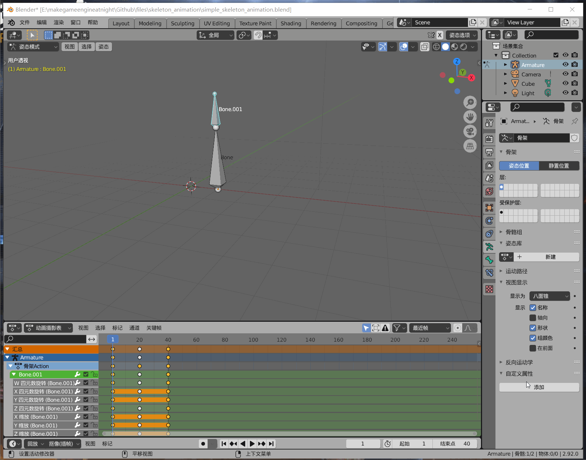

## 19. 骨骼蒙皮动画

最简单、形象的蒙皮动画，就是Blender里制作骨骼动画时，看到的运动的`骨骼`。

如上图，将Blender骨骼可视化从八面锥改成柔性骨骼，就看到2个长方体在动。

之前已经讲了，骨骼动画就是关节点动画，是关节点在动。

图中的每一个长方体，都是随着一个关节点在运动。

这种跟随某个关节点的立方体，即跟随关节点的多边形，就是骨骼蒙皮。

骨骼蒙皮随着关节点动起来了，就是骨骼蒙皮动画。

