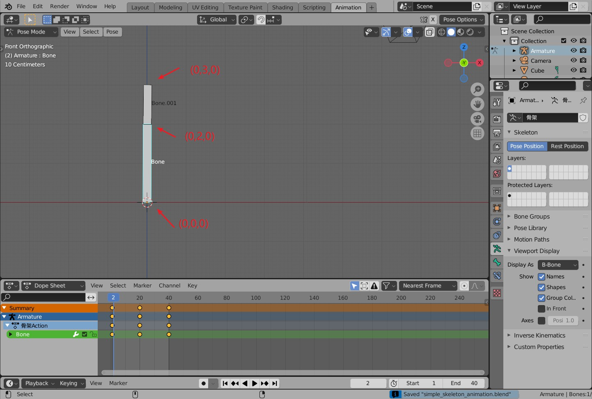

## 19.1 骨骼蒙皮动画实现

按照上一节说的骨骼蒙皮动画原理，在引擎中手动构建顶点，跟随骨骼运动，实现骨骼蒙皮动画。

### 1. 构建蒙皮顶点



在Blender中查看长方体的相关数据，构建顶点数据。

高度如图中标注，宽度是0.2 。

顶点的坐标、索引、颜色数据以`MeshFilter::Vertex`存储，另外还需要存储顶点跟随哪个骨骼移动。

在`MeshFilter`中新建成员变量`vertex_relate_bone_index_`记录。

```c++
//file:source/renderer/mesh_filter.h line:64

public:
    ......

    /// 获取顶点关联骨骼索引数组，长度为顶点个数
    unsigned char* vertex_relate_bone_index(){return vertex_relate_bone_index_;};

    void set_vertex_relate_bone_index(unsigned char* vertex_relate_bone_index){
        vertex_relate_bone_index_ = vertex_relate_bone_index;
    }
private:
    Mesh* mesh_;//Mesh对象

    unsigned char* vertex_relate_bone_index_;//顶点关联骨骼索引，长度为顶点个数
```

游戏中模型骨骼数一般比较少，所以用`unsigned char*`存储就够了。

