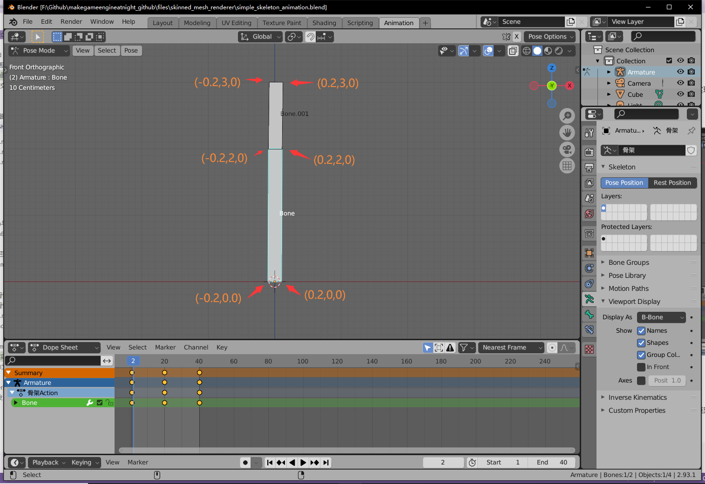
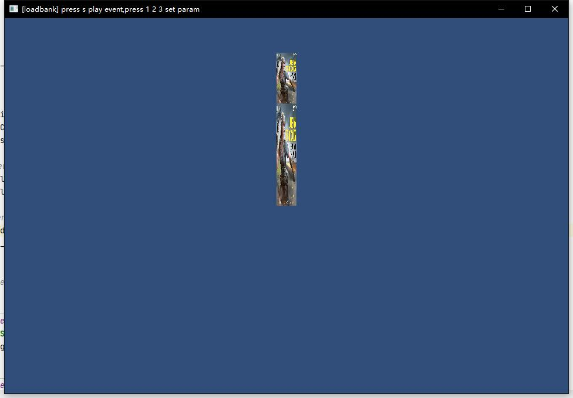
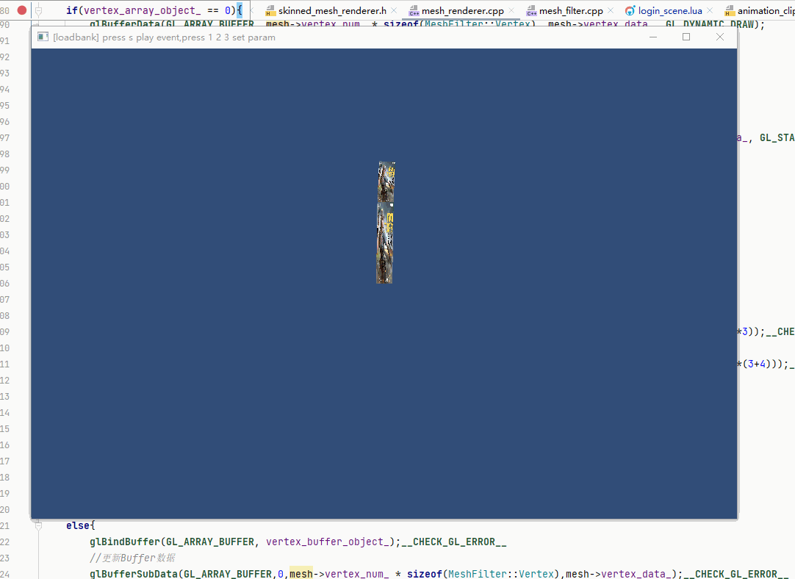

## 19.1 骨骼蒙皮动画实现

```bash
CLion项目文件位于 samples\skinned_mesh_renderer\simple_skinned_mesh_renderer
```

按照上一节说的骨骼蒙皮动画原理，在引擎中手动构建顶点，跟随骨骼运动，实现骨骼蒙皮动画。

### 1. 构建蒙皮顶点



在Blender中查看长方体的相关数据，构建顶点数据。

我这里做前面一个面就行，手动构建立方体顶点数据太复杂了，坐标如图中标注。

目前顶点的坐标、索引、颜色数据以`MeshFilter::Vertex`存储，另外还需要存储顶点跟随哪个骨骼移动。

在`MeshFilter`中新建成员变量`vertex_relate_bone_index_`记录。

```c++
//file:source/renderer/mesh_filter.h line:83

public:
    ......

    /// 获取顶点关联骨骼索引数组，长度为顶点个数
    std::vector<unsigned char>& vertex_relate_bone_index_vec(){return vertex_relate_bone_index_vec_;};

    void set_vertex_relate_bone_index_vec(std::vector<unsigned char>& vertex_relate_bone_index_vec){
        vertex_relate_bone_index_vec_ = vertex_relate_bone_index_vec;
    }

    /// 获取蒙皮Mesh对象指针
    Mesh* skinned_mesh(){return skinned_mesh_;};
    void set_skinned_mesh(Mesh* skinned_mesh){skinned_mesh_ = skinned_mesh;};
private:
    Mesh* mesh_= nullptr;//Mesh对象
    Mesh* skinned_mesh_= nullptr;//蒙皮Mesh对象
    std::vector<unsigned char> vertex_relate_bone_index_vec_;//顶点关联骨骼索引，长度为顶点个数
```

游戏中模型骨骼数一般比较少，所以用`unsigned char*`存储就够了。


```c++
Mesh* skinned_mesh_= nullptr;//蒙皮Mesh对象
```

另外新建了变量`skinned_mesh_`，用于存储每一帧计算得到的，由骨骼变换之后的顶点，然后用于渲染。

在只有`MeshRenderer`的情况下，从`mesh_`中读取静态顶点数据，渲染静态模型。

当挂了`SkinnedMeshRenderer`组件之后，就会计算每一帧由骨骼变换之后的顶点，交由`MeshRenderer`渲染，这样就得到了动画。

现在项目转向Lua了，之前手动构建顶点数据的接口不适用了，于是创建了新的接口。

```c++
//file:source/renderer/mesh_filter.cpp line:73

/// 创建Mesh
/// \param vertex_data 所有的顶点数据,以float数组形式从lua传过来
/// \param vertex_index_data 所有的索引数据,以unsigned short数组形式从lua传过来
void MeshFilter::CreateMesh(std::vector<float>& vertex_data,std::vector<unsigned short>& vertex_index_data){
    if(mesh_!= nullptr){
        delete mesh_;
        mesh_=nullptr;
    }
    mesh_=new Mesh();
    mesh_->vertex_num_=vertex_data.size()/9;//一个vertex由9个float组成。
    mesh_->vertex_index_num_=vertex_index_data.size();

    unsigned short vertex_data_size= mesh_->vertex_num_ * sizeof(Vertex);
    mesh_->vertex_data_= static_cast<Vertex *>(malloc(vertex_data_size));
    memcpy(mesh_->vertex_data_, &vertex_data[0], vertex_data_size);

    unsigned short vertex_index_data_size=mesh_->vertex_index_num_ * sizeof(unsigned short);
    mesh_->vertex_index_data_= static_cast<unsigned short *>(malloc(vertex_index_data_size));
    memcpy(mesh_->vertex_index_data_,&vertex_index_data[0],vertex_index_data_size);
}
```

就是将Lua中传递过来的float数组转成顶点数据。

完成以上接口，就可以在Lua中构建Mesh了。

```lua
--file:example/login_scene.lua line:31

--手动创建Mesh
local vertex_data=sol2.convert_sequence_float({
    -0.2,0,0,  1.0,1.0,1.0,1.0, 0,0,--与 Bone 关联的顶点，就是下面那一根骨骼。
     0.2,0,0,  1.0,1.0,1.0,1.0, 1,0,
     0.2,2,0,  1.0,1.0,1.0,1.0, 1,1,
    -0.2,2,0,  1.0,1.0,1.0,1.0, 0,1,

    -0.2,2,0,  1.0,1.0,1.0,1.0, 0,0,--与 Bone.001 关联的顶点，就是上面一根骨骼。
     0.2,2,0,  1.0,1.0,1.0,1.0, 1,0,
     0.2,3,0,  1.0,1.0,1.0,1.0, 1,1,
    -0.2,3,0,  1.0,1.0,1.0,1.0, 0,1,
})
local vertex_index_data=sol2.convert_sequence_ushort({
    0,1,2,
    0,2,3,

    4,5,6,
    4,6,7
})
local vertex_relate_bone_index_vec=sol2.convert_sequence_uchar({--顶点关联的骨骼序号
    0, 0, 0, 0,
    1, 1, 1, 1
})
local mesh_filter=self.go_skeleton_:AddComponent("MeshFilter")
mesh_filter:CreateMesh(vertex_data,vertex_index_data)--手动构建Mesh
mesh_filter:set_vertex_relate_bone_index_vec(vertex_relate_bone_index_vec)
```

有了顶点之后，然后创建`GameObject` ，加 `MeshRenderer` 创建 `Material`之类的就不再详细说了。

效果如图：



### 2. 每帧更新顶点

根据骨骼动画播放时间，可以计算得到当前位于第几帧，然后就可以获取到这一帧所有骨骼的状态矩阵。

将骨骼的状态矩阵作用于顶点，顶点就会跟随骨骼移动，这就是骨骼蒙皮动画。

这一操作在`SkinnedMeshRenderer`中完成。

```c++
//file:source/renderer/skinned_mesh_renderer.cpp line:24

void SkinnedMeshRenderer::Update() {
    //主动获取 MeshFilter 组件
    auto component_mesh_filter=game_object()->GetComponent("MeshFilter");
    auto mesh_filter=dynamic_cast<MeshFilter*>(component_mesh_filter);
    if(!mesh_filter){
        DEBUG_LOG_ERROR("SkinnedMeshRenderer::Update() failed, can't get MeshFilter component");
        return;
    }
    //获取 Mesh
    auto mesh=mesh_filter->mesh();
    if(!mesh){
        DEBUG_LOG_ERROR("SkinnedMeshRenderer::Update() failed, can't get Mesh");
        return;
    }
    //获取顶点关联骨骼索引数组，长度为顶点个数
    auto vertex_relate_bone_index_vec=mesh_filter->vertex_relate_bone_index_vec();
    if(vertex_relate_bone_index_vec.empty()){
        DEBUG_LOG_ERROR("SkinnedMeshRenderer::Update() failed, can't get vertex relate bone index");
        return;
    }

    //主动获取 Animation 组件
    auto component_animation=game_object()->GetComponent("Animation");
    auto animation=dynamic_cast<Animation*>(component_animation);
    if(!animation){
        DEBUG_LOG_ERROR("SkinnedMeshRenderer::Update() failed, can't get Animation component");
        return;
    }
    //获取当前播放的 AnimationClip
    auto animation_clip=animation->current_animation_clip();
    if(!animation_clip){
        DEBUG_LOG_ERROR("SkinnedMeshRenderer::Update() failed, can't get current AnimationClip");
        return;
    }
    //获取当前帧最新的骨骼矩阵
    std::vector<glm::mat4>& bone_matrices=animation_clip->GetCurrentFrameBoneMatrix();
    //获取 SkinnedMesh
    MeshFilter::Mesh* skinned_mesh=mesh_filter->skinned_mesh();
    if(skinned_mesh==nullptr){
        //拷贝Mesh整体
        skinned_mesh= static_cast<MeshFilter::Mesh *>(malloc(mesh->size()));
        memcpy(skinned_mesh,mesh, mesh->size());
        mesh_filter->set_skinned_mesh(skinned_mesh);

        //拷贝顶点数据 vertex_data_
        skinned_mesh->vertex_data_= static_cast<MeshFilter::Vertex *>(malloc(mesh->vertex_num_*sizeof(MeshFilter::Vertex)));
        memcpy(skinned_mesh->vertex_data_,mesh->vertex_data_, mesh->vertex_num_*sizeof(MeshFilter::Vertex));
    }
    //计算当前帧顶点位置
    for(int i=0;i<skinned_mesh->vertex_num_;i++){
        auto& vertex=mesh->vertex_data_[i];
        auto& bone_index=vertex_relate_bone_index_vec[i];

        //获取当前顶点关联的骨骼T-Pos矩阵
        glm::mat4& bone_t_pose_matrix=animation_clip->GetBoneTPose(bone_index);
        //获取T-Pos矩阵的逆矩阵
        glm::mat4 bone_t_pose_matrix_inverse=glm::inverse(bone_t_pose_matrix);
        //将顶点坐标转换到骨骼空间
        glm::vec4 vertex_position=bone_t_pose_matrix_inverse*glm::vec4(vertex.position_,1.0f);

        //当前帧顶点关联的骨骼矩阵
        auto& bone_matrix=bone_matrices[bone_index];
        //计算当前帧顶点位置(模型坐标系，bone_matrix里带了相对于模型坐标系的位置，作用到骨骼坐标系的位置上，就转换到了模型坐标系)
        glm::vec4 pos_in_world=bone_matrix*vertex_position;

        skinned_mesh->vertex_data_[i].position_=glm::vec3{pos_in_world.x,pos_in_world.y,pos_in_world.z};
    }
}
```

流程如下：
1. 从`MeshFilter`获取静态`Mesh`数据，获取顶点关联的骨骼序号。
2. 将顶点坐标乘以骨骼T-POS逆矩阵，顶点从模型坐标系变换到骨骼坐标系。
3. 将这一帧骨骼的变换矩阵作用于骨骼坐标系中的顶点坐标，就得到了当前帧模型坐标系的顶点坐标。
4. 将当前帧模型坐标系的顶点坐标填到`skinned_mesh`。

### 3. 渲染

得到当前帧的顶点坐标后，扔到`MeshRenderer`去渲染。

不过之前`MeshRenderer`使用了`VBO`、`EBO`来缓存顶点数据到显存，而现在骨骼蒙皮动画的顶点数据是每一帧变化的。

就需要每一帧都对显存中缓存的顶点数据进行更新。

骨骼蒙皮动画计算的只是新的顶点坐标，所以只需要更新`VBO`就可以了，`EBO`中存储的是索引，无需更新。

另外顶点数据上传的时候，要设定为`GL_DYNAMIC_DRAW`，因为我们每个Update都会去修改，而`GL_STATIC_DRAW`表示不会修改，OpenGL对这两个设置会选择不同的存储方案以达到更好的性能。


更新`VBO`用`glBufferSubData`，API定义如下：

```c++
/// 更新缓冲区对象
/// \param target 目标，一般用 GL_ARRAY_BUFFER
/// \param offset 从哪个位置开始更新
/// \param size   更新多少字节数据
/// \param data   数据
void glBufferSubData(GLenum  target, GLintptr  offset, GLsizeiptr  size, const void * data);
```

在`MeshRenderer`中，判断如果`skinned_mesh`存在，则每一帧都更新`VBO`。

```c++
//file:source/renderer/mesh_renderer.cpp line:74

//当骨骼蒙皮动画生效时，渲染骨骼蒙皮Mesh
MeshFilter::Mesh* mesh=mesh_filter->skinned_mesh()== nullptr?mesh_filter->mesh():mesh_filter->skinned_mesh();

//获取`Shader`的`gl_program_id`，指定为目标Shader程序。
GLuint gl_program_id=material_->shader()->gl_program_id();

if(vertex_array_object_ == 0){
    ......
}
else{
    glBindBuffer(GL_ARRAY_BUFFER, vertex_buffer_object_);__CHECK_GL_ERROR__
    //更新Buffer数据
    glBufferSubData(GL_ARRAY_BUFFER,0,mesh->vertex_num_ * sizeof(MeshFilter::Vertex),mesh->vertex_data_);__CHECK_GL_ERROR__
}
```

### 4. 测试

在Lua中创建好物体，挂上`MeshFilter` `MeshRenderer` `SkinnedMeshRenderer`，手动创建好顶点数据，加载从Blender导出的骨骼动画。

```lua
--file:example/login_scene.lua line:17

function LoginScene:Awake()
    --创建相机1 GameObject
    self.go_camera_= GameObject("main_camera")
    --挂上 Transform 组件
    self.go_camera_:AddComponent("Transform"):set_position(glm.vec3(0, 0, 10))
    --挂上 Camera 组件
    self.camera_=self.go_camera_:AddComponent("Camera")
    self.camera_:set_depth(0)

    --创建骨骼蒙皮动画
    self.go_skeleton_=GameObject("skeleton")
    self.go_skeleton_:AddComponent("Transform"):set_position(glm.vec3(0, 0, 0))
    self.go_skeleton_:AddComponent("Animation"):LoadAnimationClipFromFile("animation/export.skeleton_anim","idle")

    --手动创建Mesh
    local vertex_data=sol2.convert_sequence_float({
        -0.2,0,0,  1.0,1.0,1.0,1.0, 0,0,--与 Bone 关联的顶点，就是下面那一根骨骼。
         0.2,0,0,  1.0,1.0,1.0,1.0, 1,0,
         0.2,2,0,  1.0,1.0,1.0,1.0, 1,1,
        -0.2,2,0,  1.0,1.0,1.0,1.0, 0,1,

        -0.2,2,0,  1.0,1.0,1.0,1.0, 0,0,--与 Bone.001 关联的顶点，就是上面一根骨骼。
         0.2,2,0,  1.0,1.0,1.0,1.0, 1,0,
         0.2,3,0,  1.0,1.0,1.0,1.0, 1,1,
        -0.2,3,0,  1.0,1.0,1.0,1.0, 0,1,
    })
    local vertex_index_data=sol2.convert_sequence_ushort({
        0,1,2,
        0,2,3,

        4,5,6,
        4,6,7
    })
    local vertex_relate_bone_index_vec=sol2.convert_sequence_uchar({--顶点关联的骨骼序号
        0, 0, 0, 0,
        1, 1, 1, 1
    })
    local mesh_filter=self.go_skeleton_:AddComponent("MeshFilter")
    mesh_filter:CreateMesh(vertex_data,vertex_index_data)--手动构建Mesh
    mesh_filter:set_vertex_relate_bone_index_vec(vertex_relate_bone_index_vec)

    --手动创建Material
    self.material_ = Material()--设置材质
    self.material_:Parse("material/cube.mat")

    --挂上 MeshRenderer 组件
    local skinned_mesh_renderer= self.go_skeleton_:AddComponent("SkinnedMeshRenderer")
    skinned_mesh_renderer:SetMaterial(self.material_)

    --播放动画
    self.go_skeleton_:GetComponent("Animation"):Play("idle")
end
```

最终效果如图：

