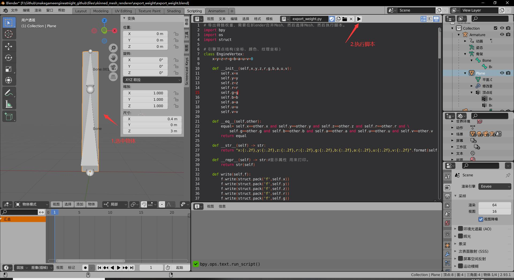
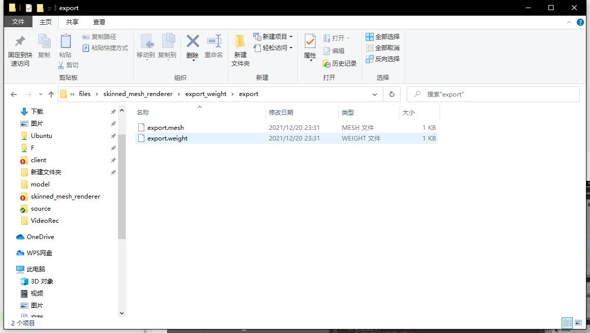
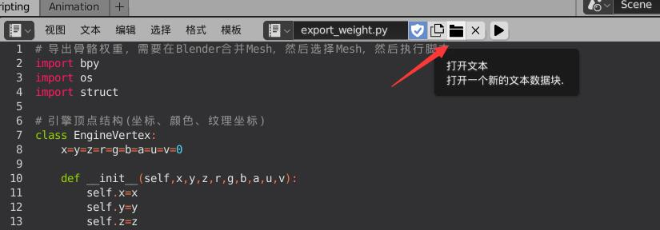

## 19.4 Blender导出蒙皮权重

```bash
Blender文件位于 files\skinned_mesh_renderer\export_weight\export_weight.blend
```

在Blender中做完蒙皮，并且刷好权重之后，就可以导出了。

前面已经介绍了如何导出Mesh，以及骨骼动画，那么现在只要导出顶点关联的骨骼序号以及对应权重即可。

其实就是导出 `19.2 骨骼权重` 手动创建的数据，如下：

```lua
--file:example/login_scene.lua line:53

--顶点关联骨骼信息,按照 bone_index_[4] bone_weight_[4] 的顺序存储
local vertex_relate_bone_infos=sol2.convert_sequence_int({
    0, -1, -1, -1, --[[左边骨骼，右边权重]] 100, -1, -1, -1,--第一个顶点：关联骨骼0，权重是1。注意-1表示无骨骼。
    0, -1, -1, -1, --[[左边骨骼，右边权重]] 100, -1, -1, -1,--第二个顶点同理
    0, -1, -1, -1, --[[左边骨骼，右边权重]] 100, -1, -1, -1,--第三个顶点同理
    0, -1, -1, -1, --[[左边骨骼，右边权重]] 100, -1, -1, -1,--第四个顶点同理

    0,  1, -1, -1, --[[左边骨骼，右边权重]] 70,  30, -1, -1,--第一个顶点：关联骨骼0，权重0.7，关联骨骼1，权重0.3。
    0, -1, -1, -1, --[[左边骨骼，右边权重]] 100, -1, -1, -1,--第二个顶点：关联骨骼0，权重1.
    1, -1, -1, -1, --[[左边骨骼，右边权重]] 100, -1, -1, -1,--第三个顶点：关联骨骼1，权重1.
    1, -1, -1, -1, --[[左边骨骼，右边权重]] 100, -1, -1, -1,--第四个顶点：关联骨骼1，权重1.
})
mesh_filter:set_vertex_relate_bone_infos(vertex_relate_bone_infos)
```

只不过上面是在Lua中手动创建的数据，受限于Lua的API，没法直接以内存的形式传递，而是从`table`转成了`vector`，再遍历拷贝。

在Blender中导出，可以直接导出更符合内存结构的数据到文件中，在引擎中就只要加载然后`memcpy`，速度更快。

来看一下之前的代码，单个顶点关联的骨骼及权重，用结构`VertexRelateBoneInfo`来存储。

```c++
//file:source/renderer/mesh_filter.h line:84

/// 顶点关联骨骼及权重,每个顶点最多可以关联4个骨骼。
struct VertexRelateBoneInfo{
    char bone_index_[4];//骨骼索引，一般骨骼少于128个，用char就行。
    char bone_weight_[4];//骨骼权重，权重不会超过100，所以用char类型就可以。
};
```

所有顶点关联的骨骼权重，存储在`MeshFilter::vertex_relate_bone_infos_`中：

```c++
private:
    ......
    VertexRelateBoneInfo* vertex_relate_bone_infos_= nullptr;//顶点关联骨骼信息(4个骨骼索引、权重)，长度为顶点数
```

按照这个结构，只要将Lua中手动创建的数据格式，一个一个数字写入到文件就行了。

读取的时候再读取整段数据，`memcpy`即可。

下面就来看如何导出吧。

### 导出蒙皮权重数据

我这里还是直接贴出Blender的Python代码，注释写的比较详细。

```python
# file:files\skinned_mesh_renderer\export_weight\export_weight.py

# 导出骨骼权重，需要在Blender合并Mesh，然后选择Mesh，然后执行脚本。
import bpy
import os
import struct

# 引擎顶点结构(坐标、颜色、纹理坐标)
class EngineVertex:
    x=y=z=r=g=b=a=u=v=0

    def __init__(self,x,y,z,r,g,b,a,u,v):
        self.x=x
        self.y=y
        self.z=z
        self.r=r
        self.g=g
        self.b=b
        self.a=a
        self.u=u
        self.v=v
    
    def __eq__(self,other):
        equal= self.x==other.x and self.y==other.y and self.z==other.z and self.r==other.r and \
            self.g==other.g and self.b==other.b and self.a==other.a and self.u==other.u and self.v==other.v
        return equal

    def __str__(self) -> str:
        return "x:{:.2f},y:{:.2f},z:{:.2f},r:{:.2f},g:{:.2f},b:{:.2f},a:{:.2f},u:{:.2f},v:{:.2f}".format(self.x,self.y,self.z,self.r,self.g,self.b,self.a,self.u,self.v)

    def __repr__(self) -> str:#显示属性 用来打印。
        return str(self)

    def write(self,f):
        f.write(struct.pack('f',self.x))
        f.write(struct.pack('f',self.y))
        f.write(struct.pack('f',self.z))
        f.write(struct.pack('f',self.r))
        f.write(struct.pack('f',self.g))
        f.write(struct.pack('f',self.b))
        f.write(struct.pack('f',self.a))
        f.write(struct.pack('f',self.u))
        f.write(struct.pack('f',self.v))

# 顶点关联骨骼及权重,每个顶点最多可以关联4个骨骼。
class VertexRelateBoneInfo:
    bone_index=[-1,-1,-1,-1] #骨骼索引，一般骨骼少于128个，用char就行。注意-1表示无骨骼。
    bone_weight=[-1,-1,-1,-1]#骨骼权重，权重不会超过100，所以用char类型就可以。

    def __init__(self):# 一定要在 __init__ 里面初始化一次，不然每次实例化返回的对象实例都是相同指针。
        self.bone_index=[-1,-1,-1,-1]
        self.bone_weight=[-1,-1,-1,-1]

    def __str__(self):
        return "bone_index:{},bone_weight:{}".format(self.bone_index,self.bone_weight)

    def __repr__(self):
        return str(self)
    
    def write(self,f):
        for i in range(4):# 写入4个骨骼索引
            f.write(struct.pack('b',self.bone_index[i]))
        for i in range(4):# 写入4个骨骼权重，注意权重是乘以100的。
            if self.bone_weight[i]>=0:
                f.write(struct.pack('b',int(self.bone_weight[i]*100)))
            else:
                f.write(struct.pack('b',-1))

# 显示信息框
def ShowMessageBox(message = "", title = "Message Box", icon = 'INFO'):
    def draw(self, context):
        self.layout.label(text=message)
    bpy.context.window_manager.popup_menu(draw, title = title, icon = icon)

print("----------- EXPORT MESH & WEIGHT ---------")

# 当前选中的Mesh
mesh_selected = bpy.context.object.data

print("---------- COLLECT BONE ------------")
# 收集骨骼名字 [bone_name , bone_name , ...]
bone_names=[]
armature_object = bpy.data.objects["Armature"]
for i in range(0, len(armature_object.data.bones)):
    bone = armature_object.data.bones[i]
    bone_names.append(bone.name)
print(bone_names)

print("---------- COLLECT WEIGHT ------------")
# 收集骨骼权重
armature_object = bpy.data.objects["Armature"]#场景中的骨架对象。

object_group_names = [g.name for g in bpy.context.object.vertex_groups]# 获取当前Mesh 关联的所有的顶点组名称。
print(object_group_names)

print("----------- GENERATE MESH & WEIGHT ---------")
# 生成引擎顶点数据，并设置权重。
uv_layer = mesh_selected.uv_layers.active.data

engine_vertexes=[]
engine_vertex_indexes=[]
engine_vertex_relate_bone_infos=[]#顶点关联骨骼信息(4个骨骼索引、权重)，长度为顶点数。

for poly in mesh_selected.polygons:#遍历多边形
    print("Polygon index: %d, length: %d" % (poly.index, poly.loop_total))
    if poly.loop_total==4:
        ShowMessageBox("Need Triangle","Polygon Error",  'ERROR')
        break
    
    # 遍历一个多边形的3个顶点，注意这里的loop_index是包含重复顶点的顶点数组的index，是以三角形为单位*3作为顶点总数，并不是实际顶点的index。
    # 例如第一个三角形就是0 1 2，第二个三角形就是 3 4 5。是包含重复顶点的。
    for loop_index in range(poly.loop_start + poly.loop_total-1,poly.loop_start-1,-1):
        vertex_index=mesh_selected.loops[loop_index].vertex_index#顶点在Blender中的索引
        vertex=mesh_selected.vertices[vertex_index]
        uv=uv_layer[loop_index].uv

        engine_vertex=EngineVertex(vertex.co.x,vertex.co.z,vertex.co.y,1,1,1,1,uv.x,uv.y)#构造引擎顶点，注意 y z调换
        
        #判断顶点是否存在
        find_engine_vertex_index=-1
        for engine_vertex_index in range(len(engine_vertexes)):
            if engine_vertexes[engine_vertex_index]==engine_vertex:
                find_engine_vertex_index=engine_vertex_index
                break
        
        if find_engine_vertex_index<0:
            find_engine_vertex_index=len(engine_vertexes)
            engine_vertexes.append(engine_vertex)

            # 这个顶点的权重数据
            vertex_relate_bone_info=VertexRelateBoneInfo()
            for group_index in range(0, len(vertex.groups)):#遍历顶点关联的顶点组。
                group = vertex.groups[group_index]
                group_name = object_group_names[group.group]#获取顶点组名字
                # print("Vertex group index: %d, group name: %s, weight: %f" % (group_index, group_name, group.weight))
                if group_name in bone_names:#判断顶点组名字是否在骨骼名字列表中。制作的时候，建模人员要严格按照骨骼名字来作为顶点组名字。
                    bone_index=bone_names.index(group_name)#获取骨骼索引。
                    vertex_relate_bone_info.bone_index[group_index]=bone_index
                    vertex_relate_bone_info.bone_weight[group_index]=group.weight
                else:
                    print("Error: group name not in bone names")
            # print(vertex_relate_bone_info)
            engine_vertex_relate_bone_infos.append(vertex_relate_bone_info)
            
        engine_vertex_indexes.append(find_engine_vertex_index)#把index放入顶点索引表
        
print(engine_vertexes)
print(engine_vertex_indexes)
print(*engine_vertex_relate_bone_infos,sep='\n')

print("----------- CHECK EXPORT DIR ---------")

# 检查目录 export 是否存在，不存在则创建
blender_project_dir = os.path.dirname(bpy.data.filepath)
if os.path.exists(blender_project_dir+"/export")==False:
    os.mkdir(blender_project_dir+"/export")

print("----------- WRITE MESH FILE ---------")

# 将顶点数据写入 export.mesh 文件
with open(blender_project_dir+"/export/export.mesh", 'wb') as f:
    #写入文件头
    f.write("mesh".encode())
    f.write(struct.pack('H',len(engine_vertexes)))
    f.write(struct.pack('H',len(engine_vertex_indexes)))
    
    #写入顶点数据
    for engine_vertex in engine_vertexes:
        engine_vertex.write(f)

    #写入索引数据
    kVertexIndexVectorInverse=engine_vertex_indexes[::-1]
    for engine_vertex_index in kVertexIndexVectorInverse:
        f.write(struct.pack('H',engine_vertex_index))
    
    f.close()

print("----------- WRITE WEIGHT FILE ---------")
    
# 将权重数据写入 export.weight 文件
with open(blender_project_dir+"/export/export.weight", 'wb') as f:
    #写入文件头
    f.write("weight".encode())

    #写入顶点关联骨骼信息(4个骨骼索引、权重)，长度为顶点数。
    for vertex_relate_bone_info in engine_vertex_relate_bone_infos:
        vertex_relate_bone_info.write(f)
    
    f.close()
    
print("----------- SUCCESS --------------")
```

注意先选中物体，然后再执行脚本。



会同时导出`.Mesh`(模型)和`.Weight`(权重)文件。



如果代码没有加载出来，可能是因为我电脑路径和你电脑路径不对，那点旁边的按钮，再打开代码文件。

