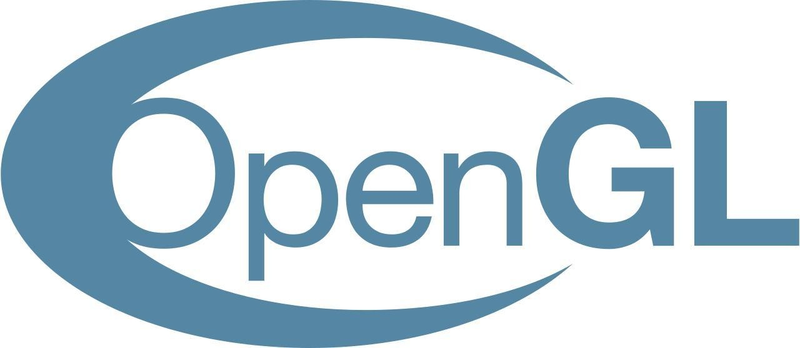

##2.1 Opengl到底是什么

###opengl是一套规范。

opengl是一套规范，这套规范制定了一些opengl的API 和 shader 语法。

这里我可以用大家熟悉的C#来作为对比，C#也是一套规范，制定了基本的API 和 语法规则，但是在API之下，具体的实现，是可以不同的。

微软对C#的实现是C#.net，我们在Unity里用到的C#实现，是C# mono。

opengl这套规范也是如此，API的具体实现是交给显卡厂商的，Intel的集成显卡可能是这样实现的，英伟达的显卡确是另外的一套实现。

在保证实现规范里的API之后，显卡厂商会自己再进行一些扩展，添加一些高性能的特有的API，这种API一般以EXT标记。

所以当我们打开一个Unity 编译好的shader，会看到里面有很多判断用来区分显卡厂商，这是Unity在尝试使用显卡厂商最新添加的扩展API，以获得最高的性能。

可以到维基百科查看更官方的介绍以及opengl的历史发展：https://en.wikipedia.org/wiki/OpenGL

###为什么选择OpenGL

opengl已经是上一个时代的产物，opengl的下一个版本是Vulkan，与最新的DX，Metal齐头并进。

但是我们并不会花太多时间在图形库上，所以学习任何一种图形库都是可以的。

之所以选择opengl，是因为opengl是目前唯一支持所有平台的图形库，这样可以更快速的完成引擎的第一个版本。