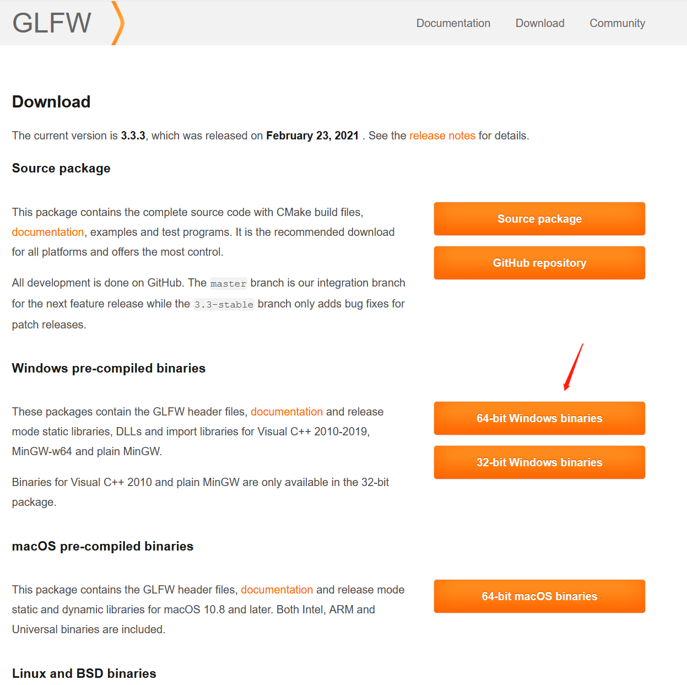
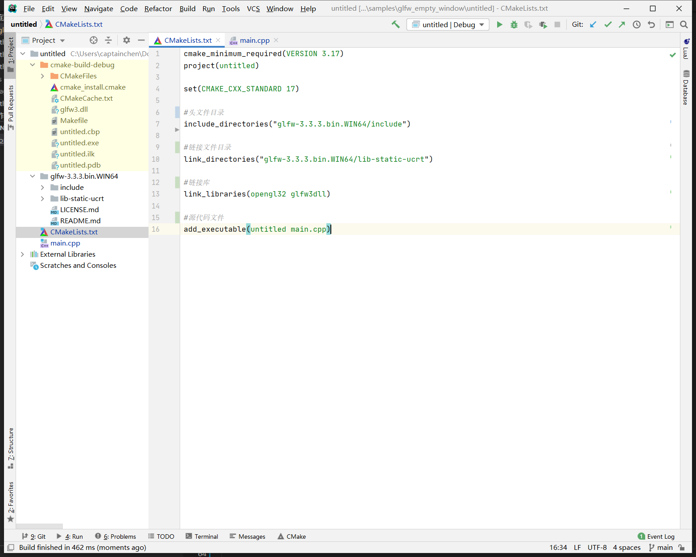
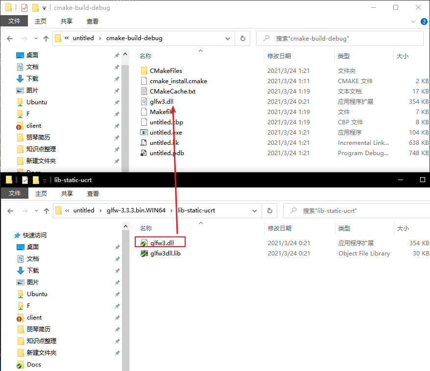
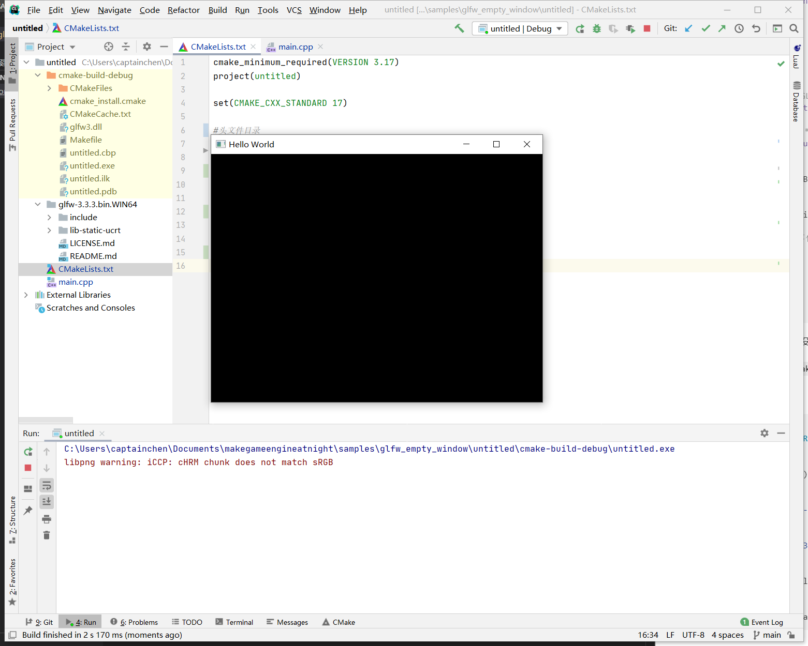

##2.2 搭建Opengl开发环境

如果要自己一行一行代码去创建opengl环境，比较麻烦，opengl官网推荐了很多开源库，几行代码就可以创建opengl环境。

我这里选择 glfw 。


###1.下载glfw

glfw的下载地址 `https://www.glfw.org/download.html`

在download 页面，选择 对应系统文件 下载。



###2.配置CLion项目

首先安装好Mingw+CLion，先安装Mingw，再安装CLion打开后会自动识别。

    Mingw下载地址：http://sourceforge.net/projects/mingw-w64/files/Toolchains%20targetting%20Win32/Personal%20Builds/mingw-builds/installer/mingw-w64-install.exe/download
    CLion下载地址；https://www.jetbrains.com/clion/
    

用CLion新建一个`C++`项目，然后复制下面的代码到 `main.cpp` 中。

```c++
//main.cpp
#include <GLFW/glfw3.h>

int main(void)
{
    GLFWwindow* window;

    /* 初始化glfw */
    if (!glfwInit())
        return -1;

    /* 创建一个Window 和 OpenGL上下文 */
    window = glfwCreateWindow(640, 480, "Hello World", NULL, NULL);
    if (!window)
    {
        //创建失败就退出
        glfwTerminate();
        return -1;
    }

    /* 激活上面创建的OpenGL上下文 */
    glfwMakeContextCurrent(window);

    /* 进入游戏引擎主循环 */
    while (!should_close(window))
    {
        /* Render here */
        glClear(GL_COLOR_BUFFER_BIT);

        /* Swap front and back buffers */
        glfwSwapBuffers(window);

        /* 处理鼠标 键盘事件 */
        glfwPollEvents();
    }

    glfwTerminate();
    return 0;
}
```

如下图


这个时候编译不通过的，还没有添加 glfw lib库和头文件引用。

CLion中的依赖库全部在 `CMakeLists.txt` 中进行配置。

修改如下：

```cmake
#CMakeLists.txt
cmake_minimum_required(VERSION 3.17)
project(untitled)

set(CMAKE_CXX_STANDARD 17)

#头文件目录
include_directories("glfw-3.3.3.bin.WIN64/include")

#链接文件目录
link_directories("glfw-3.3.3.bin.WIN64/lib-static-ucrt")

#链接库
link_libraries(opengl32 glfw3dll)

#源代码文件
add_executable(untitled main.cpp)
```

如下图



这个时候可以编译通过了。但是运行不了，因为缺失dll文件。

拷贝 `glfw-3.3.3.bin.WIN64\lib-static-ucrt\glfw3.dll` 到 `cmake-build-debug` 目录，如下图：



运行，得到一个空的OpenGL窗口(Unity蓝)。




###3.这就是OpenGL

上面得到的黑窗口，就是OpenGL的 `Hello World！`，在这上面慢慢进行扩展，就进入到更绚丽的游戏世界。

仔细观察代码，理解OpenGL的工作流程。


```flow
create_window_context=>start: 创建Window 上下文
make_current_window_context=>inputoutput: 绑定Window 上下文
main_loop=>inputoutput: 进入主循环
    should_close=>condition: 是否退出循环
    render=>inputoutput: 渲染
    swapbuffer=>inputoutput: 交换缓冲区
    pollevent=>inputoutput: 处理IO
end=>end: 结束

create_window_context->make_current_window_context->main_loop->should_close

should_close(yes)->end

should_close(no)->render(right)->swapbuffer(right)->pollevent(right)->should_close
```

###4.示例下载

CLion项目文件存放在 `samples\glfw_empty_window\untitled` 目录中，直接用CLion打开即可。

###5.参考文档

glfw官方教程

    https://www.glfw.org/documentation.html