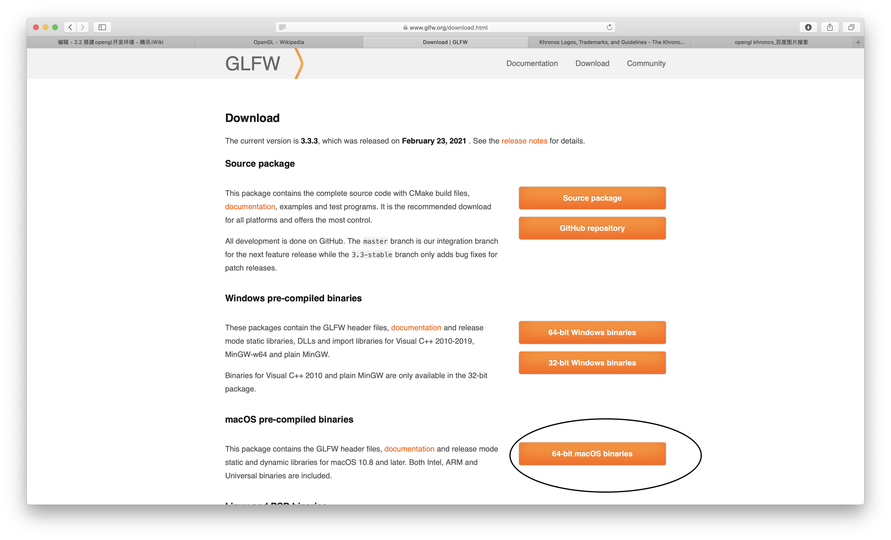

##2.2 搭建Opengl开发环境

如果要自己一行一行代码去创建opengl环境，比较麻烦。

opengl官网也推荐了很多开源库，几行代码就可以创建opengl环境。

我这里选择 glfw 。

###下载glfw

glfw的官网是 https://www.glfw.org

在download 页面，选择 macOS pre-compiled binaries 下载。

如果是Windows，选择上面的Windows pre-compiled binaries，对应系统位数。