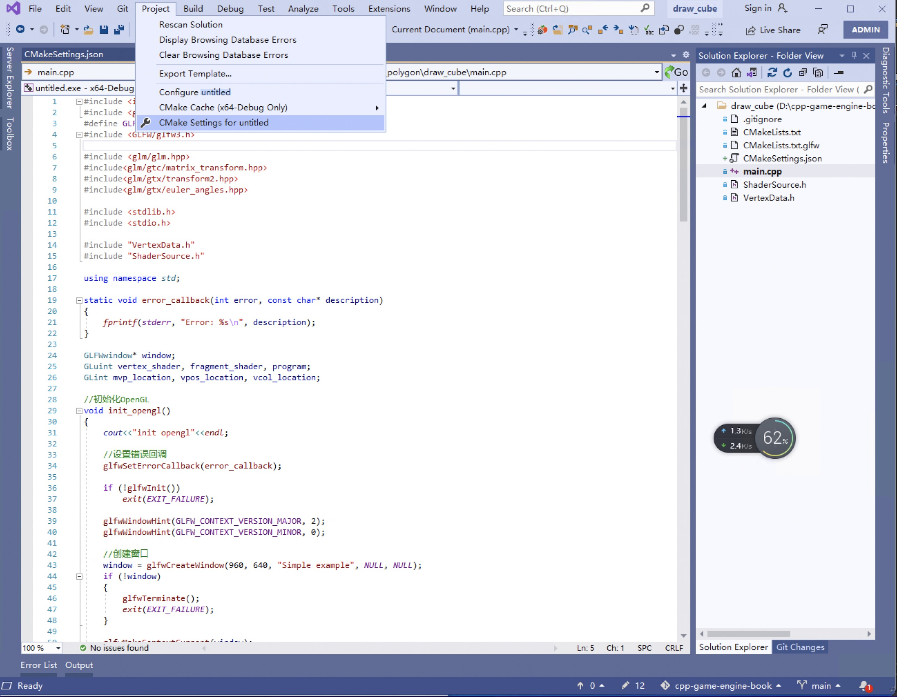
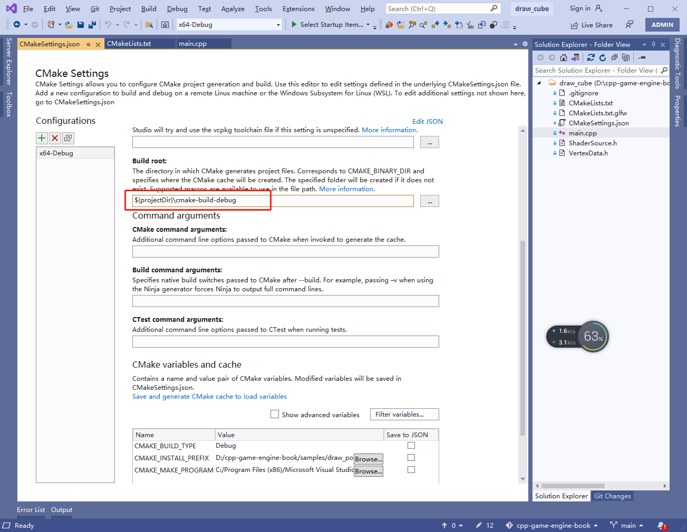
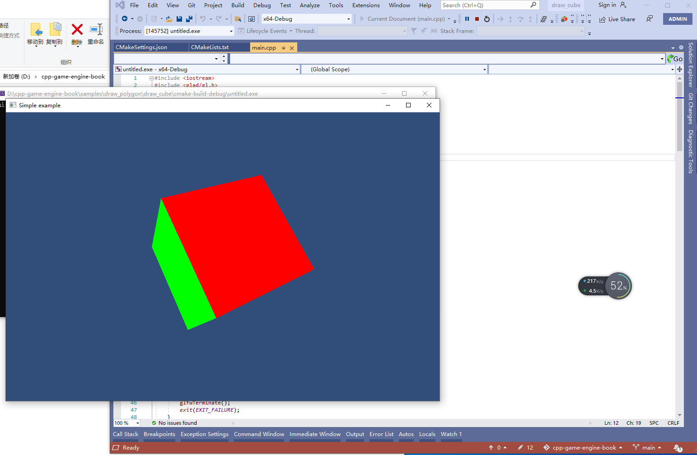
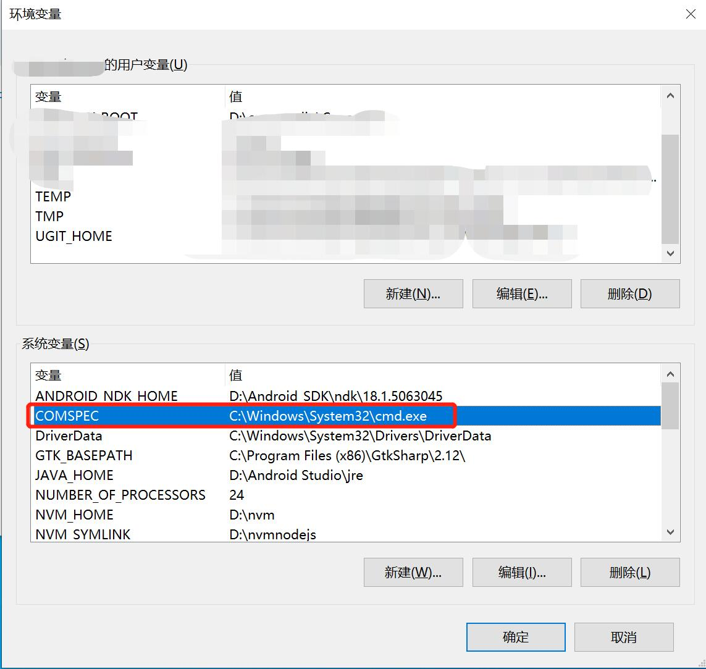

## 2.3 使用VisualStudio开发

VisualStudio自2019开始，支持了CMake，那么可以用VS直接打开CLion项目文件夹。

不过打开之后，会提示找不到源文件等各种错误，这是因为VS的输出目录和CLion不一致导致的。

按如下配置即可。

首先从菜单栏打开CMake配置界面，如下图：

在打开的配置界面中，将红框的配置，修改为下图的值：

保存，就可以编译运行项目了。

如果你的VisualStudio不是安装在默认目录，那么可能还需要添加一个环境变量，如下图：

