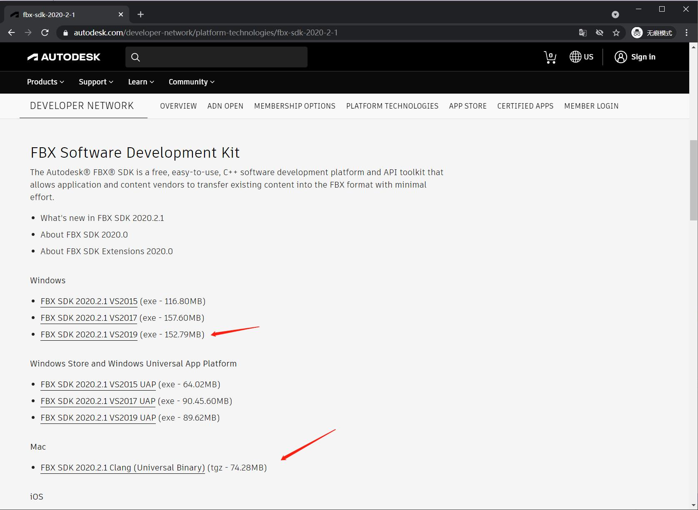
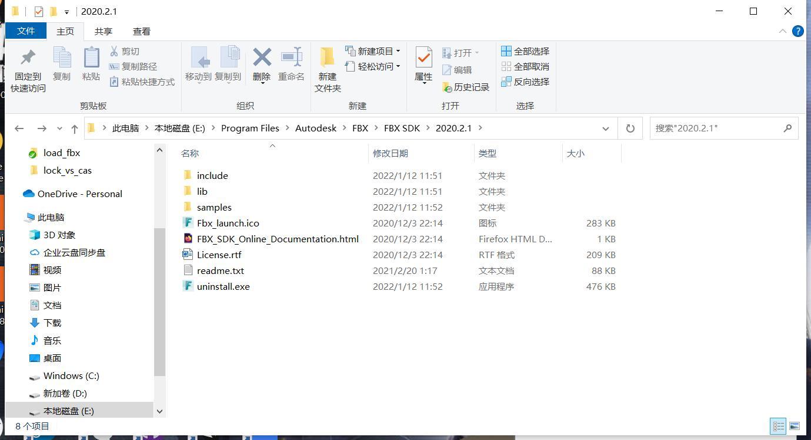
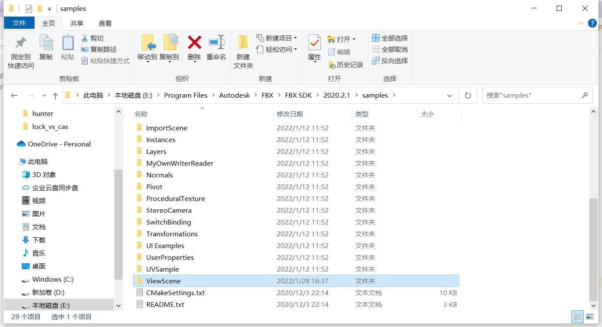
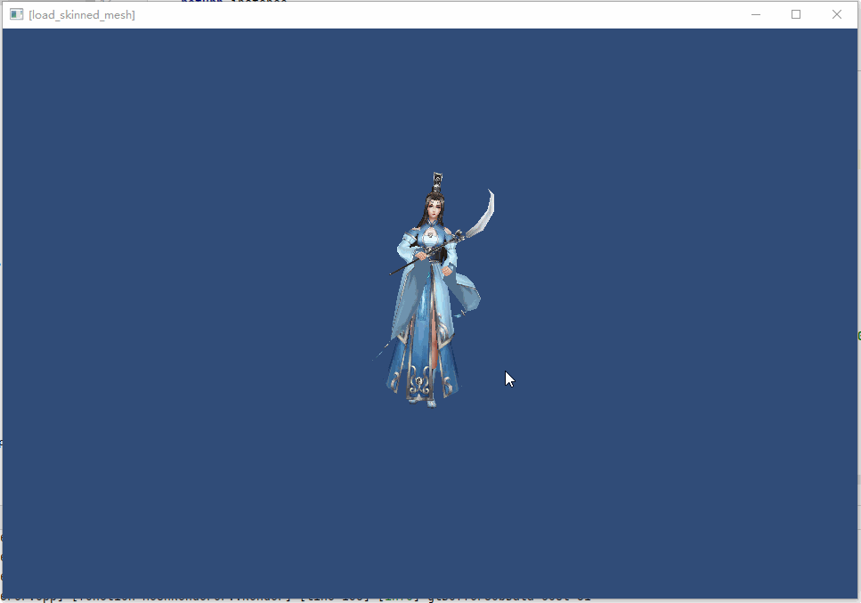

## 20. 解析FBX文件

介绍完了骨骼蒙皮动画之后，是不是感觉自己学了个寂寞，并没有看到游戏中炫酷的动画？

只介绍从Blender导出数据，但是工作中用Blender很少，网上也很少找到Blender的项目资源。

不过这都不是问题，前面介绍Blender只是为了让你理解骨骼蒙皮动画的原理，实际项目很少从Blender导出模型。

游戏开发一般都是从建模软件导出FBX，导入到引擎中转换成引擎所需的格式。

这一章节介绍使用FBX SDK将建模软件导出的FBX，转换成引擎所需的格式。

### 1. FBX简介

FBX是Autodesk家的模型格式，虽然没有开源，但是大家都摸得很熟了，Github上也能找到很多读取FBX的库，最出名的就是Assimp。

Assimp是一个模型转换库，支持多达40多种格式互相转换，例如将FBX转OBJ，将OBJ转FBX等等。

我以前也用过一阵子，有兴趣的话可以参考看看。

```text
OpenGL ES 学习教程(六) 使用开源库 Assimp 将 Obj 模型 转换成自己的格式
https://blog.csdn.net/huutu/article/details/50154875

OpenGL ES 学习教程(十一) Skin Mesh (骨骼动画)
https://blog.csdn.net/huutu/article/details/50727100
```

在这书里就正式一点，用Autodesk提供的官方SDK来解析。

### 2. FBX SDK简介

目前最新的是`FBX SDK 2020.2.1`，下载地址：

```text
https://www.autodesk.com/developer-network/platform-technologies/fbx-sdk-2020-2-1
```



下载自己所需的版本就行。

以Windows版本为例，安装后目录如下：



* include:头文件
* lib: dll、lib
* samples:示例项目



对于本章节内容，只需要看`ViewScene`这一个示例即可，它介绍了如何加载一个FBX文件，并解析骨骼动画，然后进行蒙皮。

本章节内容只是这个例子的一小部分而已。

### 3. 本章目标

本章从FBX文件中导出Mesh、权重、骨骼动画，并解析播放。

最终实现下面的效果。

