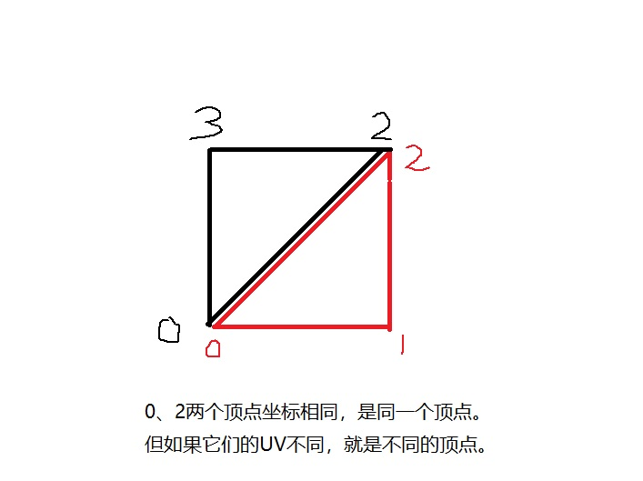

## 20.3 导出权重

```bash
CLion项目文件位于 samples\load_fbx\extra_weight
```

上一节就说到Cluster 顶点组 这个东西，就是受一个骨骼影响的顶点集合。

骨骼影响顶点，这里的`影响`，其实就是权重。

一个顶点可能受到多个骨骼影响，骨骼对顶点影响大，那么权重就大。

权重数据也是从Cluster里面获得。

### 1. 获取权重数据

按照下面步骤获取权重数据：

1. 初始化FBX SDK。
2. 遍历节点，找到Mesh节点。
3. 从Mesh节点获取蒙皮修改器，获取所有Cluster。
4. 从Cluster获取影响的顶点索引，以及对应的权重。

核心代码如下：

```c++
//file:example/main.cpp line:172

void ParseNodeRecursive(FbxNode* pNode){
    auto name=pNode->GetName();
    DEBUG_LOG_INFO("node name: {}", name);
    FbxNodeAttribute* lNodeAttribute = pNode->GetNodeAttribute();
    if (lNodeAttribute)
    {
        // 获取pNode相对于锚点的offset
        ......

        if (lNodeAttribute->GetAttributeType() == FbxNodeAttribute::eMesh)
        {
            ......

            // 实际顶点权重数据
            Engine::VertexRelateBoneInfo* vertex_relate_bone_infos_=new Engine::VertexRelateBoneInfo[lVertexCount];
            // 获取蒙皮修改器
            int lSkinIndex=0;
            FbxSkin * lSkinDeformer = (FbxSkin *)pMesh->GetDeformer(lSkinIndex, FbxDeformer::eSkin);
            // 获取蒙皮修改器上的顶点组数量，一般来说就是骨骼数量，绑定的时候，一般是以一个骨骼作为一个顶点组。
            int lClusterCount = lSkinDeformer->GetClusterCount();
            // 遍历骨骼
            for ( int lClusterIndex=0; lClusterIndex<lClusterCount; ++lClusterIndex) {
                // 获取骨骼的顶点组
                FbxCluster *lCluster = lSkinDeformer->GetCluster(lClusterIndex);

                // 获取这个顶点组影响的顶点索引数量
                int lVertexIndexCount = lCluster->GetControlPointIndicesCount();
                for (int k = 0; k < lVertexIndexCount; ++k) {
                    //拿到顶点索引
                    int lIndex = lCluster->GetControlPointIndices()[k];
                    //拿到这个簇中对这个顶点的权重
                    double lWeight = lCluster->GetControlPointWeights()[k];

                    vertex_relate_bone_infos_[lIndex].Push(lClusterIndex,(int)(lWeight*100));
                }
            }

            //上面记录了所有实际顶点的权重，下面要设置到逻辑顶点上。
            ......

            //写入Weight文件
            ......
        }
    }
    // 遍历子节点，递归
    ......
}
```

获取的顶点权重数据存放在`vertex_relate_bone_infos_`这个结构中：

```c++
//file:example/main.cpp line:172

// 实际顶点权重数据
Engine::VertexRelateBoneInfo* vertex_relate_bone_infos_=new Engine::VertexRelateBoneInfo[lVertexCount];
```

`Engine::VertexRelateBoneInfo`这个就是存储顶点对应骨骼权重的结构，可以回顾一下`19.4 Blender导出蒙皮权重`。

```c++
//file:example/engine.h line:164

/// 顶点关联骨骼及权重,每个顶点最多可以关联4个骨骼。
struct VertexRelateBoneInfo{
    char bone_index_[4];//骨骼索引，一般骨骼少于128个，用char就行。
    char bone_weight_[4];//骨骼权重，权重不会超过100，所以用char类型就可以。

    VertexRelateBoneInfo(){
        for (int i = 0; i < sizeof(bone_index_); ++i) {
            bone_index_[i]=-1;
        }
        for (int i = 0; i < sizeof(bone_weight_); ++i) {
            bone_weight_[i]=-1;
        }
    }

    void Push(char bone_index,char bone_weight){
        for (int i = 0; i < sizeof(bone_index_); ++i) {
            if(bone_index_[i]==-1){
                bone_index_[i]=bone_index;
                if(bone_weight_[i]==-1){
                    bone_weight_[i]=bone_weight;
                    return;
                }
                DEBUG_LOG_ERROR("bone_index_ bone_weight_ not sync");
            }
        }
        DEBUG_LOG_ERROR("too much bone");
    }
};
```

### 2. 组织写入文件

上面获取到权重数据并保存到`vertex_relate_bone_infos_`，这个数据并不能直接写入到`.weight`文件。

因为从Cluster获取到的是实际顶点的索引与权重，而渲染所需要的并不是实际顶点。



如上图的正方形，由2个三角形组成。

按道理说我们只要4个顶点，然后传入6个索引数据，就可以绘制出来这个正方形。

但是如果0、2两个顶点，在两个三角形中的UV不相同，那么它们在每个三角形就都是独一份，就不能算公用顶点。

所以还需要根据UV的情况，对数据再组织一次，才能写入`.weight`文件。

```c++
//file:example/main.cpp line:172

void ParseNodeRecursive(FbxNode* pNode){
    auto name=pNode->GetName();
    DEBUG_LOG_INFO("node name: {}", name);
    FbxNodeAttribute* lNodeAttribute = pNode->GetNodeAttribute();
    if (lNodeAttribute)
    {
        // 获取pNode相对于锚点的offset
        ......

        if (lNodeAttribute->GetAttributeType() == FbxNodeAttribute::eMesh)
        {
            ......

            // 实际顶点权重数据
            Engine::VertexRelateBoneInfo* vertex_relate_bone_infos_=new Engine::VertexRelateBoneInfo[lVertexCount];
            // 获取蒙皮修改器
            int lSkinIndex=0;
            FbxSkin * lSkinDeformer = (FbxSkin *)pMesh->GetDeformer(lSkinIndex, FbxDeformer::eSkin);
            // 获取蒙皮修改器上的顶点组数量，一般来说就是骨骼数量，绑定的时候，一般是以一个骨骼作为一个顶点组。
            int lClusterCount = lSkinDeformer->GetClusterCount();
            // 遍历骨骼
            for ( int lClusterIndex=0; lClusterIndex<lClusterCount; ++lClusterIndex) {
                // 获取骨骼的顶点组
                FbxCluster *lCluster = lSkinDeformer->GetCluster(lClusterIndex);

                // 获取这个顶点组影响的顶点索引数量
                int lVertexIndexCount = lCluster->GetControlPointIndicesCount();
                for (int k = 0; k < lVertexIndexCount; ++k) {
                    //拿到顶点索引
                    int lIndex = lCluster->GetControlPointIndices()[k];
                    //拿到这个簇中对这个顶点的权重
                    double lWeight = lCluster->GetControlPointWeights()[k];

                    vertex_relate_bone_infos_[lIndex].Push(lClusterIndex,(int)(lWeight*100));
                }
            }

            //上面记录了所有实际顶点的权重，下面要设置到逻辑顶点上。
            const FbxVector4 * lControlPoints = pMesh->GetControlPoints();

            // 是否有UV数据？
            bool mHasUV = pMesh->GetElementUVCount() > 0;
            bool mAllByControlPoint = true;
            FbxGeometryElement::EMappingMode lUVMappingMode = FbxGeometryElement::eNone;
            if (mHasUV) {
                lUVMappingMode = pMesh->GetElementUV(0)->GetMappingMode();
                if (lUVMappingMode == FbxGeometryElement::eNone) {
                    mHasUV = false;
                }
                if (mHasUV && lUVMappingMode != FbxGeometryElement::eByControlPoint) {
                    mAllByControlPoint = false;
                }
            }
            // 获取Mesh多边形个数，对游戏来说就是三角形面数。
            const int lPolygonCount = pMesh->GetPolygonCount();
            int lPolygonVertexCount = mAllByControlPoint?pMesh->GetControlPointsCount():lPolygonCount * 3;

            Engine::WeightFile weightFile(lPolygonVertexCount);

            // 遍历所有三角面，遍历每个面的三个顶点，解析顶点坐标、UV坐标数据。
            for (int lPolygonIndex = 0; lPolygonIndex < lPolygonCount; ++lPolygonIndex) {
                // 三角面，3个顶点
                for (int lVerticeIndex = 0; lVerticeIndex < 3; ++lVerticeIndex) {
                    // 传入面索引，以及当前面的第几个顶点，获取顶点索引。
                    const int lControlPointIndex = pMesh->GetPolygonVertex(lPolygonIndex, lVerticeIndex);
                    if (lControlPointIndex >= 0) {
                        Engine::VertexRelateBoneInfo vertex_relate_bone_info=vertex_relate_bone_infos_[lControlPointIndex];
                        for (int i = 0; i < 4; ++i) {
                            char bone_index=vertex_relate_bone_info.bone_index_[i];
                            char weight=vertex_relate_bone_info.bone_weight_[i];
                            weightFile.Push(lPolygonIndex*3+lVerticeIndex,bone_index,weight);
                        }
                    }
                }
            }
            weightFile.Write(fmt::format("../data/model/fbx_extra_{}.weight", name).c_str());
        }
    }
    // 遍历子节点，递归
    ......
}
```

至此，从FBX中导出了Mesh、骨骼动画、权重，万事俱备，下面只要读取这三个数据，就可以渲染骨骼蒙皮动画了。