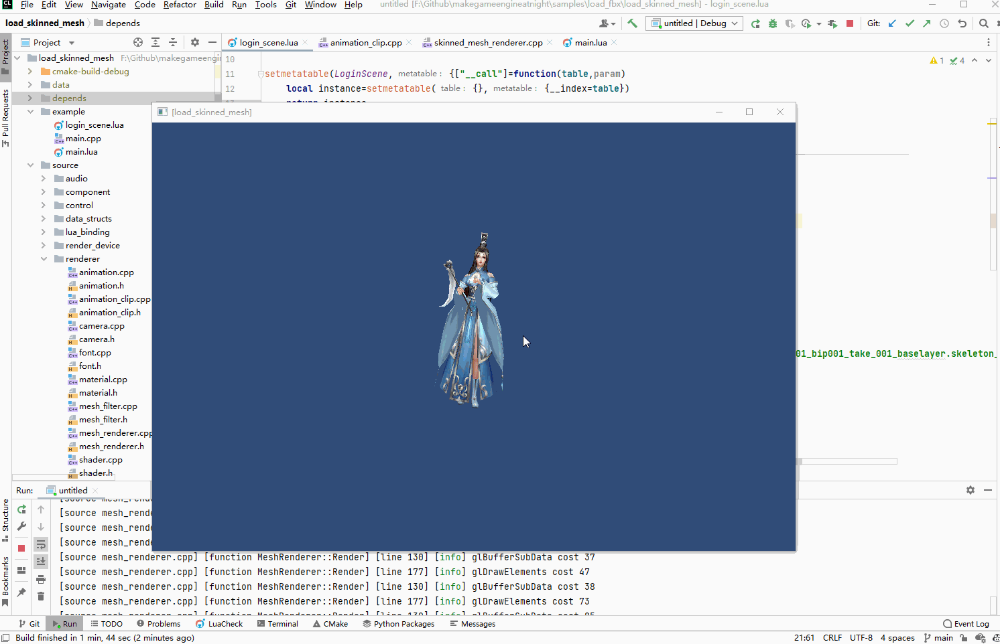

## 20.4 渲染骨骼蒙皮动画

```bash
CLion项目文件位于 samples\load_fbx\extra_weight
```

### 1. 加载Mesh、骨骼动画、权重

回顾前面从FBX中导出了Mesh、骨骼动画、权重的流程，除了骨骼动画导出数据变简单了之外，导出Mesh、权重都是和以前的文件格式一致，没有变化。

那么读取解析Mesh、权重文件的代码就不用修改了。

唯一需要修改的就是读取解析骨骼动画，现在读取后不用Bake：

```c++
//file:source/renderer/animation_clip.cpp line:27

void AnimationClip::LoadFromFile(const char *file_path) {
    //读取文件头
    ifstream input_file_stream(Application::data_path()+file_path,ios::in | ios::binary);
    if(!input_file_stream.is_open()) {
        DEBUG_LOG_ERROR("AnimationClip::LoadFromFile: open file failed,file_path:{}",file_path);
        return;
    }
    char file_head[14];
    input_file_stream.read(file_head,13);
    file_head[13]='\0';
    if(strcmp(file_head,SKELETON_ANIMATION_HEAD) != 0) {
        DEBUG_LOG_ERROR("AnimationClip::LoadFromFile: file head error,file_head:{},the right is:{}",file_head,SKELETON_ANIMATION_HEAD);
        return;
    }
    //读取名字长度
    unsigned short name_length;
    input_file_stream.read(reinterpret_cast<char *>(&name_length),sizeof(name_length));
    //读取名字
    char *name_buffer = new char[name_length+1];
    input_file_stream.read(name_buffer,name_length);
    name_buffer[name_length]='\0';
    name_ = name_buffer;
    delete[] name_buffer;
    //读取帧数
    input_file_stream.read(reinterpret_cast<char *>(&frame_count_),sizeof(frame_count_));
    //读取帧率
    input_file_stream.read(reinterpret_cast<char *>(&frame_per_second_),sizeof(frame_per_second_));
    //读取骨骼数量
    unsigned short bone_count=0;
    input_file_stream.read(reinterpret_cast<char *>(&bone_count), sizeof(unsigned short));
    //读取骨骼名字数组
    for(unsigned short i=0;i<bone_count;i++) {
        //读取骨骼名字长度
        unsigned short bone_name_size=0;
        input_file_stream.read(reinterpret_cast<char *>(&bone_name_size), sizeof(unsigned short));

        char* bone_name=new char[bone_name_size+1];
        input_file_stream.read(bone_name,bone_name_size);
        bone_name[bone_name_size]='\0';
        bone_names_.push_back(bone_name);
        delete[] bone_name;
    }
    //读取骨骼动画
    for (int frame_index = 0; frame_index < frame_count_; frame_index++) {
        //读取一帧的骨骼矩阵
        std::vector<glm::mat4> bone_matrices;
        for (unsigned short bone_index = 0; bone_index < bone_count; bone_index++) {
            glm::mat4 bone_matrix;
            input_file_stream.read(reinterpret_cast<char *>(&bone_matrix), sizeof(float) * 16);
            bone_matrices.push_back(bone_matrix);
        }
        bone_matrix_frames_vector_.push_back(bone_matrices);
    }
    input_file_stream.close();
}
```

在每一帧直接获取当前帧所有骨骼的位移矩阵，作用到顶点上面就可以了：

```c++
//file:source/renderer/skinned_mesh_renderer.cpp line:59

void SkinnedMeshRenderer::Update() {
    ......

    //获取当前播放的 AnimationClip
    auto animation_clip=animation->current_animation_clip();
    if(!animation_clip){
        DEBUG_LOG_ERROR("SkinnedMeshRenderer::Update() failed, can't get current AnimationClip");
        return;
    }
    //获取当前帧最新的骨骼矩阵
    std::vector<glm::mat4>& bone_matrices=animation_clip->GetCurrentFrameBoneMatrix();
    //获取 SkinnedMesh
    MeshFilter::Mesh* skinned_mesh=mesh_filter->skinned_mesh();
    if(skinned_mesh==nullptr){
        //拷贝Mesh整体
        skinned_mesh= static_cast<MeshFilter::Mesh *>(malloc(mesh->size()));
        memcpy(skinned_mesh,mesh, mesh->size());
        mesh_filter->set_skinned_mesh(skinned_mesh);

        //拷贝顶点数据 vertex_data_
        skinned_mesh->vertex_data_= static_cast<MeshFilter::Vertex *>(malloc(mesh->vertex_num_*sizeof(MeshFilter::Vertex)));
        memcpy(skinned_mesh->vertex_data_,mesh->vertex_data_, mesh->vertex_num_*sizeof(MeshFilter::Vertex));
    }
    //计算当前帧顶点位置
    for(int i=0;i<skinned_mesh->vertex_num_;i++){
        auto& vertex=mesh->vertex_data_[i];
        glm::vec4 vertex_position=glm::vec4(vertex.position_,1.0f);

        glm::vec4 pos_by_bones;//对每个Bone计算一次位置，然后乘以权重，最后求和

        for(int j=0;j<4;j++){
            auto& bone_index=vertex_relate_bone_infos[i].bone_index_[j];//顶点关联的骨骼索引
            if(bone_index==-1){
                continue;
            }
            float bone_weight=vertex_relate_bone_infos[i].bone_weight_[j]/100.f;//顶点关联的骨骼权重

            //当前帧顶点关联的骨骼矩阵
            auto& bone_matrix=bone_matrices[bone_index];
            //计算当前帧顶点位置(模型坐标系，bone_matrix里带了相对于模型坐标系的位置，作用到骨骼坐标系的位置上，就转换到了模型坐标系)
            glm::vec4 pos_in_world=bone_matrix*vertex_position;

            //乘以权重
            pos_by_bones=pos_by_bones+pos_in_world*bone_weight;
        }

        skinned_mesh->vertex_data_[i].position_=pos_by_bones.xyz();
    }
}
```

### 2. 实例测试

修改lua代码，加载前面导出的文件，运行测试。

```lua
function LoginScene:Awake()
    --创建相机1 GameObject
    self.go_camera_= GameObject("main_camera")
    --挂上 Transform 组件
    self.go_camera_:AddComponent("Transform"):set_position(glm.vec3(0, 0, 5))
    --挂上 Camera 组件
    self.camera_=self.go_camera_:AddComponent("Camera")
    self.camera_:set_depth(0)

    --创建骨骼蒙皮动画
    self.go_skeleton_=GameObject("skeleton")
    self.go_skeleton_:AddComponent("Transform"):set_position(glm.vec3(0, -1, 0))
    self.go_skeleton_:GetComponent("Transform"):set_rotation(glm.vec3(-90, 0, 0))
    self.go_skeleton_:AddComponent("Animation"):LoadAnimationClipFromFile("animation/fbx_extra_bip001_bip001_take_001_baselayer.skeleton_anim","idle")

    local mesh_filter=self.go_skeleton_:AddComponent("MeshFilter")
    mesh_filter:LoadMesh("model/fbx_extra_jiulian.mesh")--加载Mesh
    mesh_filter:LoadWeight("model/fbx_extra_jiulian.weight")--加载权重文件

    --手动创建Material
    self.material_ = Material()--设置材质
    self.material_:Parse("material/fbx_extra_jiulian.mat")

    --挂上 MeshRenderer 组件
    local skinned_mesh_renderer= self.go_skeleton_:AddComponent("SkinnedMeshRenderer")
    skinned_mesh_renderer:SetMaterial(self.material_)

    --播放动画
    self.go_skeleton_:GetComponent("Animation"):Play("idle")
end
```

看到人物动起来了。

