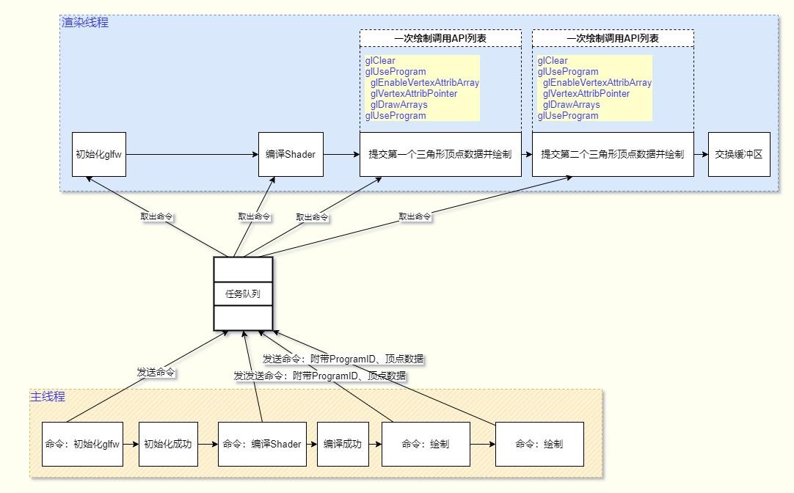
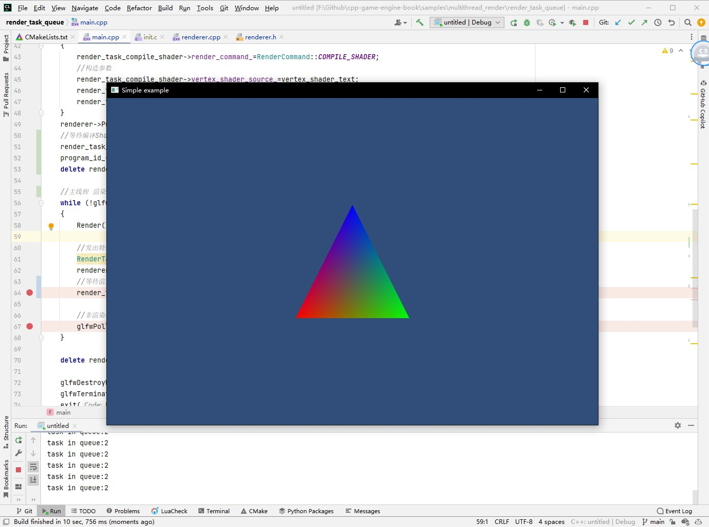

## 21.1 基于任务队列的多线程渲染

上一节测试了GLFW对多线程的支持，证实了在单独子线程调用OpenGL API渲染是可行的。

那么这一节就来对其进行细化，将渲染三角形这一目标，拆分多个子任务，主线程以命令的形式与渲染线程进行通信。

任务可以拆分为任务命令和任务参数。

* 案例一

    你在蹲坑，发现没有纸了，打电话叫你老婆拿纸，这是一个任务。

    任务命令：拿纸

    任务参数：无

    你是主线程，发出命令。

    老婆是渲染线程，接受命令，执行，给你结果。

    这是一个阻塞式任务，你(主线程)必须等老婆(渲染线程)执行任务(拿纸)，返回结果(给你纸)。

    就如下面图中的`编译Shader`命令。

    
    <br>

* 案例二

    你在外面闲逛，你老婆打电话过来叫你去买一斤西瓜，这是一个任务。

    任务命令：买东西

    任务参数有2个：物品：西瓜 重量：一斤

    老婆是主线程，发出命令并带参数。

    你是渲染线程，接受命令，解析参数，执行。

    买西瓜是比较复杂的操作，要去多个店里询问，比价，拿西瓜，称重，最后付款，才算完成了买西瓜这个任务。

    老婆(主线程)不管这些步骤，她只要发命令，然后等结果。

    这是一个非阻塞任务，老婆不会一直等你买瓜回去，她可能在打王者荣耀。

    等你买好瓜到家，老婆又发出命令，让你去切瓜。

    主线程发出渲染命令后，也不会等渲染结果，而是转身就去执行其他逻辑。

    就如案例一图中的`绘制`命令。
    <br>

* 案例三
    
    你老婆在蹲坑，没有纸了，打电话叫你拿纸，叫你买一斤西瓜，然后再去拿两个顺丰快递，然后再去取1000块钱。

    第一个是阻塞任务，然后几个都是非阻塞任务。

    命令太多，参数太多，人到中年，记忆力衰退，你记不住了。
    
    你需要一个任务队列来保存这些任务，然后从任务队列里面取任务来做。

    就如同下图，`编译shader`是阻塞性任务，完成之后才能去做`绘制`这个非阻塞任务。

    
    <br>

那么案例三是我们所需要的，来看下如何实现。

### 1. 渲染任务

非阻塞性任务由 `任务命令` `任务参数` 组成。

阻塞性任务由 `任务命令` `任务参数` `回传结果` 组成。

```c++
/// 渲染命令
enum RenderCommand {
    NONE,
    COMPILE_SHADER,//编译着色器
    DRAW_ARRAY,//绘制
    END_FRAME,//帧结束
};

/// 渲染任务基类
class RenderTaskBase{
public:
    RenderTaskBase(){}
    virtual ~RenderTaskBase(){}
public:
    RenderCommand render_command_;//渲染命令
    bool need_return_result = false;//是否需要回传结果
    bool return_result_set = false;//是否设置好了回传结果
};

/// 需要回传结果的阻塞性任务
class RenderTaskNeedReturnResult: public RenderTaskBase{
public:
    RenderTaskNeedReturnResult(){
        render_command_=RenderCommand::NONE;
        need_return_result=true;
    }
    ~RenderTaskNeedReturnResult(){}
    /// 等待任务在渲染线程执行完毕，并设置回传结果。主线程拿到结果后才能执行下一步代码。
    virtual void Wait(){
        while(return_result_set==false){}
    }
};
```

对于阻塞性任务，在主线程中将`need_return_result`设置为`true`。

渲染线程中处理这个任务后，要设置回传结果，然后设置`return_result_set=true`，标记任务完成。

主线程则调用`Wait()`，等待这个任务执行完毕才继续下一步。

本小节实例中有3个任务：
1. RenderTaskCompileShader (编译着色器任务)
2. RenderTaskDrawArray (绘制任务)
3. RenderTaskEndFrame (特殊任务：帧结束标志)

任务结构如下：

```c++
/// 编译着色器任务
class RenderTaskCompileShader: public RenderTaskNeedReturnResult{
public:
    RenderTaskCompileShader(){
        render_command_=RenderCommand::COMPILE_SHADER;
    }
    ~RenderTaskCompileShader(){}
public:
    const char* vertex_shader_source_= nullptr;
    const char* fragment_shader_source_= nullptr;
public:
    GLuint result_program_id_=0;//存储编译Shader结果的ProgramID
};

/// 绘制任务
class RenderTaskDrawArray: public RenderTaskBase {
public:
    RenderTaskDrawArray(){
        render_command_=RenderCommand::DRAW_ARRAY;
    }
    ~RenderTaskDrawArray(){}
public:
    GLuint program_id_=0;//着色器ProgramID
    const void* positions_=nullptr;//顶点位置
    GLsizei   positions_stride_=0;//顶点数据大小
    const void* colors_=nullptr;//顶点颜色
    GLsizei   colors_stride_=0;//颜色数据大小
};

/// 特殊任务：帧结束标志，渲染线程收到这个任务后，刷新缓冲区，设置帧结束。
class RenderTaskEndFrame: public RenderTaskNeedReturnResult {
public:
    RenderTaskEndFrame(){
        render_command_=RenderCommand::END_FRAME;
    }
    ~RenderTaskEndFrame(){}
public:
    bool render_thread_frame_end_=false;//渲染线程结束一帧
};
```

RenderTaskCompileShader (编译着色器任务)，是阻塞性任务。

在渲染线程编译着色器之后，需要将编译Shader结果的`ProgramID`设置到 `result_program_id_`，主线程拿到它之后，才能继续渲染。

RenderTaskDrawArray (绘制任务)，是非阻塞性的。

绘制一个三角形也没有什么好返回的，主线程源源不断的发出任务，渲染线程不断取出，然后执行即可。

RenderTaskEndFrame (特殊任务：帧结束标志)，也是阻塞性任务。

主线程发出一堆渲染任务后，需要等待渲染线程渲染完毕，并且调用`glfwSwapBuffers`交换缓冲区，然后才能往下走执行其他逻辑代码。

那主线程是如何知道渲染线程渲染完毕呢，没办法知道！

主线程和渲染线程通信是通过阻塞性任务的回传结果，如果在主线程中能确定某个任务是最后一个任务，就可以在这个任务上加一个标志，表示渲染结束。渲染线程执行这个任务后，交换缓冲区，并且设置标志。主线程判断标志后，就可以继续下一步了。

普通的渲染任务是没办法确定是否最后一个任务的，所以只能创建一个特殊任务，在主线程发出所有渲染命令后，再发出这个命令。

### 2.主线程发出命令

主线程中只负责初始化GLFW，然后发出命令。

```c++
Renderer* renderer;
GLuint program_id_=0;
int main(void)
{
    //设置错误回调
    glfwSetErrorCallback(error_callback);

    if (!glfwInit())
        exit(EXIT_FAILURE);

    glfwWindowHint(GLFW_CONTEXT_VERSION_MAJOR, 2);
    glfwWindowHint(GLFW_CONTEXT_VERSION_MINOR, 0);

    //创建窗口
    GLFWwindow* window = glfwCreateWindow(960, 640, "Simple example", NULL, NULL);
    if (!window)
    {
        glfwTerminate();
        exit(EXIT_FAILURE);
    }

    //创建Renderer(独立线程)
    renderer=new Renderer(window);

    //编译Shader任务
    RenderTaskCompileShader* render_task_compile_shader=new RenderTaskCompileShader();
    {
        render_task_compile_shader->render_command_=RenderCommand::COMPILE_SHADER;
        //构造参数
        render_task_compile_shader->vertex_shader_source_=vertex_shader_text;
        render_task_compile_shader->fragment_shader_source_=fragment_shader_text;
        render_task_compile_shader->need_return_result=true;//需要返回结果
    }
    renderer->PushRenderTask(render_task_compile_shader);
    //等待编译Shader任务结束并设置回传结果
    render_task_compile_shader->Wait();
    program_id_=render_task_compile_shader->result_program_id_;
    delete render_task_compile_shader;//需要等待结果的渲染任务，需要在获取结果后删除。

    //主线程 渲染循环逻辑
    while (!glfwWindowShouldClose(window))
    {
        Render();

        //发出特殊任务：渲染结束
        RenderTaskEndFrame* render_task_frame_end=new RenderTaskEndFrame();
        renderer->PushRenderTask(render_task_frame_end);
        //等待渲染结束任务，说明渲染线程渲染完了这一帧所有的东西。
        render_task_frame_end->Wait();

        //非渲染相关的API，例如处理系统事件，就放到主线程中。
        glfwPollEvents();
    }

    delete renderer;

    glfwDestroyWindow(window);
    glfwTerminate();
    exit(EXIT_SUCCESS);
}

void Render(){
    //绘制任务
    RenderTaskDrawArray* render_task_draw_array=new RenderTaskDrawArray();
    {
        render_task_draw_array->render_command_=RenderCommand::DRAW_ARRAY;
        //构造参数
        render_task_draw_array->program_id_=program_id_;
        render_task_draw_array->positions_=kPositions;
        render_task_draw_array->positions_stride_=sizeof(glm::vec3);
        render_task_draw_array->colors_=kColors;
        render_task_draw_array->colors_stride_=sizeof(glm::vec4);
    }
    renderer->PushRenderTask(render_task_draw_array);
}
```

### 3. 渲染线程

主线程中实例化`Renderer`后，在`Renderer`的构造函数中就创建了渲染线程。

```c++
Renderer::Renderer(GLFWwindow *window):window_(window), render_task_queue_(1024) {
    render_thread_ = std::thread(&Renderer::RenderMain, this);
    render_thread_.detach();
}

Renderer::~Renderer() {
    if (render_thread_.joinable()) {
        render_thread_.join();//等待渲染线程结束
    }
}
```

也创建了渲染队列`render_task_queue_`。渲染队列是单线程写单线程读安全的队列，用来放渲染任务最合适不过了，Github地址：`https://github.com/rigtorp/SPSCQueue`。

```c++
class Renderer {
public:
    Renderer(GLFWwindow* window);
    ~Renderer();

    void PushRenderTask(RenderTaskBase* render_task){
        render_task_queue_.push(render_task);
    }

private:
    /// 渲染主函数
    void RenderMain();

    /// 编译、链接Shader
    /// \param task_base
    void CompileShader(RenderTaskBase *task_base);

    /// 绘制
    /// \param task_base
    /// \param projection
    /// \param view
    void DrawArray(RenderTaskBase *task_base, glm::mat4 &projection, glm::mat4 &view);

    /// 结束一帧
    /// \param task_base
    void EndFrame(RenderTaskBase *task_base);
private:
    GLFWwindow* window_;
    std::thread render_thread_;//渲染线程
    rigtorp::SPSCQueue<RenderTaskBase*> render_task_queue_;//渲染任务队列
};
```

在渲染线程中，则一直从队列中取任务。

```c++
void Renderer::RenderMain() {
    //渲染相关的API调用需要放到渲染线程中。
    glfwMakeContextCurrent(window_);
    gladLoadGL(glfwGetProcAddress);
    glfwSwapInterval(1);

    while (!glfwWindowShouldClose(window_))
    {
        float ratio;
        int width, height;
        glm::mat4 model,view, projection, mvp;

        //获取画面宽高
        glfwGetFramebufferSize(window_, &width, &height);
        ratio = width / (float) height;
        glViewport(0, 0, width, height);

        glClear(GL_COLOR_BUFFER_BIT|GL_DEPTH_BUFFER_BIT);
        glClearColor(49.f/255,77.f/255,121.f/255,1.f);

        view = glm::lookAt(glm::vec3(0, 0, 10), glm::vec3(0, 0,0), glm::vec3(0, 1, 0));

        projection=glm::perspective(glm::radians(60.f),ratio,1.f,1000.f);

        while(true){
            if(render_task_queue_.empty()){//渲染线程一直等待主线程发出任务。
                continue;
            }
            RenderTaskBase* render_task = *(render_task_queue_.front());
            switch (render_task->render_command_) {//根据主线程发来的命令，做不同的处理
                case RenderCommand::COMPILE_SHADER:{
                    CompileShader(render_task);
                    break;
                }
                case RenderCommand::DRAW_ARRAY:{
                    DrawArray(render_task, projection, view);
                    break;
                }
            }
            render_task_queue_.pop();
            //如果这个任务不需要返回参数，那么用完就删掉。
            if(render_task->need_return_result==false){
                delete render_task;
            }

            //如果是帧结束任务，就交换缓冲区。
            if(render_task->render_command_==RenderCommand::END_FRAME){
                EndFrame(render_task);
                glfwSwapBuffers(window_);
                break;
            }
        }
        std::cout<<"task in queue:"<<render_task_queue_.size()<<std::endl;
    }
}
```

`CompileShader(编译Shader)` `DrawArray(绘制)` 这两个再熟悉不过了。

`EndFrame (特殊任务：帧结束标志)`用来标记渲染线程渲染一帧结束，代码如下：

```c++
/// 结束一帧
/// \param task_base
void Renderer::EndFrame(RenderTaskBase* task_base) {
    RenderTaskEndFrame *task = dynamic_cast<RenderTaskEndFrame *>(task_base);
    task->render_thread_frame_end_=true;
    task->return_result_set=true;
}
```

### 4. 线程同步

主线程发出任务，渲染线程从队列取任务，那么主线程是一定比渲染线程快的。

下一帧的逻辑，可能是需要对上一帧渲染结果做后处理，那么主线程就一定要等待渲染线程这一帧结束。

如果渲染任务特别重，那么渲染线程会比主线程慢很多，主线程就需要一直等待。

这就是在Unity中常见到的`Gfx.WaitForPresent`，CPU正在等待GPU渲染这一帧。

我们这里是用`RenderTaskEndFrame (特殊任务：帧结束标志)`来作为帧结束标志的。

主线程发出这个任务后，就开始等待这个任务完成。

渲染线程将`RenderTaskEndFrame.render_thread_frame_end_`设置为`true`后，主线程才知道渲染线程完成了这一帧的渲染，才继续往下走。

发出任务，到判断任务完成的这一段时间，就是Unity中的`Gfx.WaitForPresent`。

```c++
int main(void)
{
    ......

    while (!glfwWindowShouldClose(window))
    {
        Render();

        //发出特殊任务：渲染结束
        RenderTaskEndFrame* render_task_frame_end=new RenderTaskEndFrame();
        renderer->PushRenderTask(render_task_frame_end);
        //等待渲染结束任务，说明渲染线程渲染完了这一帧所有的东西。
        render_task_frame_end->Wait();

        //非渲染相关的API，例如处理系统事件，就放到主线程中。
        glfwPollEvents();
    }

    ......
}
```

### 5. 测试

运行项目测试，结果正常。

