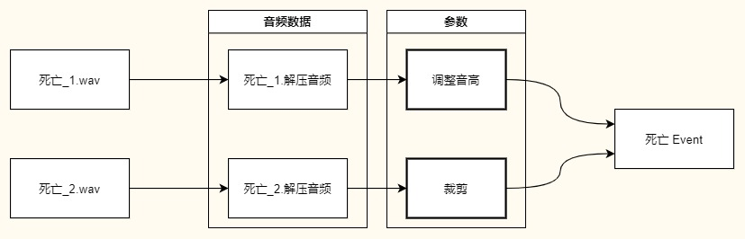
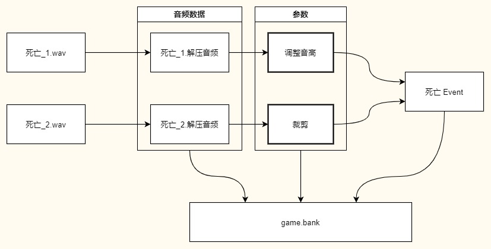

## 22.1 Wwise名词概念

Wwise中的名词较多，刚接触的时候会觉得很绕，什么Audio、Event、Bank之类的。

我仅作为一个程序员，用到的功能不多，所以就介绍一些常用的功能与概念。

### 1. Event

Event是播放音效的基本单元，简单的可以认为一个Event==一个音效。

例如在Wwise里的触发一个死亡Event -- Die，可以理解成播放一个 `Die.mp3`。

说的详细一些就是，Wwise包括音频编辑器+解析引擎。

在Wwise编辑器里导入Wav音效之后，可以修改它的参数，对它进行截取。

而Event可引用多个Wav音效进行混合、顺序播放、随机播放等。

在代码中可以用`EventID` 或者 `EventName` 来指定Event操作，为了便于阅读，后续都使用 `EventName`。

### 2. gameObjectID

Wwise的设计思想是，每一个Event都归属于一个GameObject，所以当要播放一个Event时，都应该指定一个 `gameObjectID`。

这样的设计也方便做3D音效，只需要对GameObject修改坐标，附着在GameObject上的音效也会在空间中移动。

### 3. Listener

听者。

每个听者也需要附着在一个GameObject上。

### 4. Bank

简单理解就是将多个音频文件打包，就成了一个Bank。

在FMOD和Wwise里，是以Event为单元播放声音，每个Event又可以引用多个音频文件来做混音，所以Bank是音频文件以及Event的集合。

将Wav音频导入Wwise之后，Wwise会对其进行处理转码，我们也会对其进行裁切、修改参数等，所以Bank中存放的是处理后的音频文件。

