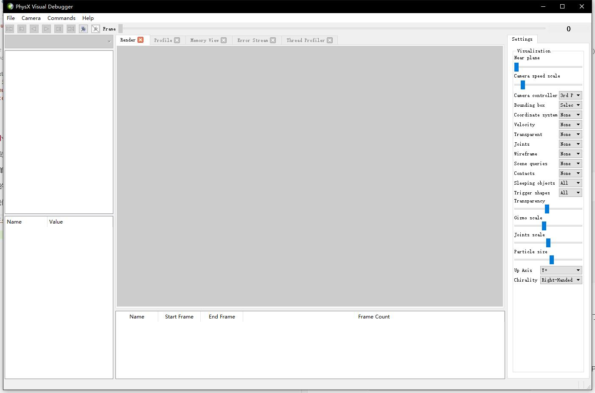
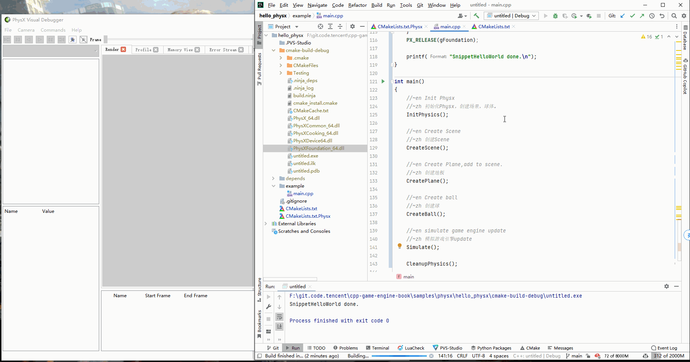
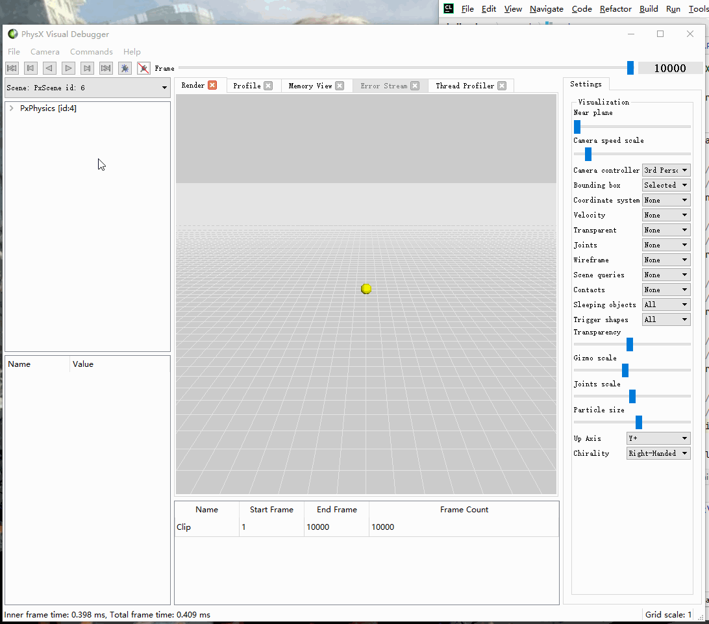
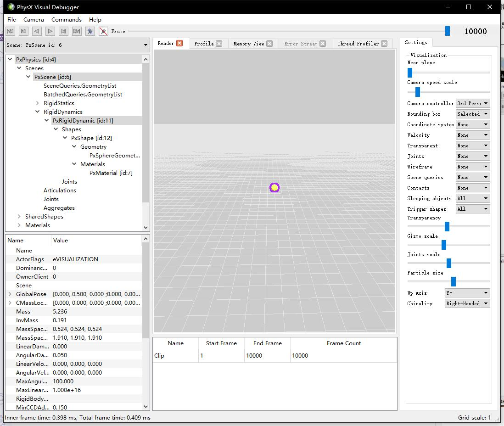

## 22.1 Physx实例-小球掉落

```bash
CLion项目文件位于 samples\physx\hello_physx
```

Physx自带了多个实例来介绍API的使用，不过我觉得还是太过复杂，所以本小节用一个最简单的例子：小球掉落，来介绍Physx的初始化、以及可视化工具PVD(PhysX Visual Debugger)的使用。

Physx API文档位于：`physx/documentation/PhysXGuide/Manual/API.html`


小球掉落这个实例，流程如下：

```c++
//file:example/main.cpp line:121

int main()
{
    //~en Init Physx
    //~zh 初始化Physx
    InitPhysics();

    //~en Create Scene
    //~zh 创建Scene
    CreateScene();

    //~en Create Plane,add to scene.
    //~zh 创建地板
    CreatePlane();

    //~en Create ball
    //~zh 创建球
    CreateBall();

    //~en simulate game engine update
    //~zh 模拟游戏引擎update
    Simulate();

    CleanupPhysics();

    return 0;
}
```

### 1. 初始化Physx

```c++
//file:example/main.cpp line:25

//~en Init Physx
//~zh 初始化Physx
void InitPhysics()
{
    //~en Creates an instance of the foundation class,.only one instance per process.
    //~zh 创建Foundation实例。
    gFoundation = PxCreateFoundation(PX_PHYSICS_VERSION, gAllocator, gErrorCallback);

    //~en Connect to pvd(PhysX Visual Debugger).
    //~zh 连接PVD
    gPvd = PxCreatePvd(*gFoundation);
    PxPvdTransport* transport = PxDefaultPvdSocketTransportCreate("127.0.0.1", 5425, 10);
    gPvd->connect(*transport,PxPvdInstrumentationFlag::eALL);

    //~en Creates an instance of the physics SDK.
    //~zh 创建Physx SDK实例
    gPhysics = PxCreatePhysics(PX_PHYSICS_VERSION, *gFoundation, PxTolerancesScale(),true,gPvd);
}
```

在创建Foundation实例，需要指定内存申请器(gAllocator)与错误回调(gErrorCallback)。

这里是使用了Physx自带的：

```c++
//file:example/main.cpp line:9

PxDefaultAllocator		gAllocator;
PxDefaultErrorCallback	gErrorCallback;
```

#### 1.1 内存申请器

内存申请，每个平台都有不一样的实现，这里看下Windows下的实现。

```c++
//file:physx\include\extensions\PxDefaultAllocator.h line:89

/**
\brief default implementation of the allocator interface required by the SDK
*/
class PxDefaultAllocator : public PxAllocatorCallback
{
public:
	void* allocate(size_t size, const char*, const char*, int)
	{
		void* ptr = platformAlignedAlloc(size);
		PX_ASSERT((reinterpret_cast<size_t>(ptr) & 15)==0);
		return ptr;
	}

	void deallocate(void* ptr)
	{
		platformAlignedFree(ptr);
	}
};
```

#### 1.2 错误回调

`PxDefaultErrorCallback` 定义：

```c++
//file:physx\include\extensions\PxDefaultErrorCallback.h
class PxDefaultErrorCallback : public PxErrorCallback
{
public:
    PxDefaultErrorCallback();
    ~PxDefaultErrorCallback();

    virtual void reportError(PxErrorCode::Enum code, const char* message, const char* file, int line);
};
```

`PxDefaultErrorCallback` 实现：

```c++
//file:physx\source\physxextensions\src\ExtDefaultErrorCallback.cpp line:40

PxDefaultErrorCallback::PxDefaultErrorCallback()
{
}

PxDefaultErrorCallback::~PxDefaultErrorCallback()
{
}

void PxDefaultErrorCallback::reportError(PxErrorCode::Enum e, const char* message, const char* file, int line)
{
	const char* errorCode = NULL;

	switch (e)
	{
	case PxErrorCode::eNO_ERROR:
		errorCode = "no error";
		break;
	case PxErrorCode::eINVALID_PARAMETER:
		errorCode = "invalid parameter";
		break;
	case PxErrorCode::eINVALID_OPERATION:
		errorCode = "invalid operation";
		break;
	case PxErrorCode::eOUT_OF_MEMORY:
		errorCode = "out of memory";
		break;
	case PxErrorCode::eDEBUG_INFO:
		errorCode = "info";
		break;
	case PxErrorCode::eDEBUG_WARNING:
		errorCode = "warning";
		break;
	case PxErrorCode::ePERF_WARNING:
		errorCode = "performance warning";
		break;
	case PxErrorCode::eABORT:
		errorCode = "abort";
		break;
	case PxErrorCode::eINTERNAL_ERROR:
		errorCode = "internal error";
		break;
	case PxErrorCode::eMASK_ALL:
		errorCode = "unknown error";
		break;
	}

	PX_ASSERT(errorCode);
	if(errorCode)
	{
		char buffer[1024];
		sprintf(buffer, "%s (%d) : %s : %s\n", file, line, errorCode, message);

		physx::shdfnd::printString(buffer);

		// in debug builds halt execution for abort codes
		PX_ASSERT(e != PxErrorCode::eABORT);

		// in release builds we also want to halt execution 
		// and make sure that the error message is flushed  
		while (e == PxErrorCode::eABORT)
		{
			physx::shdfnd::printString(buffer);
			physx::shdfnd::Thread::sleep(1000);
		}
	}	
}
```

默认的实现是直接输出错误。

一般在项目中要继承`PxErrorCallback`自己实现`reportError`，将Log上传到服务器。

### 2. 创建Scene

```c++
//file:example/main.cpp line:44

//~en Create Scene
//~zh 创建Scene
void CreateScene(){
    PxSceneDesc sceneDesc(gPhysics->getTolerancesScale());
    sceneDesc.gravity = PxVec3(0.0f, -9.81f, 0.0f);
    gDispatcher = PxDefaultCpuDispatcherCreate(2);
    sceneDesc.cpuDispatcher	= gDispatcher;
    sceneDesc.filterShader	= PxDefaultSimulationFilterShader;
    gScene = gPhysics->createScene(sceneDesc);

    PxPvdSceneClient* pvdClient = gScene->getScenePvdClient();
    if(pvdClient)
    {
        pvdClient->setScenePvdFlag(PxPvdSceneFlag::eTRANSMIT_CONSTRAINTS, true);
        pvdClient->setScenePvdFlag(PxPvdSceneFlag::eTRANSMIT_CONTACTS, true);
        pvdClient->setScenePvdFlag(PxPvdSceneFlag::eTRANSMIT_SCENEQUERIES, true);
    }
}
```

Scene是容器，后面创建的地板、小球都要添加到Scene中。

需要对Scene设置一系列参数，例如设置重力为9.81:

```c++
sceneDesc.gravity = PxVec3(0.0f, -9.81f, 0.0f);
```

Physx内部是多线程的，在下面代码里可以设置工作线程数量，这里设置为2.

```c++
gDispatcher = PxDefaultCpuDispatcherCreate(2);
```

如果设置为0，这样所有的工作都会在调用`PxScene::simulate()`的线程执行。

### 3. 创建地板

```c++
//file:example/main.cpp line:63

//~en Create Plane,add to scene.
//~zh 创建地板
void CreatePlane(){
    //~en Create Physx Material.
    //~zh 创建物理材质
    gMaterial = gPhysics->createMaterial(0.5f, 0.5f, 0.6f);

    //~en Create Plane,add to scene.
    //~zh 创建地板
    PxRigidStatic* groundPlane = PxCreatePlane(*gPhysics, PxPlane(0,1,0,0), *gMaterial);
    gScene->addActor(*groundPlane);
}
```

创建物理材质？看到这个会不会联想到前面讲的模型材质？

所谓材质，就是一系列属性的集合。

模型材质，是渲染这个模型所需要的一系列属性的集合，例如指定贴图、颜色。

物理材质，就是物体用于物理计算所需要的一系列属性的集合，例如摩擦系数、弹性系数，后面再详细介绍。

### 4. 创建球

```c++
//file:example/main.cpp line:76

//~en Create ball
//~zh 创建球
void CreateBall(){
    //~en Create RigidBody,pos is (0,10,0)
    //~zh 创建刚体，坐标是 (0,10,0)
    PxRigidDynamic* body = gPhysics->createRigidDynamic(PxTransform(PxVec3(0, 10, 0)));

    //~en Set rigidbody sharp
    //~zh 设置刚体形状，一个球。
    float radius = 0.5f;
    PxShape* shape = gPhysics->createShape(PxSphereGeometry(radius), *gMaterial);
    body->attachShape(*shape);
    shape->release();

    //~en calculate mass,mass = volume * density
    //~zh 根据体积、密度计算质量
    PxRigidBodyExt::updateMassAndInertia(*body, 10.0f);

    gScene->addActor(*body);
}
```

先创建刚体，再给刚体一个小球形状，就有了小球刚体。


指定球的密度后，就可以用体积*密度算出质量了。

```diff
+PxRigidDynamic表示动态的刚体模拟对象，其继承自PxRigidBody，PxRigidBody继承自PxRigidActor。
-PxRigidStatic 仅表示一个静态物理实体，继承自PxRigidActor。

这两个是物理世界对象的基础节点。
```

### 5. 模拟游戏引擎update

```c++
//file:example/main.cpp line:97

//~en simulate game engine update
//~zh 模拟游戏引擎update
void Simulate(){
    static const PxU32 frameCount = 10000;
    for(PxU32 i=0; i<frameCount; i++) {
        gScene->simulate(1.0f/60.0f);
        gScene->fetchResults(true);
    }
}
```

调用`gScene->simulate(1.0f/60.0f);`开始模拟后，Physx内部多个工作线程就开始计算。

调用`gScene->fetchResults(true);`等待计算结果。

### 6. 使用PVD查看小球掉落效果

CLion直接运行项目，发现只有控制台输出了`SnippetHelloWorld done.`，说好的球下落没有了。

没办法，作为一个最简单的实例，画面是不可能有的。

那如何去查看小球下落的效果呢，这个时候就要用到PVD(PhysX Visual Debugger)了。

PVD是Physx提供的可视化调试器，先启动PVD，然后再运行项目，连接成功后，项目中的Physx数据就会发送到PVD中。

PVD下载地址：`https://developer.nvidia.com/physx-visual-debugger`

先启动PVD。



然后启动项目。



在PVD中可以看到小球，小球一瞬间就掉下去了。

为什么没有慢慢往下掉呢，这是因为在实例中是简单的for循环模拟帧，每一帧并没有`1.0f/60.0f`的时间间隔。

PVD中的数据是支持回放的，PVD左上角的控制按钮，分别是回到第一帧，上一帧、倒放、播放、下一帧、最后一帧。

先点击回到第一帧，再点击播放，就可以看到小球掉落的过程。



选中小球，在左侧就会显示小球属性。



其他的功能就慢慢探索吧。