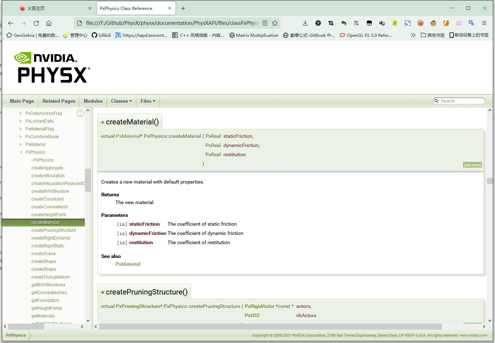
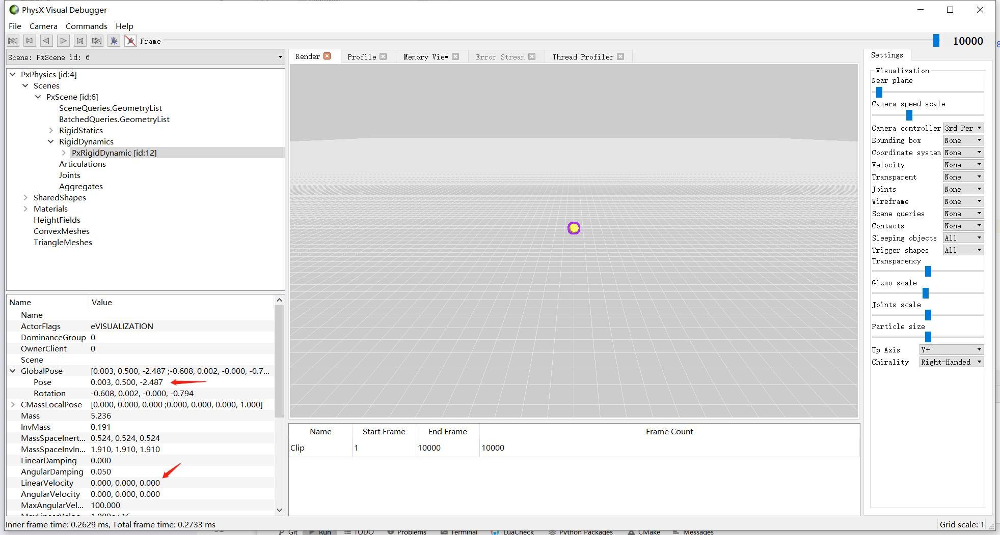
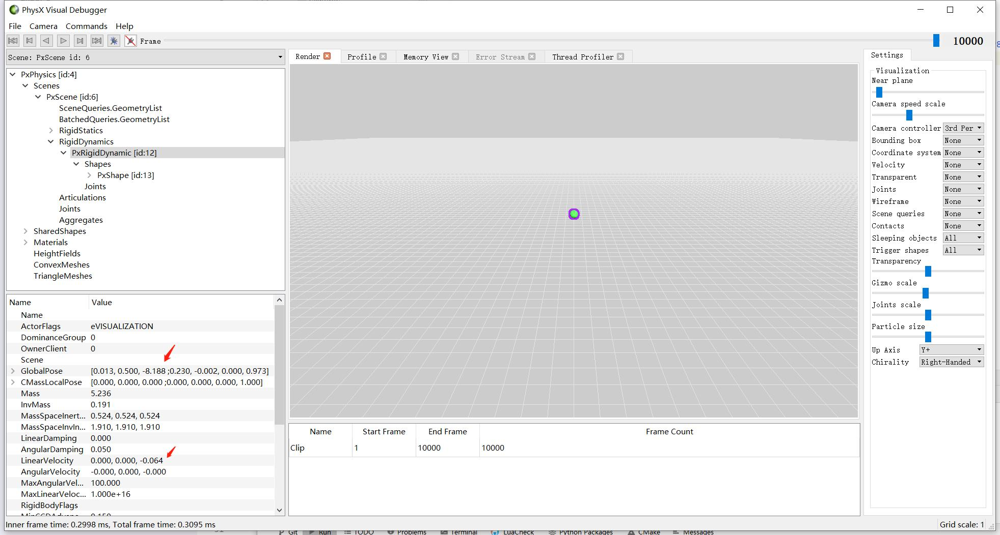
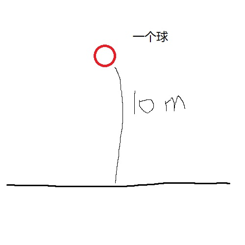
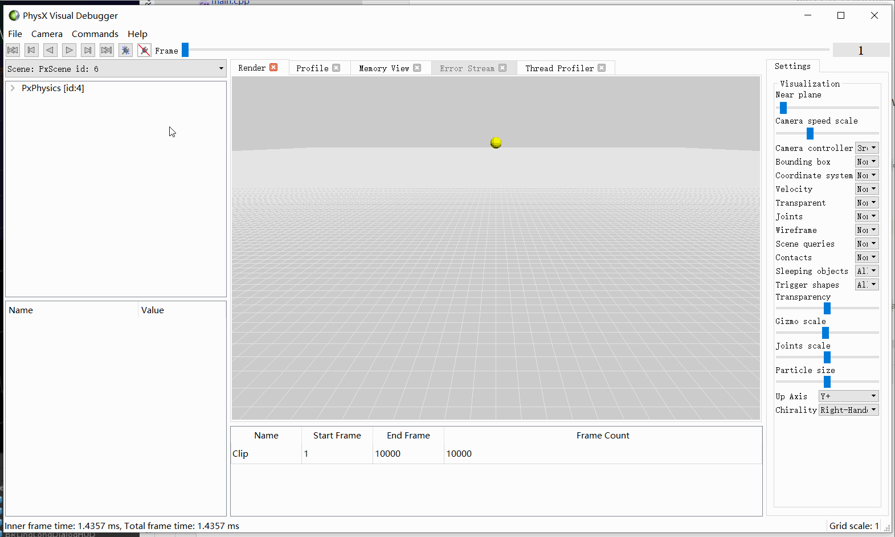
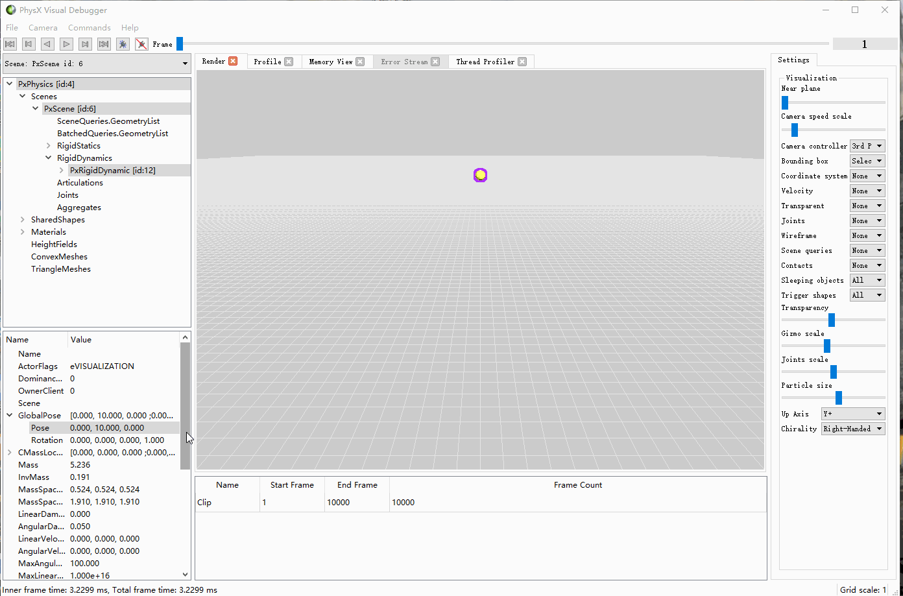
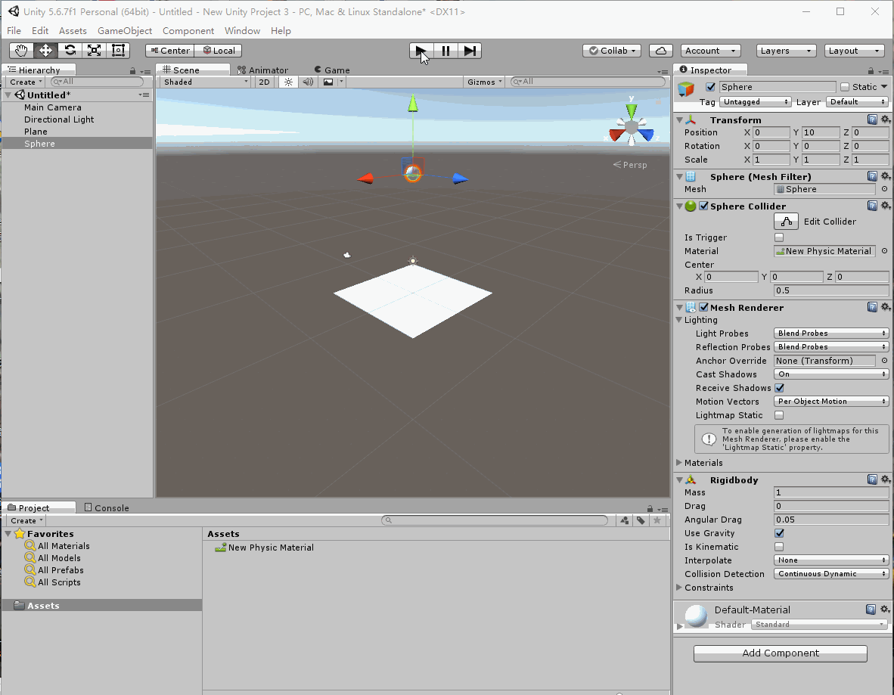

## 22.2 物理材质

所谓材质，就是一系列属性的集合。

模型材质，是渲染这个模型所需要的一系列属性的集合，例如指定贴图、颜色。

物理材质，就是物体用于物理计算所需要的一系列属性的集合，例如摩擦系数、弹性系数。

### 1. 物理材质属性

既然物理材质是用于物理计算的一系列属性集合，那它包括哪些属性呢？

打开Physx的API文档 physx/documentation/PhysXGuide/Manual/API.html，搜索函数名 `createMaterial`，就能找到创建物理材质指定的三个参数的含义。



| 属性  | 含义  |
|---|---|
| staticFriction  |  静摩擦系数，物体相对静止时与地面的摩擦力系数。 |
|dynamicFriction|动摩擦系数，物体相对运动时，与地面的摩擦力系数。|
|restitution|弹性系数|

静摩擦力比动摩擦力大一些。

你使出吃奶的力气推箱子，箱子推动之后，就不用那么大力气了。

箱子动起来的那一个临界点，所需的力气是最大的，就说明箱子与地面摩擦力也是最大的。

箱子动起来之后，不用那么大力气了，就说明箱子与地面摩擦力小了。

数值越大，就代表材质的摩擦力越大，就越难移动。

弹性就很好理解了，皮球从高处掉落，如果忽略各种损失，弹性是1，那么就会弹起来回到原位。

如果弹性是0，那么皮球就像掉落进了泥坑。

### 2. 物理材质属性表现

下面通过2个例子，来分别测试摩擦系数与弹性系数对表现的影响。

### 2.1 摩擦系数

```bash
CLion项目文件位于 samples\physx\physx_material_friction
```

情景测试：给小球一个初始速度1.0，对比观察在摩擦系数为0 以及几乎为1的情况下，小球的移动情况。

只是在上一节的基础上对材质稍微修改，这里就不再介绍Physx初始化、创建Scene这些流程了，直接看创建地板、创建小球的相关代码。

```c++
//file:example/main.cpp line:60

//~en Create Plane,add to scene.
//~zh 创建地板
void CreatePlane(){
    //~en Create Physx Material.
    //~zh 创建物理材质
    PxMaterial* planeMaterial = gPhysics->createMaterial(98.0f, 100.0f, 0.01f);

    //~en Create Plane,add to scene.
    //~zh 创建地板
    PxRigidStatic* groundPlane = PxCreatePlane(*gPhysics, PxPlane(0,1,0,0), *planeMaterial);
    gScene->addActor(*groundPlane);
}

//~en Create ball
//~zh 创建球
void CreateBall(){
    //~en Create RigidBody,pos is (0,0.5,0)
    //~zh 创建刚体，坐标是 (0,0.5,0)
    PxRigidDynamic* rigidDynamic = gPhysics->createRigidDynamic(PxTransform(PxVec3(0, 0.5, 0)));

    //~en Create Physx Material.
    //~zh 创建小球的物理材质
    PxMaterial* ballMaterial = gPhysics->createMaterial(0.1f, 0.0f, 0.98f);
    ballMaterial->setFrictionCombineMode(PxCombineMode::eMAX);

    //~en Set rigid body sharp
    //~zh 设置刚体形状，一个球。
    float radius = 0.5f;
    PxShape* shape = gPhysics->createShape(PxSphereGeometry(radius), *ballMaterial);
    rigidDynamic->attachShape(*shape);
    shape->release();

    //~en calculate mass,mass = volume * density
    //~zh 根据体积、密度计算质量
    PxRigidBodyExt::updateMassAndInertia(*rigidDynamic, 10.0f);

    gScene->addActor(*rigidDynamic);

    //~en addForce can also make the ball move.
    //~zh 加上一个力，就可以让小球移动了。注意施加力时，小球必须已经被添加到场景中。
    rigidDynamic->addForce(PxVec3(0,0,-20),PxForceMode::eFORCE,true);
}
```

来对比下地板的物理材质与小球的物理材质：

```c++
//~en Create Physx Material.
//~zh 创建物理材质
PxMaterial* planeMaterial = gPhysics->createMaterial(98.0f, 100.0f, 0.01f);
```

```c++
//~en Create Physx Material.
//~zh 创建小球的物理材质
PxMaterial* ballMaterial = gPhysics->createMaterial(0.1f, 0.0f, 0.98f);
ballMaterial->setFrictionCombineMode(PxCombineMode::eMAX);
```

地板的物理材质指定了较大的静摩擦力系数与动摩擦力系数。

小球的物理材质指定了几乎为0的摩擦力系数。

小球的物理材质将摩擦力计算模式设置为`PxCombineMode::eMAX`，意思是选取接触的两个物体摩擦力系数较大的一个，那么这里就是选取了地板材质的较大摩擦力系数。

设置好摩擦系数之后，最后给小球施加了一个力，让小球往前滚动。

```c++
//~en addForce can also make the ball move.
//~zh 加上一个力，就可以让小球移动了。注意施加力时，小球必须已经被添加到场景中。
rigidDynamic->addForce(PxVec3(0,0,-20),PxForceMode::eFORCE,true);
```

摩擦力系数大，就说明阻力大，表现出来就是小球比较难滚动。

打开PVD，然后运行项目后，在PVD中看到效果如下图：



小球在10000帧之后，向前行进了2.487m，然后停止了运动。

将小球的物理材质将摩擦力组合模式设置为`PxCombineMode::eMIN`，意思是选取接触的两个物体摩擦力系数较小的一个，那么这里就是选取了小球材质的极小摩擦力系数。

再次运行项目，在PVD中看到效果如下图：



小球在10000帧之后，向前行进了8.188m，并且仍处于运动中。

### 2.2 弹性系数

```bash
CLion项目文件位于 samples\physx\physx_material_restitution
```

情景测试：小球从10m高掉落，对比观察在弹性系数为0 以及几乎为1的情况下，小球的情况。



直接看创建地板、创建小球的相关代码。

```c++
//file:example/main.cpp line:60

//~en Create Plane,add to scene.
//~zh 创建地板
void CreatePlane(){
    //~en Create Physx Material.
    //~zh 创建物理材质
    PxMaterial* planeMaterial = gPhysics->createMaterial(0.5f, 0.5f, 0.01f);

    //~en Create Plane,add to scene.
    //~zh 创建地板
    PxRigidStatic* groundPlane = PxCreatePlane(*gPhysics, PxPlane(0,1,0,0), *planeMaterial);
    gScene->addActor(*groundPlane);
}

//~en Create ball
//~zh 创建球
void CreateBall(){
    //~en Create RigidBody,pos is (0,10,0)
    //~zh 创建刚体，坐标是 (0,10,0)
    PxRigidDynamic* body = gPhysics->createRigidDynamic(PxTransform(PxVec3(0, 10, 0)));

    //~en Create Physx Material.
    //~zh 创建小球的物理材质
    PxMaterial* ballMaterial = gPhysics->createMaterial(0.5f, 0.5f, 0.98f);

    //~en Set ball material restitution combine mode. When ball hit the floor, choose the larger, smaller, or average of the two.
    //~zh 设置小球材质的弹性系数计算模式，小球与地板碰撞时，弹性系数是取两者大的、小的、还是平均。
    ballMaterial->setRestitutionCombineMode(PxCombineMode::eMAX);
//    ballMaterial->setRestitutionCombineMode(PxCombineMode::eAVERAGE);
//    ballMaterial->setRestitutionCombineMode(PxCombineMode::eMIN);

    //~en Set rigid body sharp
    //~zh 设置刚体形状，一个球。
    float radius = 0.5f;
    PxShape* shape = gPhysics->createShape(PxSphereGeometry(radius), *ballMaterial);
    body->attachShape(*shape);
    shape->release();

    //~en calculate mass,mass = volume * density
    //~zh 根据体积、密度计算质量
    PxRigidBodyExt::updateMassAndInertia(*body, 10.0f);

    gScene->addActor(*body);
}
```

对比地板的物理材质与小球的物理材质：

```c++
//~en Create Physx Material.
//~zh 创建物理材质
PxMaterial* planeMaterial = gPhysics->createMaterial(0.5f, 0.5f, 0.01f);
```

```c++
//~en Create Physx Material.
//~zh 创建小球的物理材质
PxMaterial* ballMaterial = gPhysics->createMaterial(0.5f, 0.5f, 0.98f);

//~en Set ball material restitution combine mode. When ball hit the floor, choose the larger, smaller, or average of the two.
//~zh 设置小球材质的弹性系数计算模式，小球与地板碰撞时，弹性系数是取两者大的、小的、还是平均。
ballMaterial->setRestitutionCombineMode(PxCombineMode::eMAX);
```

地板的物理材质指定了几乎为0的弹性系数。

小球的物理材质指定了几乎为1的弹性系数。

小球的物理材质将弹性系数组合模式设置为`PxCombineMode::eMAX`，意思是选取接触的两个物体弹性系数较大的一个，那么这里就是选取了小球材质的较大弹性系数。

弹性系数越大，表现出来就是小球下落后能弹回得越高。

打开PVD，然后运行项目后，在PVD中看到效果如下图，小球几乎能弹回到原来的位置：


将小球的物理材质将摩擦力组合模式设置为`PxCombineMode::eMIN`，意思是选取接触的两个物体弹性系数较小的一个，那么这里就是选取了地板材质的几乎为0的弹性系数。

再次运行项目，在PVD中看到效果如下图，小球下落后就不动了，像掉到了泥坑里：



### 3. 物理引擎的误差

上面测试小球材质的弹性系数时，如果要百分百弹回到原来的位置，那是不是只要将弹性系数设置为1.0就可以了呢？

修改好代码后，在PVD中看到效果如下图：



可以看到小球越弹越高了，这是怎么回事？

在谷歌搜索几乎没有找到有效信息，只能请教公司大佬，大佬的意思是物理引擎是一定存在误差的，这里既有浮点型精度问题，也有其他的一些问题，随着时间的增加，误差会逐渐放大。如果要让小球完美回到原位，只能将Distitution设置得稍微小一点，然后在快到顶端的时候做些拟合，例如给它加一些力，或者直接设置位置。

不过我想到Unity是用Physx做物理引擎的，Unity的物理材质属性和Physx是一一对应，只是将Physx Restitution改成了 Bounciness。

所以拿Unity也测试了一次，发现表现是一致的。



在谷歌搜索`unity bounciness 1.0`就能找到一些信息。

```bash
https://forum.unity.com/threads/bounciness-1-0-conservation-of-energy-doesnt-work.143472/
```

这里Unity的技术支持给到的解释和解决方案和公司大佬说的一致。


