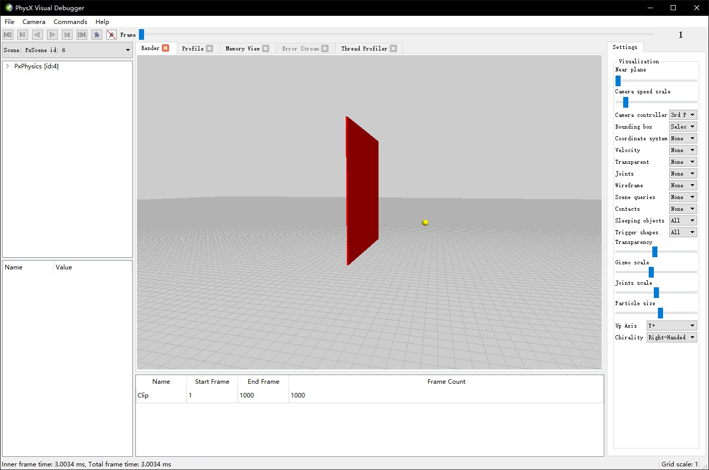
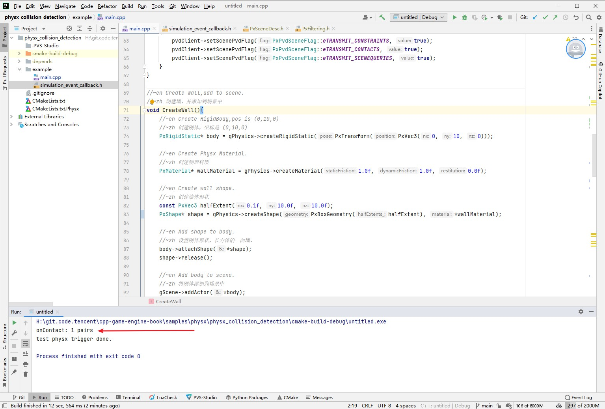
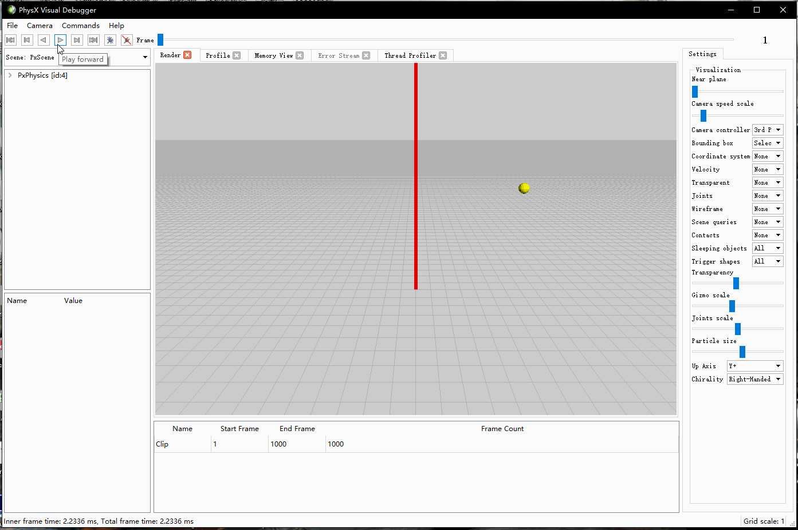
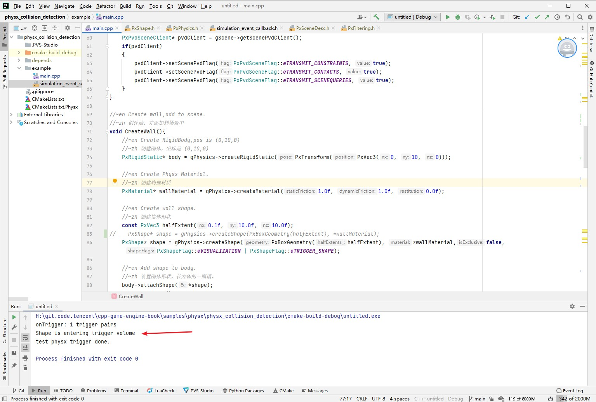
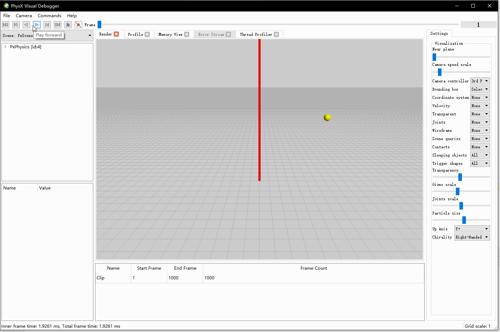

## 22.3 碰撞检测

```bash
CLion项目文件位于 samples\physx\physx_collision_detection
```

在Physx的设定，刚体(PxRigidBody)只是一个质点，它拥有质量，但是具体的表现是通过形状(PxShape)来约束的。

同一个刚体，可以附加一个正方体的Shape，也可以附加一个球体的Shape，不同形状的Shape有着不同的物理检测的结果。

对同一个形状的Shape，可以设置不同的标志(PxShapeFlag)，`PxShapeFlag::eSIMULATION_SHAPE`表示刚体将在物理模拟中参与碰撞，`PxShapeFlag::eTRIGGER_SHAPE`则表示只作为Trigger，不参与碰撞。

其实在上一节的两个实例，就已经是参与碰撞的。

这是因为创建Shape默认是指定了`PxShapeFlag::eSIMULATION_SHAPE`，即参与碰撞。

```c++
//file:physx/include/PxPhysics.h line:377

//@}
/** @name Shapes
*/
//@{

/**
\brief Creates a shape which may be attached to multiple actors

The shape will be created with a reference count of 1.

\param	[in] geometry		The geometry for the shape
\param	[in] material		The material for the shape
\param	[in] isExclusive	Whether this shape is exclusive to a single actor or maybe be shared
\param	[in] shapeFlags		The PxShapeFlags to be set

Shared shapes are not mutable when they are attached to an actor

@see PxShape
*/
PX_FORCE_INLINE	PxShape*	createShape(	const PxGeometry& geometry, 
                                            const PxMaterial& material, 
                                            bool isExclusive = false, 
                                            PxShapeFlags shapeFlags = PxShapeFlag::eVISUALIZATION | PxShapeFlag::eSCENE_QUERY_SHAPE | PxShapeFlag::eSIMULATION_SHAPE)
{
    PxMaterial* materialPtr = const_cast<PxMaterial*>(&material);
    return createShape(geometry, &materialPtr, 1, isExclusive, shapeFlags);
}
```

但是之前并没有添加回调，下面就来将回调加上。

本小节通过小球撞墙的例子，来看着两个标志的表现，以及测试事件回调。



### 1. 事件回调

Physx提供了事件回调接口`PxSimulationEventCallback`。

例子里继承并重写了接口,输出Log，用于观察碰撞检测。

```c++
//file:example/simulation_event_callback.h line:14

//~en SimulationEventCallback is a PxSimulationEventCallback that is used to receive events from the PhysX SDK.
//~zh SimulationEventCallback 是一个用于从 PhysX SDK 接收事件的 PxSimulationEventCallback。
class SimulationEventCallback: public PxSimulationEventCallback {
public:
    void onConstraintBreak(PxConstraintInfo* constraints, PxU32 count) override {
        printf("onConstraintBreak\n");
    }

    void onWake(PxActor** actors, PxU32 count) override {
        printf("onWake\n");
    }

    void onSleep(PxActor** actors, PxU32 count) override {
        printf("onSleep\n");
    }

    void onTrigger(PxTriggerPair* pairs, PxU32 count) override {
		printf("onTrigger: %d trigger pairs\n", count);
        while(count--)
        {
            const PxTriggerPair& current = *pairs++;
            if(current.status & PxPairFlag::eNOTIFY_TOUCH_FOUND)
                printf("Shape is entering trigger volume\n");
            if(current.status & PxPairFlag::eNOTIFY_TOUCH_LOST)
                printf("Shape is leaving trigger volume\n");
        }
    }

    void onAdvance(const PxRigidBody*const*, const PxTransform*, const PxU32) override {
        printf("onAdvance\n");
    }

    void onContact(const PxContactPairHeader& pairHeader, const PxContactPair* pairs, PxU32 count) override {
		printf("onContact: %d pairs\n", count);
    }
};
```

在创建Scene的时候，对SceneDesc指定了事件回调处理`SimulationEventCallback`的实例`gSimulationEventCallback`。

```c++
//file:example/main.cpp line:38

//~zh 设置在碰撞发生时，Physx需要做的事情
//~en Set the actions when collision occurs,Physx needs to do.
static	PxFilterFlags SimulationFilterShader(PxFilterObjectAttributes attributes0, PxFilterData filterData0,PxFilterObjectAttributes attributes1, PxFilterData filterData1,PxPairFlags& pairFlags, const void* constantBlock, PxU32 constantBlockSize) {
    pairFlags = PxPairFlag::eCONTACT_DEFAULT | PxPairFlag::eNOTIFY_TOUCH_FOUND;
    return PxFilterFlags();
}

//~en Create Scene
//~zh 创建Scene
void CreateScene(){
    PxSceneDesc sceneDesc(gPhysics->getTolerancesScale());
    sceneDesc.gravity = PxVec3(0.0f, -0.98f, 0.0f);
    gDispatcher = PxDefaultCpuDispatcherCreate(2);
    sceneDesc.cpuDispatcher	= gDispatcher;
    //~zh 指定事件回调
    //~en Specify the event callback
    sceneDesc.simulationEventCallback = &gSimulationEventCallback;
    //~zh 设置在碰撞发生时，Physx需要做的事情
    //~en Set the actions when collision occurs,Physx needs to do.
    sceneDesc.filterShader	= SimulationFilterShader;
    gScene = gPhysics->createScene(sceneDesc);

    PxPvdSceneClient* pvdClient = gScene->getScenePvdClient();
    if(pvdClient)
    {
        pvdClient->setScenePvdFlag(PxPvdSceneFlag::eTRANSMIT_CONSTRAINTS, true);
        pvdClient->setScenePvdFlag(PxPvdSceneFlag::eTRANSMIT_CONTACTS, true);
        pvdClient->setScenePvdFlag(PxPvdSceneFlag::eTRANSMIT_SCENEQUERIES, true);
    }
}
```

由于物理引擎是特别消耗性能的，所以Physx默认是不处理碰撞检测回调的，所以还需要将碰撞检测回调的处理标志加上：

```c++
//~zh 设置在碰撞发生时，Physx需要做的事情
//~en Set the actions when collision occurs,Physx needs to do.
sceneDesc.filterShader	= SimulationFilterShader;
```

在函数`SimulationFilterShader`里，指定了`PxPairFlag::eNOTIFY_TOUCH_FOUND`，这个标志表示在碰撞发生时，Physx需要处理回调函数。

至此，事件回调就设置好了。

### 2. 检测碰撞

创建墙壁与小球。

```c++
//file:example/main.cpp line:71

//~en Create wall,add to scene.
//~zh 创建墙，并添加到场景中
void CreateWall(){
    //~en Create RigidBody,pos is (0,10,0)
    //~zh 创建刚体，坐标是 (0,10,0)
    PxRigidStatic* body = gPhysics->createRigidStatic(PxTransform(PxVec3(0, 10, 0)));

    //~en Create Physx Material.
    //~zh 创建物理材质
    PxMaterial* wallMaterial = gPhysics->createMaterial(1.0f, 1.0f, 0.0f);

    //~en Create wall shape.
    //~zh 创建墙体形状
    const PxVec3 halfExtent(0.1f, 10.0f, 10.0f);
    PxShape* shape = gPhysics->createShape(PxBoxGeometry(halfExtent), *wallMaterial);

    //~en Add shape to body.
    //~zh 设置刚体形状，长方体的一面墙。
    body->attachShape(*shape);
    shape->release();

    //~en Add body to scene.
    //~zh 将刚体添加到场景中
    gScene->addActor(*body);
}

//~zh 创建小球，并添加到场景中
//~en Create ball,add to scene.
void CreateBall(){
    //~en Create RigidBody,pos is (10,0,0)
    //~zh 创建刚体，坐标是 (10,0,0)
    PxRigidDynamic* body = gPhysics->createRigidDynamic(PxTransform(PxVec3(10, 5, 0)));
    body->setLinearVelocity(PxVec3(-14.0f, 0.0f, 0.0f));

    //~en Create Physx Material.
    //~zh 创建小球的物理材质
    PxMaterial* ballMaterial = gPhysics->createMaterial(0.5f, 0.5f, 1.0f);

    //~en Set rigid body sharp
    //~zh 设置刚体形状，一个球。
    float radius = 0.5f;
    PxShape* shape = gPhysics->createShape(PxSphereGeometry(radius), *ballMaterial);
    body->attachShape(*shape);
    shape->release();

    //~en calculate mass,mass = volume * density
    //~zh 根据体积、密度计算质量
    PxRigidBodyExt::updateMassAndInertia(*body, 1.0f);

    gScene->addActor(*body);
}
```

和上一节的代码没有太大差别，只是创建地板换成了创建墙壁，就不多介绍了。



输出了碰撞的Log。



在PVD中可以看到发生了碰撞，小球被墙壁反弹。

### 3. 作为Trigger

将墙作为Trigger，不参与碰撞。

```c++
//file:example/main.cpp line:71

//~en Create wall,add to scene.
//~zh 创建墙，并添加到场景中
void CreateWall(){
    ......

    //~en Create wall shape.
    //~zh 创建墙体形状
    const PxVec3 halfExtent(0.1f, 10.0f, 10.0f);
//    PxShape* shape = gPhysics->createShape(PxBoxGeometry(halfExtent), *wallMaterial);
    PxShape* shape = gPhysics->createShape(PxBoxGeometry(halfExtent), *wallMaterial,false,PxShapeFlag::eVISUALIZATION | PxShapeFlag::eTRIGGER_SHAPE);

    ......
}
```



输出了Trigger的Log。



在PVD中可以看到没有碰撞，小球直接穿过了墙壁。