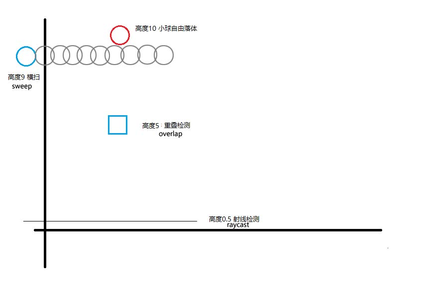
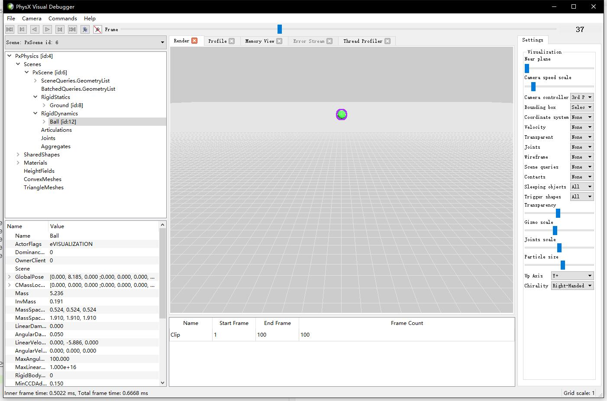

## 22.5 场景查询

```bash
CLion项目文件位于 samples\physx\physx_scene_query
```

场景查询挺陌生的，但是射线(Raycast)大家就都知道，从起点发一条射线出去，返回射线撞到的物体信息，这其实就是在查询场景物体的信息。

场景查询有以下几种：
1. raycasts:射线检测
2. overlaps:重叠检测，确定两个几何对象是否相交。
3. sweeps:横扫检测，沿一条线移动一个几何对象以找到与另一个几何对象的第一个交点。

下面分别来看。

### 1. 射线检测

射线检测，表示以某个坐标为起点，发出一条直线，检测场景中的物体，是否与该直线相交。


Physx提供了多个接口用以做射线检测，这里简单介绍检测单个对象的接口。

```c++
/**
\brief 发出射线，返回第一个碰撞点。

\param[in] scene		scene
\param[in] origin		射线起点
\param[in] unitDir		射线方向
\param[in] distance		射线长度
\param[in] outputFlags	标志哪些属性要被写入到hit里
\param[out] hit			射线碰撞点信息
\return                 返回True如果有碰撞
*/
static bool raycastSingle(	const PxScene& scene,
                            const PxVec3& origin, const PxVec3& unitDir, const PxReal distance,
                            PxSceneQueryFlags outputFlags, PxRaycastHit& hit,
                            const PxSceneQueryFilterData& filterData = PxSceneQueryFilterData(),
                            PxSceneQueryFilterCallback* filterCall = NULL, const PxSceneQueryCache* cache = NULL);
```

### 2. 重叠检测

重叠检测，表示检测场景中的物体，是否与某个范围重叠。


Physx也提供了多个接口用以做重叠检测，这里简单介绍检测单个Geometry的接口。

```c++
/**
\brief 指定坐标与范围，检测与其重叠的物体。
\param[in] scene			The scene
\param[in] geometry			要检查重叠的对象的几何形状（支持的类型有：box, sphere, capsule, convex）。
\param[in] pose				物体位置
\param[out] hit				碰撞点信息
\return 					如果发现重叠，则返回 True。
*/
static bool	overlapAny(	const PxScene& scene,
                        const PxGeometry& geometry, const PxTransform& pose,
                        PxOverlapHit& hit,
                        const PxSceneQueryFilterData& filterData = PxSceneQueryFilterData(),
                        PxSceneQueryFilterCallback* filterCall = NULL);
```

### 3. 横扫检测

横扫检测，表示以一个固定的几何物体，沿着一个方向向前推进，检测是否与场景中的物体相交。

其实就是立体版的射线检测，射线检测是一条直线，而横扫检测是一个立体线。


Physx也提供了多个接口用以做横扫检测，这里简单介绍检测返回单个碰撞信息的接口。

```c++
/**
\brief 返回沿射线击中的第一个刚体actor。将按照 outputFlags 字段的指定返回阻塞命中的数据。
\param[in] scene		The scene
\param[in] geometry		要检查重叠的对象的几何形状（支持的类型有：box, sphere, capsule, convex）。
\param[in] pose			物体位置
\param[in] unitDir		射线方向
\param[in] distance		距离，受限制于 PX_MAX_SWEEP_DISTANCE.
\param[in] outputFlags	指定返回阻塞命中的数据。
\param[out] hit			碰撞点信息
\return 				如果发现碰撞，则返回 True。
*/
static bool sweepSingle(const PxScene& scene,
						const PxGeometry& geometry, const PxTransform& pose, const PxVec3& unitDir, const PxReal distance,
						PxSceneQueryFlags outputFlags,
						PxSweepHit& hit,
						const PxSceneQueryFilterData& filterData = PxSceneQueryFilterData(),
						PxSceneQueryFilterCallback* filterCall = NULL,
						const PxSceneQueryCache* cache = NULL,
						PxReal inflation=0.0f);
```

### 4. 实例

实例中测试了上面提到的三种场景查询：
1. 在高度9，以小球，进行横扫检测。
2. 在高度5，以Box，进行重叠检测。
3. 在高度0.5，进行射线检测。



代码如下：

```c++
//file:example/main.cpp line:106

//~zh 场景查询
//~en scene query
void SceneQuery(int frame){
    //~zh 射线检测：从指定位置发出射线，检测小球掉落。
    //~en Returns the first rigid actor that is hit along the ray.
    PxVec3 origin(0,0.5f,10);
    PxVec3 uintDir(0,0,-1);
    PxHitFlags hitFlags = PxHitFlag::ePOSITION | PxHitFlag::eNORMAL | PxHitFlag::eUV;
    PxRaycastHit raycastHit;
    if(PxSceneQueryExt::raycastSingle(*gScene, origin, uintDir, 20, hitFlags, raycastHit)){
        printf("frame %d,raycastHit.position:(%f,%f,%f)\n", frame, raycastHit.position.x, raycastHit.position.y, raycastHit.position.z);
    }

    //~zh 重叠检测：检测是否有对象与指定几何对象重叠。
    //~en Test returning, for a given geometry, any overlapping object in the scene.
    PxOverlapHit overlapHit;
    if(PxSceneQueryExt::overlapAny(*gScene,PxBoxGeometry(0.5f,0.5f,0.5f),PxTransform(PxVec3(0,5.0f,0)),overlapHit)){
        printf("frame %d,overlapHit:%s\n",frame,overlapHit.actor->getName());
    }

    //~zh 横扫检测：向前发射一个小球检测碰撞。
    //~en sweep:fire a small ball forward to detect collision.
    PxSweepHit sweepHit;
    if(PxSceneQueryExt::sweepSingle(*gScene,PxSphereGeometry(0.5f), PxTransform(PxVec3(0,9.0f,10)),uintDir,20,hitFlags,sweepHit)){
        printf("frame %d,sweepHit:%s\n",frame,sweepHit.actor->getName());
    }
}
```

运行后查看日志：

```bash
frame 1,sweepHit:Ball
frame 2,sweepHit:Ball
frame 3,sweepHit:Ball
frame 4,sweepHit:Ball
frame 5,sweepHit:Ball
frame 6,sweepHit:Ball
frame 7,sweepHit:Ball
frame 8,sweepHit:Ball
frame 9,sweepHit:Ball
frame 10,sweepHit:Ball
frame 11,sweepHit:Ball
frame 12,sweepHit:Ball
frame 13,sweepHit:Ball
frame 14,sweepHit:Ball
frame 15,sweepHit:Ball
frame 16,sweepHit:Ball
frame 17,sweepHit:Ball
frame 18,sweepHit:Ball
frame 19,sweepHit:Ball
frame 20,sweepHit:Ball
frame 21,sweepHit:Ball
frame 22,sweepHit:Ball
frame 23,sweepHit:Ball
frame 24,sweepHit:Ball
frame 25,sweepHit:Ball
frame 26,sweepHit:Ball
frame 27,sweepHit:Ball
frame 28,sweepHit:Ball
frame 29,sweepHit:Ball
frame 30,sweepHit:Ball
frame 31,sweepHit:Ball
frame 32,sweepHit:Ball
frame 33,sweepHit:Ball
frame 34,sweepHit:Ball
frame 35,sweepHit:Ball
frame 36,sweepHit:Ball
frame 37,sweepHit:Ball
frame 54,overlapHit:Ball
frame 55,overlapHit:Ball
frame 56,overlapHit:Ball
frame 57,overlapHit:Ball
frame 58,overlapHit:Ball
frame 59,overlapHit:Ball
frame 60,overlapHit:Ball
frame 61,overlapHit:Ball
frame 62,overlapHit:Ball
frame 63,overlapHit:Ball
frame 64,overlapHit:Ball
frame 65,overlapHit:Ball
frame 81,raycastHit.position:(0.000000,0.500000,0.217368)
frame 82,raycastHit.position:(0.000000,0.500000,0.445586)
frame 83,raycastHit.position:(0.000000,0.500000,0.500000)
frame 84,raycastHit.position:(0.000000,0.500000,0.446527)
frame 85,raycastHit.position:(0.000000,0.500000,0.224890)
SnippetHelloWorld done.

Process finished with exit code 0
```

可以看到：
1. 从 1-37 帧，都被横扫检测到。
2. 从 54-65 帧，被重叠检测到。
3. 从 81-85 帧，被射线检测到。

可以在PVD中查看指定帧坐标来验证是否准确。



上图是第37帧的小球，高度8.185，处在横扫检测的范围内。

