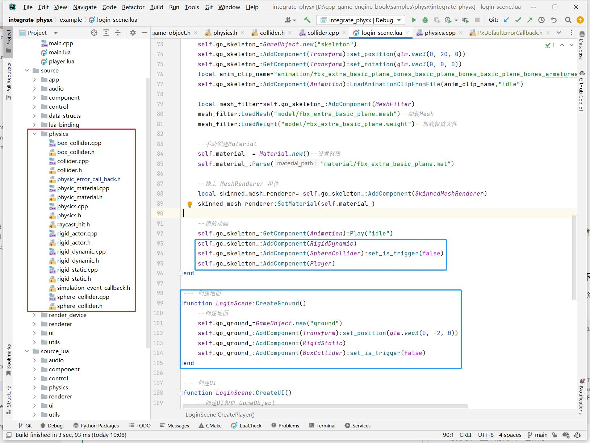

## 22.6 引擎集成Physx

```bash
CLion项目文件位于 samples/physx/integrate_physx
```

前面小节将常用的Physx功能都介绍了一遍，现在将这些功能都集成到游戏引擎中。

为了展示Physx物理引擎功能，我这里做了一个飞机坠毁的演示：
1. 场景查询：从飞机向下打射线检测距离，播放坠机警报，当触地时，播放爆炸音效。
2. 物理模拟：飞机触地时，根据物理材质的配置，会弹起、再下落、往复几次，最终静止。
3. 触发器：开启触发器后，飞机穿过地面，并回调脚本的OnEnterTrigger。

<iframe
    width="800" 
    height="450" 
    src="https://player.bilibili.com/player.html?aid=597280096&bvid=BV1RB4y1D76x&cid=739135863&page=1" 
    frameborder="0"  
    allowfullscreen>
</iframe>

### 1. 整体结构

还是老的集成三方库的套路：对Physx某个功能，编写单独的Component实现。

代码结构如下，参照日常使用Unity的习惯设计的，大家都应该很容易理解。



就不再详细介绍具体的代码实现了，打两个断点跑一跑就熟悉了。

### 2. 疑难点

集成Physx到引擎框架是比较顺的，但是跑测试就遇到的几个问题，提一下遇到的疑难点。

#### 2.1 已经附加到 Actor 的 Shape 是不可修改的。

触发器的实现，是通过在Shape上附加数据，添加一个标记，表示当前Shape是Trigger，不参与物理模拟。

```c++
//file:source/physics/collider.cpp line:51

void Collider::UpdateTriggerState(){
    if(px_shape_== nullptr){
        return;
    }
    //~zh 设置附加数据为1，表示当前Shape是Trigger
    //~en set shape's user data 1, it is a trigger.
    px_shape_->setSimulationFilterData(PxFilterData(is_trigger_?1:0,0,0,0));
    px_shape_->userData=game_object();
}
```

一般添加Trigger的代码是这样的：

```lua
--file:example/login_scene.lua line:94

self.go_skeleton_:AddComponent(RigidDynamic)
self.go_skeleton_:AddComponent(SphereCollider):set_is_trigger(false)
```

先添加 RigidDynamic(Actor)，然后添加 SphereCollider，然后设置为 Trigger。

问题是在 SphereCollider 实例化之后，就会将它的 Shape，附加到 Actor之上。

这个时候再对Shape 设置为 Trigger，Physx会提示：<font color=red>已经附加到 Actor 的 Shape 是不可修改的。</font>

解决方案就是设置为Trigger的时候，先断开Shape与Actor的附加关系，然后设置Trigger，再重新Attach。

```c++
//file:source/physics/collider.h line:25

void set_is_trigger(bool is_trigger){
    if(is_trigger_==is_trigger){
        return;
    }
    is_trigger_=is_trigger;
    UnRegisterToRigidActor();
    CreateShape();
    UpdateTriggerState();
    RegisterToRigidActor();
}
```

#### 2.2 自定义错误回调

一定要自定义错误回调并实现。

在上面的Trigger实现以及测试时，发现Trigger修改总是不生效，然后到之前小节的项目上测试，就发现Physx输出了错误。

代码和之前小节的也是一致，错误处理也都是用的默认的`PxDefaultErrorCallback`。

看起来并没有哪里不对，引擎项目和之前小节的测试项目，差别就是输出日志问题，在引擎里日志输出被spdlog托管了。

既然可能是spdlog引起的问题，那么自定义错误回调就可以解决。

直接照搬`PxDefaultErrorCallback`，然后将日志打印改为spdlog的，错误日志就有了。

### 3. 优化

Physx提供了接口给游戏引擎集成使用，游戏引擎主逻辑一般是单线程的，那Physx内部是单线程的吗？

不是的。

Physx内部是多线程的。

```c++
//file:source/physics/physics.cpp line:60

void Physics::FixedUpdate() {
    if(px_scene_==nullptr) {
        DEBUG_LOG_ERROR("px_scene_==nullptr,please call Physics::CreatePxScene() first");
        return;
    }
    px_scene_->simulate(1.0f / 60.0f);
    px_scene_->fetchResults(true);
}
```

在`FixedUpdate`里做了2件事：
1. simulate：驱动Physx循环
2. fetchResults：阻塞 等待内部多线程完成任务。

在面对几千上万的物体需要进行物理模拟时，多线程是有明显优势的，测试发现Physx耗时高，可以按需增加线程数。

```c++
//file:source/physics/physics.cpp line:69

PxScene* Physics::CreatePxScene() {
    if(px_physics_==nullptr) {
        DEBUG_LOG_ERROR("px_physics_==nullptr,please call Physics::Init() first");
        return nullptr;
    }
    //~zh 创建Physx Scene
    PxSceneDesc sceneDesc(px_physics_->getTolerancesScale());
    sceneDesc.gravity = PxVec3(0.0f, -9.81f, 0.0f);
    px_cpu_dispatcher_ = PxDefaultCpuDispatcherCreate(2);
    sceneDesc.cpuDispatcher	= px_cpu_dispatcher_;
    ......

    return px_scene;
}
```

这里的 `px_cpu_dispatcher_ = PxDefaultCpuDispatcherCreate(2);` 就是指定内部为2个线程。

如果场景物理模拟任务很多，可以多加几个线程，或者切分多个子Scene。

如果场景物理模拟任务很少，那么将数量设置为0，让Physx直接跑在引擎逻辑主线程上，减少线程间交换数据的耗时。