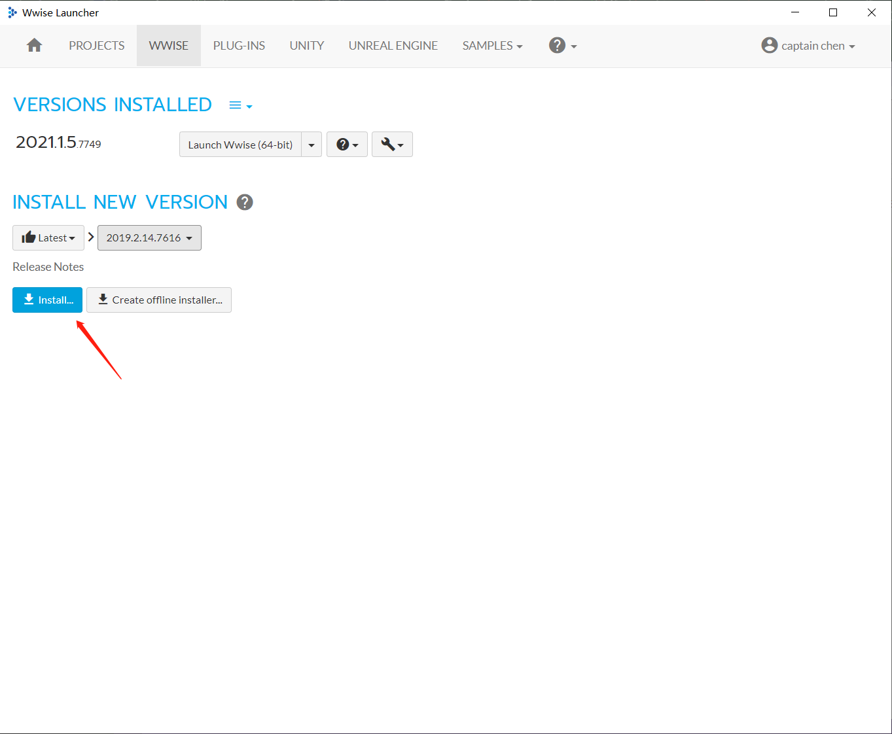
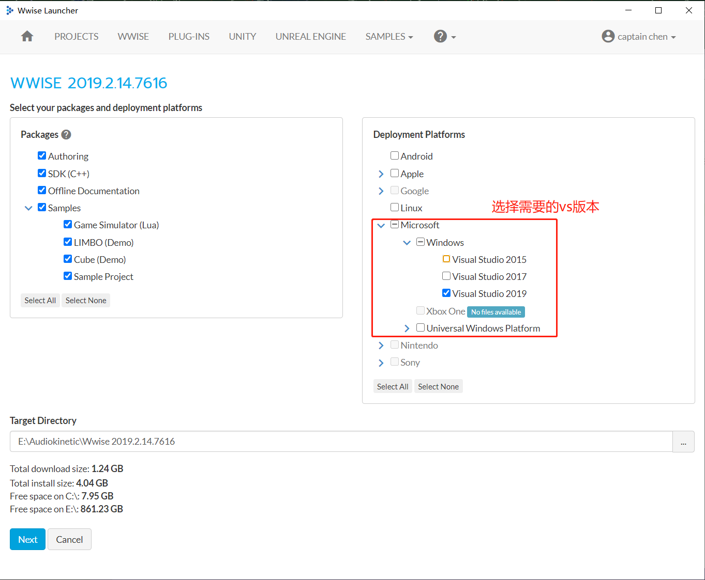
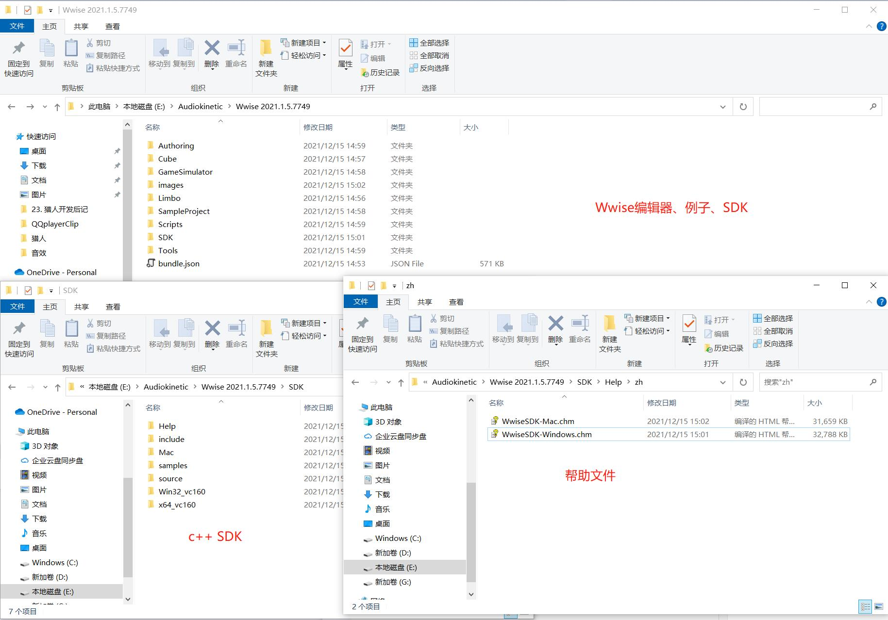
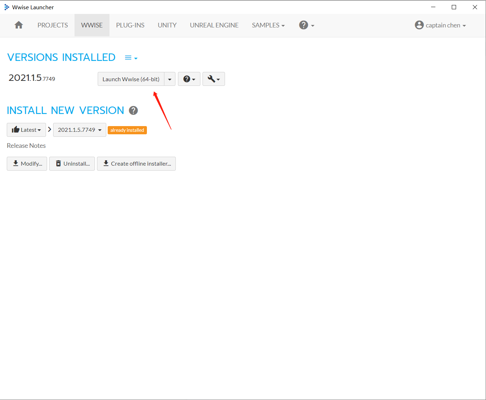
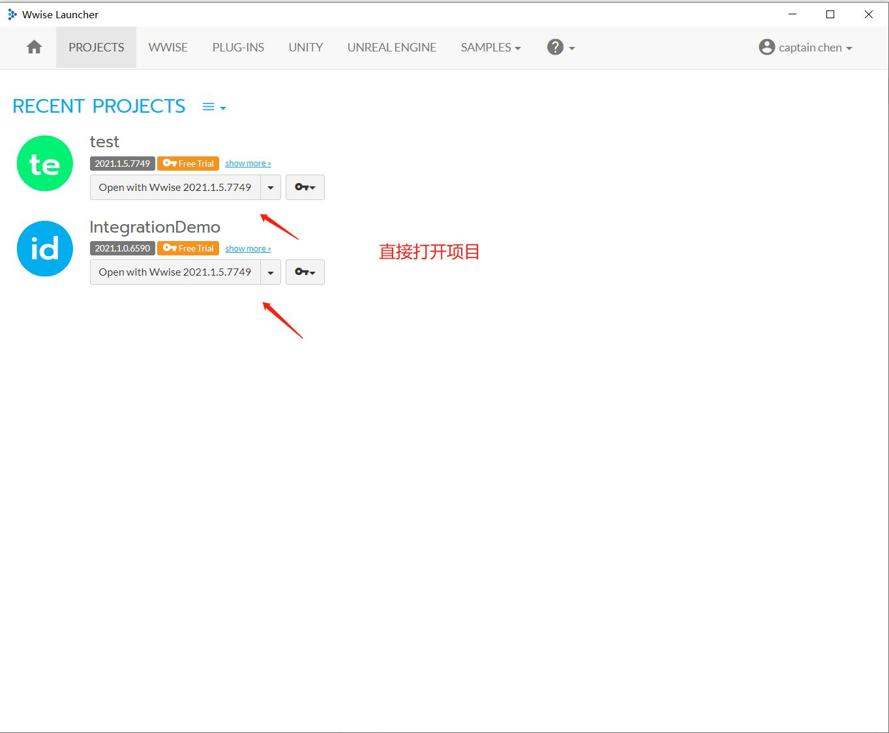

## 22. 集成Wwise

在前面`15. 播放音效`这一章，介绍过了集成`FMOD`来作为音频引擎，播放音效，也简单介绍了`Wwise`和`FMOD`。

最近公司搞了个`Wwise`的作品比赛活动，我也把它集成了进来，后续有需求的话，就不用另外再集成了，在`CMakeLists.txt`里切换即可。

### 1. 安装Wwise

先下载`Wwise Launcher`,地址：`https://www.audiokinetic.com/zh/downloads/`。

下载后打开，切换到`WWISE`选项卡，选择一个版本安装。

下一步选择需要安装的组件，选择需要的VS版本SDK。

然后下一步下一步就安装好了。

安装好之后，就能看到有编辑器、例子、C++ SDK、帮助文件，这些东西。

### 2. 启动Wwise

切换到WWISE选项卡，就可以启动。

或者在PROJECTS选项卡，直接打开项目。

### 3. 编辑器教程

和FMOD一样，也是在Wwise编辑器制作好音效，导出Bank给项目使用的。

官网有一些教程，不过这里还是推荐B站官方号的系列教程。

Wwise 101 教学视频:`https://space.bilibili.com/492900204/channel/seriesdetail?sid=895118`

Wwise 201 教学视频:`https://space.bilibili.com/492900204/channel/seriesdetail?sid=895113`

其中Wwise 101 教学视频有大佬翻译了。

WWISE101中文教程合集【完更】：`https://space.bilibili.com/17571301/channel/seriesdetail?sid=1254113`

后续我也会录制一些和教程相关的视频。

### 4. 优势与劣势

